# 超级 CAD Agent 工具层演进与原生插件引入阶段说明

最后更新：2026-06-10

配套主文档：[超级CADAgent系统架构参考文档.md](超级CADAgent系统架构参考文档.md)

本文是 **超级 CAD Agent 工具调用层** 的阶段开发说明。它不绑定任何现有仓库、单一 CAD 软件或某一种调用方式，目标是说明：系统如何从早期 CAD 自动化，演进到受工具网关治理的多后端 CAD / BIM 工具体系，并在合适阶段引入 AutoCAD 原生插件。

---

## 1. 文档定位

本文不是某个插件的开发备忘录，也不是某个当前项目的任务清单。它是主架构文档的工具层配套说明，回答三个问题：

1. CAD 工具层应该如何从单一执行通道演进为多后端体系。
2. AutoCAD 原生插件应该在什么位置、什么阶段、什么边界内引入。
3. 工具层如何接受 Agent Runtime、工具网关、治理控制平面、证据账本和评测系统约束。

核心判断：

> CADMCP 适合早期连接真实 CAD；原生插件适合承担稳定事务、精确回读、局部修改和回滚；几何内核和中立工程数据内核才是长期中心。工具层不是智能中枢，工具只执行经过授权、可回读、可审计的工程意图。

---

## 2. 工具层在超级 CAD Agent 中的位置

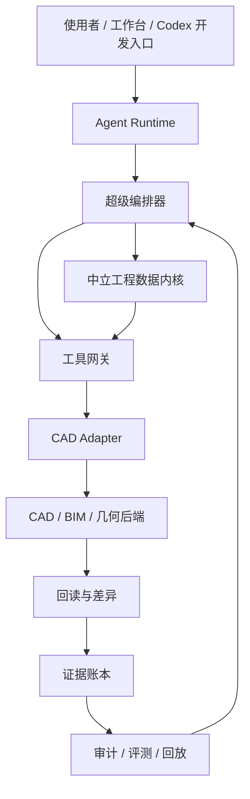

工具层只处在 **执行与回读** 位置。它不能越过任务对象、绘图计划、策略引擎、权限授权、事务保护和证据审计。

---

## 2A. 与主文档概念的层级映射

主文档偏逻辑分层，本文档偏执行流程。两者使用的名称不同，但应按下表理解。

| 主文档概念 | 工具文档概念 | 关系 |
| --- | --- | --- |
| 超级编排器 | Agent Runtime / 调用方 | Agent Runtime 是运行时承载，超级编排器是其中的总控职能 |
| 治理控制平面 | 策略引擎 / 权限检查 | 逻辑上独立，运行时可作为工具网关的策略插件或外部服务 |
| 审计层 | 网关审计步骤 / 审计器 | 逻辑上独立，工具流程中表现为执行后的审计步骤 |
| 证据账本 | 证据包 / Trace 输出 | 证据包是单次输出，证据账本是长期事实源 |
| 局部修复 Agent | `guarded_update` / `rollback_batch` | Agent 决定修什么，工具后端只执行受控修改 |
| CAD_PLAN | Tool Contract | CAD_PLAN 经转换器拆成一个或多个 Tool Contract |

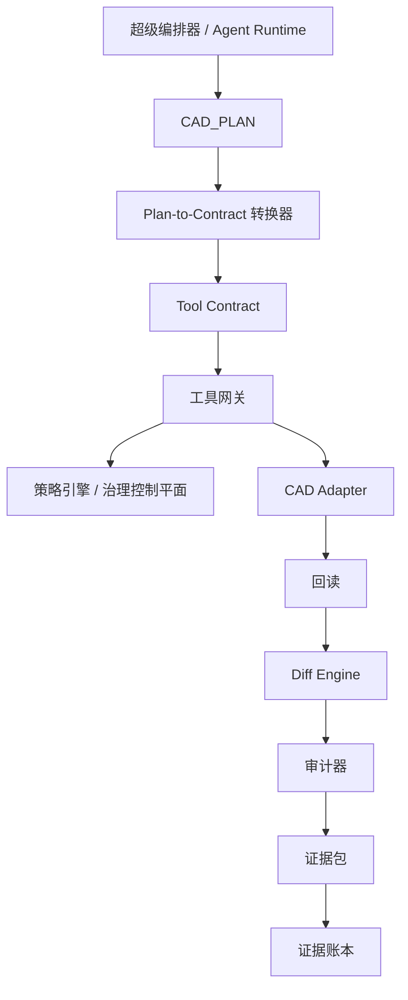

---

## 3. 工具层总原则

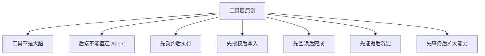

固定原则：

- Agent 不能直接调用 CAD API 或插件命令。
- 所有后端都必须通过工具网关。
- 所有 CAD 写入都必须有 Tool Contract。
- 所有高风险操作都必须有权限和授权记录。
- 所有写入结果都必须回读。
- 完成声明必须来自证据账本。
- 插件、CADMCP、云端自动化、几何内核都是后端，不是系统中心。

---

## 4. 从单一执行通道到多后端工具系统


| 阶段 | 名称 | 核心目标 | 退出标准 |
| --- | --- | --- | --- |
| 0 | 工具治理底座 | 建立 schema、权限、证据、trace、dry-run 规则 | 工具调用有统一合同和风险分级 |
| 1 | 桌面 CAD 自动化 | 通过 CADMCP、COM、脚本或类似方式连接真实 CAD | 能完成计划、写入、回读、审计闭环 |
| 2 | 工具网关 | 所有工具统一注册、授权、执行、回读 | Agent 不能绕过网关直接调用后端 |
| 3 | 原生事务后端 | AutoCAD 插件承担事务写入、局部修改、精准回读 | 插件小范围写入、回读、回滚稳定 |
| 4 | 工程数据内核 | 系统拥有任务图、几何图、语义图、证据图 | CAD 不再是唯一事实源 |
| 5 | 几何内核 | 拓扑、碰撞、约束、容差由确定性内核处理 | 几何审计不依赖截图或模型判断 |
| 6 | BIM / 多格式后端 | DWG、DXF、IFC、Revit、PDF、Viewer 各司其职 | 多后端可共享工具合同和证据格式 |
| 7 | 云端自动化与企业交付 | 批量出图、规范检查、模型转换、CDE 集成 | 有队列、监控、灰度、回滚和发布门禁 |

阶段 1 不是允许 CADMCP 绕过治理，而是允许使用 **轻量工具网关**：

- 最少有 Tool Contract。
- 最少有 no-save。
- 最少有回读和日志。
- 最少有人工确认。
- 可以暂不具备 Tool Card、预算路由、漂移监控和多后端一致性。

---

## 4A. 与主架构建设路线的对照

本阶段文档描述工具层成熟路线，不等于主系统只能按完全相同顺序建设。工具治理应从早期轻量存在，并逐步增强为完整工具网关。

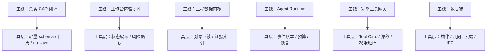

解释：

- 阶段 0 的工具治理底座不是一次性完成，而是持续迭代的基础设施。
- 连接真实 CAD 前至少要有轻量合同、日志、no-save 和人工确认。
- 完整工具网关可以在真实 CAD 经验积累后再产品化。
- 中立工程数据内核可以早期先做任务对象和证据索引，后续再扩展为几何图、语义图和版本图。

---

## 5. 工具网关总架构

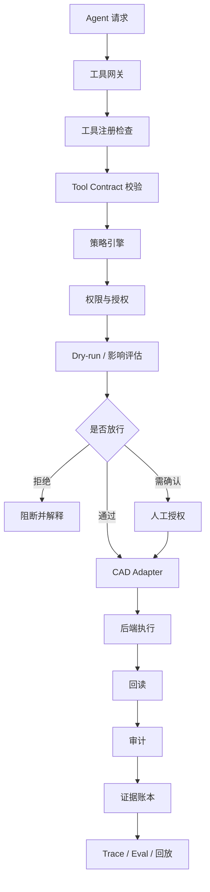

工具网关职责：

- 注册工具和后端能力。
- 校验 Tool Contract。
- 执行风险分级和权限检查。
- 对写入、删除、保存、导出、上传做人工授权。
- 执行 dry-run 和影响评估。
- 统一返回结构化结果。
- 写入证据账本。
- 为评测和回放保留 trace。

---

## 5A. 智能提示与 Codex Bridge 接入边界

工具层可以被智能体调用，但工具层本身不承载智能提示。所有自然语言理解、Prompt 编排、Agent 判断、模型复审和任务分发，都必须通过统一的模型调用边界实现，再把结果转成结构化 Tool Contract 交给工具网关。

当前阶段不把 OpenAI API 作为硬性前提。开发状态下，默认可以用 `Codex Bridge` 调用 Codex 当前推荐的高推理模型，例如 `gpt-5.5`，让 Codex 充当 CAD Agent 的开发态 LLM 后端。未来如果要做多用户稳定工作台服务，再把同一层替换为 OpenAI API、企业模型代理、本地模型或混合路由。

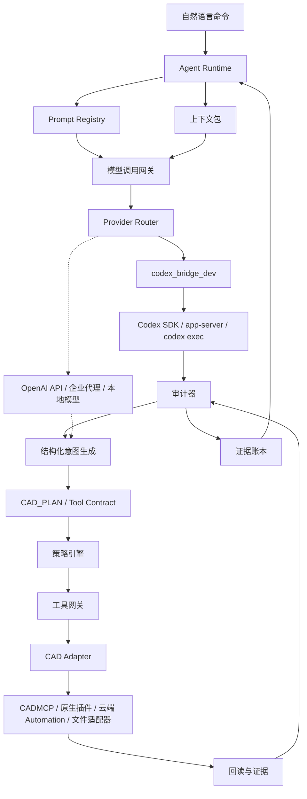

硬规则：

- Prompt 不写进 CAD 插件。
- Prompt 不写进前端按钮和临时脚本。
- 插件不直接调用 Codex、模型 API 或任何 LLM 后端。
- 工具网关不负责自然语言理解，只接收结构化 Tool Contract。
- 模型调用网关必须记录 Provider、模型版本、Prompt 版本、输入摘要、输出结构、额度 / 成本估计和 trace。
- 当前开发态默认 Provider 是 `codex_bridge_dev`，推荐模型配置为 `gpt-5.5`。
- `gpt-5.5` 不写死为永久模型名，应放在 Provider Registry 或配置层，便于跟随 Codex 推荐模型升级。
- 模型输出必须先经 schema 校验、策略检查和 dry-run，才能进入 CAD 后端。
- 当前阶段暂不展开多用户生产服务的 SLA、计费、限流和企业模型合规问题。

当前 / 未来边界：

| 层 | 当前阶段 | 未来阶段 |
| --- | --- | --- |
| Prompt Registry | 保存核心 Prompt、版本和用途 | 支持多租户、灰度、回滚和审计 |
| 模型调用网关 | 单 Provider 薄封装，默认 `codex_bridge_dev` | 多 Provider Router、成本路由、限流 |
| Provider Router | 只做配置化选择和 trace | OpenAI API、企业代理、本地模型混合路由 |
| 结构化输出 | 以 schema 校验和失败重试为主 | 严格输出协议、自动评测、漂移监控 |

模型智能度不是统一拉满，而是按风险路由：

| 调用类型 | 模型智能度 | 说明 |
| --- | --- | --- |
| 任务理解、跨 Agent 分发、复杂约束诊断 | 极高 | 需要强推理、长上下文和多目标权衡 |
| 规范复审、错误归因、最终放行建议 | 极高 | 错误会导致错误图纸或错误提交 |
| CAD_PLAN 归一化、字段补全、普通解释 | 中高 | 需要稳定结构化输出 |
| 摘要、分类、日志压缩、简单抽取 | 中低 | 可由 schema、规则和缓存约束 |
| 插件写入、回读、回滚、几何计算 | 不靠模型 | 必须由确定性工具和审计证据承担 |

因此，原生插件引入阶段不要求插件拥有高智能，而要求系统拥有可控的模型调用能力。当前开发态先用 Codex Bridge 调用 `gpt-5.5`，优先保证总控、分发、诊断和复审的智能度；插件越强，越应保持确定性；智能越强，越应受模型调用网关、Prompt Registry 和证据账本约束。

---

## 5B. 模型资源与工具调用预算

工具层不决定智能，但必须配合资源治理。每次模型判断、dry-run、CAD 写入、截图、回读、审计和重试，都应进入同一个任务预算。

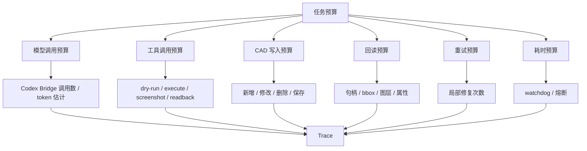

工具层至少记录：

| 字段 | 说明 |
| --- | --- |
| `budgetId` | 本轮任务预算编号 |
| `modelCallCount` | 由模型调用网关写入，工具层只引用 |
| `toolCallCount` | 工具网关累计 |
| `cadWriteCount` | CAD 写入批次数 |
| `readbackCount` | 回读次数 |
| `retryCount` | 重试和局部修复次数 |
| `elapsedMs` | 子动作耗时 |
| `circuitBreakerStatus` | 是否触发熔断 |

当前阶段不需要复杂计费，但需要资源 trace。否则未来无法判断失败来自模型浪费、工具不稳、CAD 后端慢，还是编排链路过长。

归属边界：

- 治理控制平面决定预算上限、熔断和是否升级人工复核。
- 模型调用网关记录模型调用和 token / 额度估计。
- 工具网关执行工具预算，并记录工具调用、写入、回读、截图、重试和耗时。
- 工具层不得自行扩大预算，只能请求治理控制平面重新授权。

---

## 6. CAD Adapter 分层

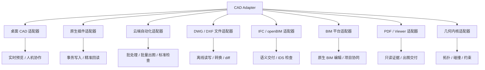

CAD Adapter 的目标不是抽象出一个“大而全 CAD API”，而是让不同后端吃同一类工程意图、输出同一类回读和证据。

阶段定位：

- CAD Adapter 不是独立大阶段，而是从轻量工具网关开始出现的接口抽象。
- 早期可以只有 `fake_cad`、`cad_cli` 或 `cad_mcp` 一个实现。
- 到完整工具网关阶段，CAD Adapter 应稳定为多后端统一入口。
- 插件、几何内核、云端 Automation 都应作为 Adapter 后端，而不是绕过 Adapter 的特殊通道。

---

## 7. 后端角色与分工

| 后端 | 主要价值 | 适合场景 | 不适合场景 |
| --- | --- | --- | --- |
| CADMCP / COM / 脚本 | 快速连接真实桌面 CAD | 早期真实 CAD 闭环、预览写入、简单回读 | 高并发、强事务、复杂局部修改 |
| AutoCAD 原生插件 | 稳定事务、精确回读、对象级修改 | 局部修复、批量属性、回滚、文档状态检查 | 自然语言理解、Agent 编排、规则晋升 |
| APS Automation | 云端批处理 CAD 引擎 | 批量出图、标准检查、DWG 处理、无人值守任务 | 实时交互式局部编辑 |
| DWG / DXF 文件适配器 | 离线解析、转换、diff | 无桌面 CAD 的文件级处理 | 需要原生 CAD 动态行为的操作 |
| 几何内核 | 确定性几何计算 | 拓扑、碰撞、约束、容差、面积体量 | 替代所有 CAD 语义或图纸表达 |
| IFC / openBIM 适配器 | 语义模型、交付标准 | IFC、IDS、构件属性、openBIM 审查 | 直接编辑专有 CAD 图面细节 |
| PDF / Viewer 适配器 | 可视化和交付证据 | 浏览、标注、截图、版本对比 | 回写真实 CAD 数据 |

---

## 8. 格式角色与回写策略

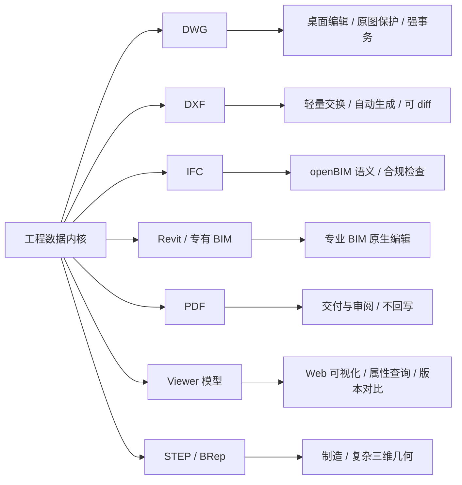

| 格式 | 可读 | 可写 | 可作为事实源 | 可作为交付物 | 回写策略 |
| --- | --- | --- | --- | --- | --- |
| DWG | 是 | 是 | 可作为图纸事实源 | 是 | 强事务、快照、回滚、人工提交 |
| DXF | 是 | 是 | 辅助事实源 | 可 | 适合交换、生成和 diff |
| IFC | 是 | 是 | 可作为 BIM 语义事实源 | 是 | 遵循 openBIM、IDS、属性集要求 |
| Revit / 专有 BIM | 是 | 视 API 而定 | 可作为专业模型事实源 | 是 | 通过原生 API 或云端平台处理 |
| PDF / 图片 | 是 | 否 | 只能作为视觉证据 | 是 | 不反向替代 CAD 回读 |
| Viewer 模型 | 是 | 否 | 辅助事实源 | 可 | 用于展示、属性查询、版本对比 |
| STEP / BRep | 是 | 是 | 几何事实源 | 可 | 适合制造与复杂三维几何 |

---

## 8A. CAD_PLAN 到 Tool Contract 的转换

工具层不直接消费自然语言，也不直接执行完整 CAD_PLAN。Agent Runtime 必须先把 CAD_PLAN 拆成一个或多个 Tool Contract。

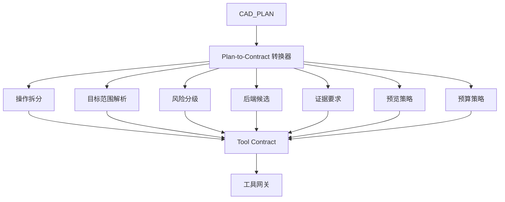

转换规则：

| CAD_PLAN 内容 | Tool Contract 字段 |
| --- | --- |
| 对象类型 / 语义对象 | `operation`、`adapter` 候选 |
| 坐标 / 尺寸 / 目标对象 | `targetScope` |
| Selection Contract | `targetScope.handles`、`targetScope.bbox`、`targetScope.documentId` |
| 依附关系 / 约束 | `preconditions`、`validationRules` |
| 允许误差 | `tolerance` |
| 回读标准 | `evidenceRequired`、`readbackRequired` |
| 保存 / 删除 / 导出 | `riskLevel`、`approvalRequired`、`saveAllowed` |
| 预览要求 | `previewStrategy` |

工具网关可以拒绝非法合同，但不负责把自然语言临场翻译成 CAD_PLAN。

---

## 9. Tool Contract 契约

Tool Contract 是工具层的入口合同。任何后端都只能执行合同内允许的内容。

```json
{
  "schemaVersion": "tool-contract/v1",
  "toolCallId": "string",
  "taskId": "string",
  "adapter": "cad_cli | cad_mcp | autocad_plugin | cloud_automation | dwg_file | geometry_kernel | ifc_bim",
  "operation": "read | create | update | delete_replace | export | audit",
  "previewStrategy": "preview_layer | shadow_dwg | memory_transaction | viewer_overlay",
  "targetScope": {
    "documentId": "string",
    "space": "model | paper",
    "layerAllowlist": [],
    "handles": [],
    "bbox": null
  },
  "riskLevel": "low | medium | high | blocked",
  "dryRunRequired": true,
  "approvalRequired": true,
  "saveAllowed": false,
  "rollbackRequired": true,
  "readbackRequired": true,
  "evidenceRequired": ["handles", "bbox", "props", "diff", "trace"]
}
```

轻量阶段最小 Tool Contract 可以只包含：

```json
{
  "schemaVersion": "tool-contract-lite/v1",
  "toolCallId": "string",
  "taskId": "string",
  "adapter": "cad_cli | cad_mcp | fake_cad",
  "operation": "read | create | audit",
  "targetScope": {
    "documentId": "string",
    "space": "model | paper",
    "layerAllowlist": []
  },
  "riskLevel": "low | medium | high | blocked",
  "saveAllowed": false,
  "readbackRequired": true,
  "evidenceRequired": ["log", "handles_or_ids", "bbox_or_count"]
}
```

轻量合同只能用于早期真实 CAD 闭环验证；一旦涉及删除、保存、跨文档、XRef、批量修改或正式交付，必须升级为完整 Tool Contract。

轻量 adapter 到完整 adapter 的迁移：

| 轻量 adapter | 完整阶段处理 | 说明 |
| --- | --- | --- |
| `fake_cad` | 只保留在 mock / test，不进入正式完整合同 | 用于验证合同、证据和评测，不证明真实 CAD 能力 |
| `cad_cli` | 可保留为 `cad_cli`，但必须有受限 Tool Card | 只适合低风险脚本、读操作、预览写入和早期验证 |
| `cad_mcp` | 升级为完整 `cad_mcp` adapter | 进入统一网关、权限、回读和证据体系 |

跨文档、XRef、图纸集和源/目标双文档操作不属于 `tool-contract/v1` 的单文档范围，应升级到 `tool-contract/v2`：

```json
{
  "schemaVersion": "tool-contract/v2",
  "documents": {
    "sourceDocuments": [],
    "targetDocuments": [],
    "xrefPolicy": "read_only | bind | detach | edit_source | blocked",
    "writeScope": "current_document | target_documents | xref_source | blocked",
    "impactAnalysisRequired": true
  }
}
```

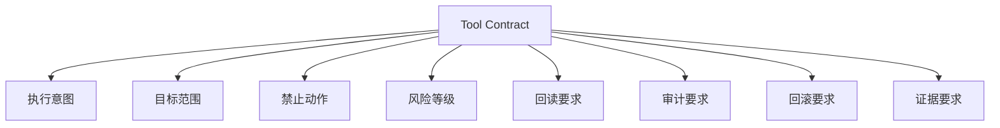

---

## 9A. Tool Card 与 Agent Card 对齐

Agent Card 描述“谁能做什么”，Tool Card 描述“哪个后端能安全执行什么”。工具层需要向 Agent Runtime 暴露稳定能力卡，而不是让 Agent 记住某个插件或脚本的细节。

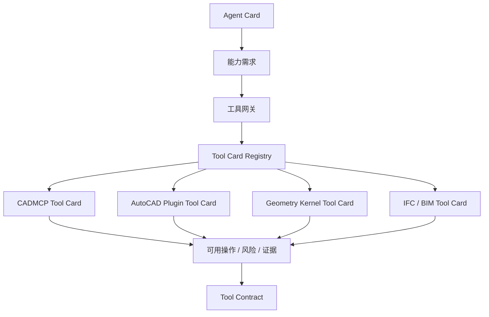

Tool Card 建议字段：

| 字段 | 说明 |
| --- | --- |
| `toolId` | 工具或后端稳定标识 |
| `adapterType` | CADMCP、插件、几何内核、云端自动化等 |
| `operations` | read、create、update、delete_replace、audit、export |
| `riskPolicy` | 哪些操作需要确认、禁止或只读 |
| `evidenceCapabilities` | 能返回 handles、bbox、props、diff、snapshot 的能力 |
| `rollbackCapabilities` | 支持事务回滚、局部撤销还是只支持重画 |
| `resourceProfile` | 平均耗时、调用成本、并发限制 |
| `evalProfile` | 最近通过率、失败类型、漂移状态 |

这样可以让 Agent 分发从“凭 Prompt 判断工具”升级为“基于能力卡和实时健康状态选择工具”。

---

## 9B. Tool Contract 与证据包版本策略

Tool Contract、Tool Card、回读结果和证据包都必须有版本。工具层不能假设所有后端永远理解同一套字段。

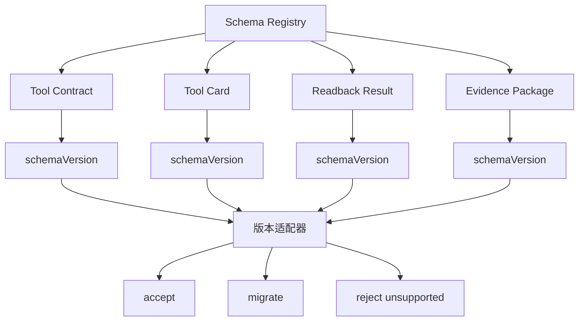

规则：

- 所有工具层结构化对象必须包含 `schemaVersion`。
- 工具网关可以兼容读取旧版本，但不得静默改变历史证据。
- 破坏性字段变更必须配 migration、回归评测和版本说明。
- 证据账本保留原始版本，评测系统可使用适配后版本做横向比较。
- `tool-contract/v1` 默认单文档；多文档、XRef、图纸集发布和跨文件复制统一进入 `tool-contract/v2`，不得把这些字段临时塞进 `targetScope`。

---

## 10. CADMCP 阶段定位

CADMCP 或类似桌面 CAD 自动化方式的价值是 **尽早连接真实 CAD 环境**。它适合早期把 Agent 的结构化计划落到真实 CAD 中，并获取第一批真实回读证据。

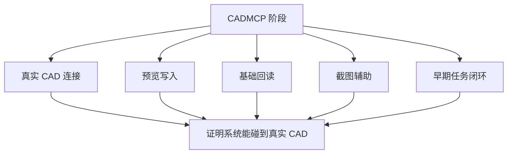

CADMCP 阶段不应承担：

- 强事务保证。
- 大规模批处理。
- 复杂局部修改。
- 企业级部署。
- 多后端一致性评测。

当 CADMCP 能稳定完成计划、写入、回读和审计后，就应尽快把它纳入工具网关，而不是让上层逻辑继续直接依赖 CADMCP 的具体命令形态。

---

## 11. 原生插件的正确定位

原生插件是桌面 CAD 的 **高可靠事务型执行后端**，不是智能体，也不是新中枢。

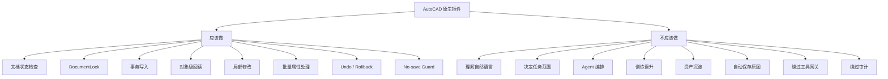

一句话：

> 插件解决稳定性、事务性和回读粒度，不解决智能、治理和审计。

---

## 12. 插件 RPC 运行模型

外部 Agent 不应直接执行 AutoCAD API。更稳妥的方式是让 AutoCAD 内部插件暴露受控 RPC 能力，由工具网关统一调用。


插件 RPC 必须满足：

- 本地安全通道。
- 请求签名或会话令牌。
- 每次调用绑定 `taskId`、`toolCallId` 和 `traceId`。
- 所有写入绑定文档、空间、图层、handle 或 bbox 范围。
- 插件返回结构化结果，不让上层猜测 AutoCAD 状态。
- 插件错误返回 `blockedReason`、`retryable`、`rollbackStatus`。

---

## 13. 事务、锁与回滚机制

真实 CAD 写入必须像数据库事务一样处理。

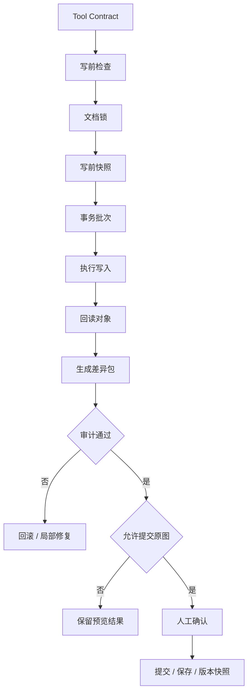

每个事务批次必须记录：

- 文档状态和路径。
- 写入前保存状态。
- 目标空间和图层。
- 输入 Tool Contract。
- 创建、修改、删除对象清单。
- before / after diff。
- 回读结果。
- 回滚计划。
- 人工授权记录。

---

## 13A. 网关故障、CAD 崩溃与并发锁

工具网关、CAD 会话和插件都可能失败。失败时默认安全优先。

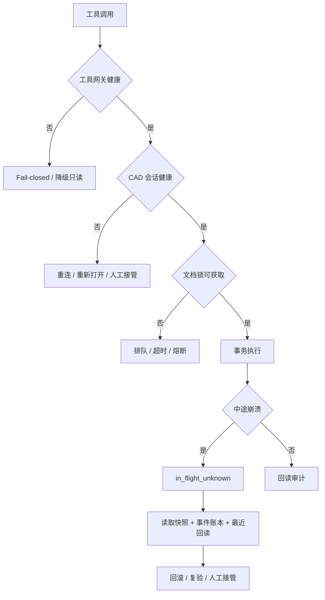

规则：

- 工具网关不可用时，默认阻断写入、删除、保存、导出；只允许只读状态查询和人工接管。
- CAD 会话崩溃后，任务不得继续写入，必须进入 `in_flight_unknown`。
- 同一 DWG 的写入默认串行，工具网关负责排队；只读回读和截图可在不读取半成品状态的前提下并行。
- 插件必须返回 `retryable`、`rollbackStatus`、`documentState` 和 `blockedReason`，不能只返回普通异常文本。

---

## 13B. 预览隔离与 no-save 语义

预览可以有多种实现，必须在 Tool Contract 中声明。

| 预览策略 | 说明 | 回滚方式 |
| --- | --- | --- |
| `preview_layer` | 当前 DWG 内真实预览图层 | 删除/隐藏预览批次 |
| `shadow_dwg` | 临时 DWG 或影子图纸 | 丢弃临时文件或 diff |
| `memory_transaction` | 插件内未提交事务 | 事务回滚 |
| `viewer_overlay` | Viewer 叠加层 | 清除 overlay |

并发边界：

- `preview_layer` 仍写入当前 DWG 数据库，即使图层不同，也默认按文档锁串行。
- `shadow_dwg`、`viewer_overlay`、离线 diff 和只读回读可以并行，但不得读取或展示未完成写入的半成品状态。

`no_save_guard` 语义：

- 默认硬阻断所有未授权保存。
- 人工确认后，上层可以调用受控 `commit_save` 或 `save_copy`。
- `commit_save` 必须绑定任务、文档、对象范围、版本快照和证据包。
- 插件不应响应任意保存命令，也不应把保存隐藏在普通写入命令里。

---

## 14. 原生插件最小能力集

第一版插件不追求完整 CAD 平台能力，只验证高价值薄能力。

```text
health
version
capabilities
active_document
document_state
apply_preview_batch
readback_handles
readback_bbox
readback_entity_props
guarded_update
guarded_delete_replace
transaction_undo_group
rollback_batch
no_save_guard
capture_viewport
```

| 能力 | 目的 |
| --- | --- |
| `health` / `version` | 让工具网关知道插件是否可用 |
| `capabilities` | 暴露插件支持的实体和操作 |
| `active_document` | 明确当前文档身份和状态 |
| `apply_preview_batch` | 在预览空间内执行受控写入 |
| `readback_*` | 回读句柄、bbox、属性、图层、类型 |
| `guarded_update` | 按目标范围局部修改 |
| `guarded_delete_replace` | 删除替换必须绑定范围和原因 |
| `rollback_batch` | 失败时回滚写入批次 |
| `no_save_guard` | 默认阻断当前业务图纸自动保存 |
| `capture_viewport` | 可选但推荐；在同一 CAD 上下文中捕获视口证据 |

---

## 15. 原生插件引入门槛

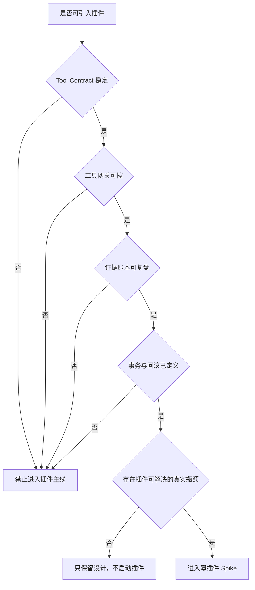

准入门槛：

- 已有统一 CAD Adapter，插件只是 backend。
- Tool Contract 能表达目标文档、目标对象、图层、操作类型、禁止动作和回读要求。
- 所有写入能生成证据包。
- 默认不保存当前业务图纸。
- 存在 CADMCP、COM、脚本或桌面自动化无法稳定解决的重复瓶颈。
- 插件 Spike 能在小范围预览写入中稳定完成事务、回读和失败回滚。

---

## 16. 插件禁区

插件越强，越要边界清晰。

| 禁区 | 原因 |
| --- | --- |
| 自然语言理解 | 这是 Agent Runtime 和规划层职责 |
| 大模型调用 | 插件应保持确定性执行后端，不能直连 Codex Bridge 或其它 LLM Provider |
| 内置 Prompt / 智能提示 | Prompt 必须由 Prompt Registry 和模型调用网关统一治理 |
| 任务分发 | 防止 CAD 后端成为隐形编排器 |
| 训练晋升 | 防止执行工具污染学习系统 |
| 资产沉淀 | 资产入库需要治理、来源和复用证据 |
| 自动保存原图 | 保存属于高风险提交动作 |
| 全图删除 | 必须绑定范围、句柄、bbox 和授权 |
| 绕过工具网关 | 会破坏权限、审计和 trace |
| 以 AutoCAD 成功代替系统完成 | 完成必须由上层审计判断 |

---

## 17. 桌面插件与云端 Automation 分工

桌面插件和云端自动化不是二选一。

```mermaid
flowchart TB
  A["桌面 AutoCAD 插件"] --> B["当前图纸交互"]
  A --> C["实时预览"]
  A --> D["事务写入"]
  A --> E["局部修复"]
  A --> F["精确回读"]

  G["云端 Automation"] --> H["批量处理"]
  G --> I["批量出图"]
  G --> J["批量标准检查"]
  G --> K["文件转换"]
  G --> L["企业任务队列"]
```

推荐分工：

- 桌面插件：处理当前用户正在看的图纸，强调交互、局部、事务、回读。
- 云端 Automation：处理批量 DWG、标准检查、出图、转换和无人值守任务。
- 文件适配器：处理无 CAD 会话的解析、diff、轻量生成。
- 几何内核：处理确定性几何判断。

---

## 18. 几何内核与中立工程数据内核阶段

长期目标不是做一个越来越大的插件，而是让系统拥有自己的工程状态。

```mermaid
flowchart TB
  A["中立工程数据内核"] --> B["任务图"]
  A --> C["几何图"]
  A --> D["语义图"]
  A --> E["图纸图"]
  A --> F["版本图"]
  A --> G["证据图"]

  C --> H["几何内核"]
  H --> H1["拓扑"]
  H --> H2["碰撞"]
  H --> H3["约束"]
  H --> H4["容差"]
  H --> H5["面积 / 体量"]

  A --> I["CAD / BIM 后端同步"]
```

进入该阶段的信号：

- 系统需要跨 CAD 后端保持一致对象关系。
- 几何审计已不能只依赖 CAD 回读。
- 需要做复杂约束、碰撞、空间推理或多方案比较。
- 需要把 CAD 作为输出和同步后端，而不是唯一状态源。

定位澄清：

- 早期可以先有轻量工程数据索引：任务对象、回读对象、证据索引、版本引用。
- 完整工程数据内核在原生插件、几何内核和多后端逐步成熟后增强。
- 因此它不是“插件之后才开始”，而是“早期轻量存在，后期成为中心事实源”。

---

## 18A. 回读结果、Diff Engine 与审计输入

后端回读只说明“实际是什么”，审计需要知道“实际和预期差多少”。因此工具层必须产出或协助产出差异包。

```mermaid
flowchart TB
  A["Tool Contract / 预期"] --> D["Diff Engine"]
  B["后端回读"] --> D
  C["几何内核"] --> D

  B --> B1["handles"]
  B --> B2["bbox"]
  B --> B3["props"]
  B --> B4["text"]
  B --> B5["layer/style"]

  C --> C1["碰撞"]
  C --> C2["闭合"]
  C --> C3["间距"]
  C --> C4["容差"]

  D --> E["Diff Package"]
  E --> F["审计器"]
  F --> G["通过 / 返工 / 人审"]
```

Diff Package 建议字段：

```json
{
  "schemaVersion": "diff-package/v1",
  "toolCallId": "...",
  "comparisonStatus": "complete | partial | unavailable",
  "unavailableReasons": [],
  "readbackCompleteness": {},
  "missingObjects": [],
  "extraObjects": [],
  "geometryDelta": [],
  "styleDelta": [],
  "textDelta": [],
  "collisionDelta": [],
  "toleranceResult": {}
}
```

审计规则：

- `complete` 才能进入自动通过判断。
- `partial` 表示部分回读缺失或 CAD 会话状态不完整，默认进入局部复验或人工复核。
- `unavailable` 表示无法建立可信 diff，不能凭模型判断交付完成。

---

## 19. 证据账本与 Trace

工具层每次调用都必须可复盘。

```mermaid
flowchart TB
  A["工具调用"] --> B["Tool Contract"]
  A --> C["权限记录"]
  A --> D["后端执行记录"]
  A --> E["回读记录"]
  A --> F["差异包"]
  A --> G["审计结果"]
  A --> H["Trace"]

  B --> I["证据包"]
  C --> I
  D --> I
  E --> I
  F --> I
  G --> I
  H --> I

  I --> J["回放"]
  I --> K["评测"]
  I --> L["交付归档"]
```

证据包最小字段：

```json
{
  "taskId": "...",
  "toolCallId": "...",
  "adapter": "...",
  "operation": "...",
  "toolVersion": "...",
  "approvalRecord": [],
  "createdHandles": [],
  "modifiedHandles": [],
  "deletedHandles": [],
  "readback": {},
  "beforeAfterDiff": {},
  "rollbackStatus": "...",
  "auditResult": {},
  "traceId": "..."
}
```

---

## 19A. 工具事件流与可回放执行

工具层 trace 不应只是最终结果日志，还应记录关键事件顺序。事件流可以支撑失败恢复、后端漂移定位、多 Agent 资源归因和评测回放。

```mermaid
sequenceDiagram
  participant A as Agent Runtime
  participant G as 工具网关
  participant T as CAD Adapter
  participant C as CAD 后端
  participant L as 事件账本

  A->>G: Tool Contract
  G->>L: tool.requested
  G->>G: schema / policy / budget
  G->>L: tool.authorized
  G->>T: dry-run / execute
  T->>L: adapter.started
  T->>C: CAD operation
  C-->>T: handles / props / diff
  T->>L: adapter.completed
  T-->>G: structured result
  G->>L: readback.recorded
  G->>L: audit.completed
  G-->>A: evidence package
```

建议事件类型：

| 事件 | 用途 |
| --- | --- |
| `tool.requested` | 记录 Agent 请求和 Tool Contract 摘要 |
| `tool.authorized` | 记录策略、权限和人工确认 |
| `budget.checked` | 记录模型、工具、重试、耗时预算 |
| `adapter.started` | 记录后端、版本、文档状态 |
| `adapter.completed` | 记录执行结果、耗时、异常 |
| `readback.recorded` | 记录 handles、bbox、props、diff |
| `audit.completed` | 记录审计结论和失败原因 |
| `rollback.applied` | 记录回滚或局部修复 |

---

## 20. 开发者路线

```mermaid
flowchart LR
  A["Codex Bridge LLM"] --> B["mock backend"]
  B --> C["fake CAD driver"]
  C --> D["CADMCP backend"]
  D --> E["CAD Adapter"]
  E --> F["plugin backend"]
  E --> G["geometry backend"]
  E --> H["cloud automation backend"]
  F --> I["多后端一致性评测"]
  G --> I
  H --> I
```

开发者应按顺序推进：

1. 先用 `Codex Bridge` 调用 Codex 当前推荐高推理模型，例如 `gpt-5.5`，证明 Agent 理解、分发、复审和结构化输出链路。
2. 再用 mock / fake 后端证明 Tool Contract 和证据格式。
3. 再接 CADMCP 证明真实 CAD 闭环。
4. 再抽象 CAD Adapter，避免上层绑定某个后端。
5. 再做薄插件 Spike。
6. 再做几何内核和云端后端。
7. 最后做多后端一致性和企业发布。

---

## 21. 使用者体验

用户不关心底层用了 CADMCP、插件还是云端 Automation。用户关心：

- 任务是否被正确理解。
- 系统是否展示将要修改哪里。
- 高风险动作是否请求确认。
- 结果是否能看见、能回读、能审计。
- 失败是否能解释和局部修复。
- 是否保护原图和版本。

```mermaid
flowchart TB
  A["用户输入"] --> B["任务时间线"]
  B --> C["执行预案"]
  C --> D["风险确认"]
  D --> E["CAD 预览"]
  E --> F["回读证据"]
  F --> G{"是否通过"}
  G -->|否| H["解释失败 / 局部修复"]
  G -->|是| I["交付 / 归档"]
```

---

## 22. 阶段验收指标

| 指标 | 说明 |
| --- | --- |
| 工具调用成功率 | 后端是否稳定执行工具合同 |
| 回读完整率 | handles、bbox、图层、类型、属性是否完整 |
| 事务回滚成功率 | 失败后是否能撤销写入批次 |
| 误写入率 | 是否改到目标范围之外 |
| no-save 命中率 | 是否正确阻断未授权保存 |
| 局部修复成功率 | 是否只修错处并复验通过 |
| 多后端一致性 | 同一任务不同后端结果是否一致 |
| CAD Worker 崩溃率 | 桌面或云端 CAD 后端稳定性 |
| 人工确认命中率 | 高风险动作是否正确触发确认 |
| 证据完整率 | 是否能完整回放任务 |

---

## 22A. 后端连续评测与漂移监控

工具后端会变化：CAD 版本升级、插件版本变化、CADMCP 行为变化、云端 Automation 引擎升级、图纸模板变化，都可能导致同一 Tool Contract 产生不同结果。因此工具层必须有连续评测。

```mermaid
flowchart TB
  A["Tool Contract 回归集"] --> B["mock backend"]
  A --> C["CADMCP backend"]
  A --> D["plugin backend"]
  A --> E["geometry backend"]
  A --> F["cloud automation backend"]

  B --> G["结果归一化"]
  C --> G
  D --> G
  E --> G
  F --> G

  G --> H["一致性比较"]
  H --> I["通过率 / 耗时 / 差异"]
  I --> J["7 日滚动指标"]
  J --> K{"是否漂移"}
  K -->|是| L["冻结后端晋升 / 回滚 / 降级"]
  K -->|否| M["继续使用"]
```

需要监控：

| 指标 | 说明 |
| --- | --- |
| `contract_pass_rate` | 同一合同在后端上的通过率 |
| `readback_diff_rate` | 回读字段、bbox、属性差异比例 |
| `latency_p95` | 后端调用耗时 |
| `rollback_success_rate` | 回滚是否可靠 |
| `crash_or_timeout_rate` | CAD 会话或 Worker 是否稳定 |
| `manual_override_rate` | 人工接管比例是否升高 |

当漂移出现时，不应让模型用更长 Prompt 解释问题，而应先降级或冻结后端，再检查工具版本、CAD 版本、模板、权限和回读差异。

---

## 23. 主要风险与控制

| 风险 | 控制方式 |
| --- | --- |
| 后端绕过 Agent 规划 | 所有调用必须经工具网关 |
| 插件误保存原图 | no-save guard、人工授权、版本快照 |
| 插件误删对象 | handle / bbox / layer 范围绑定 |
| CAD 会话状态不可控 | health、active_document、document_state |
| 版本兼容失败 | 插件版本矩阵和能力报告 |
| 工具参数被注入污染 | schema 校验、权限令牌、危险命令拦截 |
| 审计证据不足 | 强制回读、diff、trace、截图辅助 |
| 云端数据外发 | 项目级授权、数据脱敏、出网审批 |
| 学习污染 | 工具证据不能自动晋升规则 |

---

## 24. 技术可实现依据

当前公开技术已经能支撑这条路线：

- [Autodesk APS Automation API](https://aps.autodesk.com/automation-apis)：可在云端运行 AutoCAD、Revit、Inventor、Fusion 等自动化任务，支持 add-ins、scripts 和 AutoLISP 处理 DWG。
- [AutoCAD .NET TransactionManager](https://help.autodesk.com/cloudhelp/2022/ENU/OARX-ManagedRefGuide/files/OARX-ManagedRefGuide-Autodesk_AutoCAD_DatabaseServices_TransactionManager.html)：AutoCAD .NET 事务机制可管理事务开始、提交和终止。
- [AutoCAD .NET Transactions](https://help.autodesk.com/view/ACDLT/2026/ENU/?caas=caas%2Fdocumentation%2FACD%2F2014%2FENU%2Ffiles%2FGUID-50FD6118-B2D1-4313-A7D6-830794DFDEFA-htm.html)：事务可用于访问和创建对象，未提交时变更会回滚。
- [AutoCAD 2026 in APS Automation](https://aps.autodesk.com/blog/autocad-2026-watt-now-available-design-automation-api)：AutoCAD 2026 引擎已加入 APS Automation，可用于云端自动化工作流。
- [Model Context Protocol](https://modelcontextprotocol.io/specification)：MCP 最新规范提供资源、提示、工具、进度、取消、日志和安全原则。
- [MCP Authorization](https://modelcontextprotocol.io/specification/2025-11-25/basic/authorization)：MCP 授权规范强调最小权限、资源参数、令牌受众校验和禁止令牌透传。
- [Codex Models](https://developers.openai.com/codex/models)：Codex 当前推荐从 `gpt-5.5` 开始，适合复杂编码、计算机使用、知识工作和研究工作流。
- [Codex App Server](https://developers.openai.com/codex/app-server)：提供 JSON-RPC 程序化控制入口，可支撑开发态 `Codex Bridge`。
- [Codex SDK](https://developers.openai.com/codex/sdk)：支持在应用、CI/CD 或内部工具中程序化控制 Codex 线程。
- [Codex Non-interactive Mode](https://developers.openai.com/codex/noninteractive)：`codex exec` 可作为脚本化开发态调用方式。
- [OpenAI Agents SDK](https://developers.openai.com/api/docs/guides/agents)：适合构建拥有工具、协作、状态和编排能力的 Agent 应用。
- [OpenAI Tools](https://developers.openai.com/api/docs/guides/tools)：支持函数调用、远程 MCP、文件搜索、工具搜索、计算机使用等工具形态。
- [Coordination as an Architectural Layer](https://arxiv.org/abs/2605.03310)：提示多 Agent 系统需要把协调层作为独立架构关注点。
- [Solace Agent Mesh Architecture](https://solacelabs.github.io/solace-agent-mesh/docs/documentation/getting-started/architecture/)：可作为事件驱动 Agent Mesh 和异步协作参考。
- [A2A Specification](https://google-a2a.github.io/A2A/specification/)：可作为 Agent Card、能力发现和跨 Agent 通信预留参考。
- [ToolCAD](https://arxiv.org/abs/2604.07960)：展示 CAD 工具使用 Agent 的强化学习训练路径。
- [ArtiCAD](https://arxiv.org/abs/2604.10992)：展示装配体 CAD 生成中连接器和关节关系建模思路。
- [COSMO-Agent](https://arxiv.org/abs/2604.05547)：展示 CAD-CAE 闭环优化和仿真反馈方向。
- [IfcOpenShell](https://docs.ifcopenshell.org/)：可作为 IFC / openBIM 后端的解析、几何和校验基础。
- [buildingSMART IDS](https://www.buildingsmart.org/standards/bsi-standards/information-delivery-specification-ids/)：IDS 可表达 IFC 信息交付要求，适合 BIM 合规检查。
- [OpenTelemetry](https://opentelemetry.io/docs/)：适合做跨服务 trace、指标、日志和告警。

---

## 25. 阶段裁决口径

```mermaid
flowchart TB
  A["阶段裁决"] --> B{"Tool Contract 是否稳定"}
  B -->|否| C["停在工具治理底座"]
  B -->|是| D{"真实 CAD 闭环是否稳定"}
  D -->|否| E["继续桌面 CAD 自动化"]
  D -->|是| F{"工具网关是否完整"}
  F -->|否| G["进入工具网关阶段"]
  F -->|是| H{"是否需要事务型桌面后端"}
  H -->|否| I["保留插件设计，不启动主线"]
  H -->|是| J["进入薄插件 Spike"]
  J --> K{"插件是否通过事务与回读验收"}
  K -->|否| L["回退到 Adapter 阶段"]
  K -->|是| M["进入多后端演进"]
```

一句话裁决：

> 先统一工具合同，再引入插件；先保证证据闭环，再扩大写入能力；先把 CAD 当后端，再逐步建立系统自己的工程数据中心。

---

## 26. 最终判断

```mermaid
flowchart TB
  A["超级 CAD Agent 工具层"] --> B["不是 CADMCP 到插件的简单替换"]
  A --> C["不是让插件变成智能中枢"]
  A --> D["不是让模型直接执行 CAD 命令"]

  A --> E["是受工具网关治理的多后端体系"]
  E --> F["CADMCP 连接早期真实 CAD"]
  E --> G["原生插件承担事务与回读"]
  E --> H["几何内核承担确定性计算"]
  E --> I["云端自动化承担批处理"]
  E --> J["IFC / BIM 后端承担语义交付"]
  E --> K["证据账本证明所有结果"]
```

最终目标不是拥有一个更强的 CAD 插件，而是拥有一个可靠、可治理、可替换、可扩展的 CAD / BIM 工具层。这个工具层让超级 CAD Agent 可以安全地连接真实 CAD、稳定地修改图纸、清楚地证明结果，并逐步走向多后端工程交付系统。
