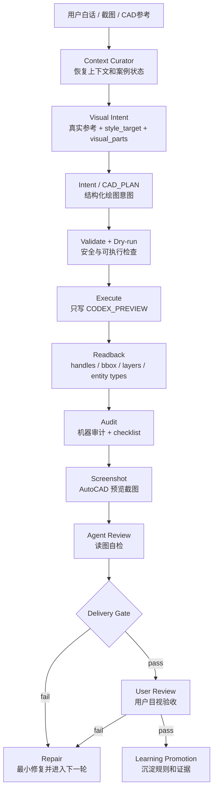

# CAD Agent Core Lab

CAD Agent Core Lab 是一个面向多 Agent 的 CAD 绘图训练底座。它不把一句白话直接丢给 AutoCAD 硬画，而是把“听懂需求、识别真实参考、生成结构化意图、落到 CAD、机器审计、截图自检、用户验收”拆成可审计、可训练、可迁移的链路。

当前阶段是 **Visual-First Agent 训练期**：先让系统看懂真实 CAD 参考，再生成可执行的绘图约束和预览结果。每一轮失败都会留下证据、归因和修正入口，让多个 Agent 在大量真实测试任务中逐步变聪明。

## 它要解决什么

- 让用户用自然语言提出 CAD 绘图目标，而不是手写脚本。
- 让 Agent 先形成 `CAD_PLAN` 或结构化绘图意图，再执行真实 CAD。
- 让 CAD 输出默认写入 `CODEX_PREVIEW`，保护用户原图和正式图层。
- 让每次落图都有 handles、bbox、图层、实体类型、截图和审计证据。
- 让失败 round 能继续自修，直到用户目视确认 pass。

理想状态下，用户只说“照这个真实参考，在旁边生成同款两座沙发，只写预览层，不保存 DWG”，系统就能完成从理解、规划、执行、核验到交付的闭环。这个目标仍在训练中，但仓库已经把底座、边界和证据链铺好。

## 端到端链路



## 架构分层

- `core/`：通用能力层，负责 CAD IO、执行、安全、schema、审计、训练 gate 和能力登记。
- `agents/pipeline/`：全局多 Agent 流水线，定义理解、视觉约束、意图、执行、审计、修复、交付、学习晋升等角色。
- `agents/<scenario>/`：轻量场景 Agent，保存住宅、展陈、医疗等场景偏好和词汇，不复制 Core 能力。
- `libraries/`：共享样式、图层、尺寸、材料、块库和可复用资源。
- `projects/`：真实或脱敏训练案例，每个案例保存 brief、feedback、expected、runs 和必要脚本。
- `scripts/`：验证、gate、coverage、CAD smoke、截图和迁移检查入口。
- `tests/`：单元测试、契约测试、训练 gate 测试和回归测试。
- `docs/`：架构、训练、治理、状态、交接和历史记录。

## 多 Agent 角色

- `pipeline_orchestrator`：调度链路，不直接落图。
- `pipeline_context_curator`：读取规则、计划、案例状态和历史反馈。
- `pipeline_visual_intent`：从真实参考产出 `style_target`、`visual_parts` 和视觉约束。
- `pipeline_intent`：把白话和视觉约束转成结构化绘图意图。
- `pipeline_execute`：只执行已通过 gate 的绘图任务。
- `pipeline_audit`：检查几何、语义、图层和交付证据。
- `pipeline_repair`：基于失败证据做最小修复。
- `pipeline_delivery`：截图、Agent 自检和交付阻断。
- `pipeline_learning_promoter`：把通过或失败的经验沉淀到规则和案例资料。

## Visual-First 训练

Visual-First 的核心要求是：**先看真实参考，再画 CAD**。对 reference-match 任务，`style_target` 不能是凭空生成的示意图，必须来自 AutoCAD 截图裁剪、用户提供参考图或真实 CAD 参考块。

典型 round 产物：

```text
projects/<case_id>/
  brief.md
  feedback.md
  expected/audit_checklist.json
  expected/style_target_reference_crop.png
  runs/roundN_visual_parts.json
  runs/roundN_intent.json
  runs/roundN_execution_summary.json
  runs/roundN_vector_readback.json
  runs/roundN_geometry_audit.json
  runs/roundN_preview.png
  runs/roundN_agent_review.json
  runs/roundN_style_compare.md
```

## 当前主训案例

当前第一条闭环案例是 `projects/residential_sofa_2seat_20260528/`。round12 已完成真实 CAD 预览、机器审计、截图和 Agent 自检，并把 `style_target` 修正为真实 AutoCAD 截图 crop。用户尚未确认视觉 pass，所以第一闭环还没有结束；后续应继续 round13、round14，直到用户目视通过。

## 安全边界

- 默认只写 `CODEX_PREVIEW`。
- 默认不保存当前 DWG。
- 不覆盖原始 DWG。
- 不修改正式图层，不删除用户原有实体。
- 截图只能作为视觉辅助，不能替代 geometry/readback 证据。
- 对外声称 CAD 完成前，必须有结构化意图、validate、dry-run、真实输出、created handles 回读、审计和必要截图。

## 换电脑继续

仓库按可迁移开发包设计。新电脑 clone 后，需要恢复 AutoCAD / CAD-MCP / Python 环境，打开对应案例 DWG，再读取 `CORE_CONTEXT_BRIEF.md` 和案例 `feedback.md`，从最后一个 round 继续。训练证据会随仓库提交；`.codegraph/`、Understand Anything 生成图、`output/`、缓存、CAD 锁文件和备份文件不会提交。

## 常用命令

```powershell
$env:PYTHONIOENCODING='utf-8'
[Console]::OutputEncoding = [System.Text.Encoding]::UTF8
$py = "$env:USERPROFILE\.codex\mcp\CAD-MCP\.venv\Scripts\python.exe"
& $py -m unittest discover -s tests
& $py scripts\run_doc_governance_audit.py --fail-on-findings
& $py scripts\run_training_round_gate.py --case-dir projects\residential_sofa_2seat_20260528 --round round12 --stage visual_contract --fail-on-blocked
& $py scripts\run_training_round_gate.py --case-dir projects\residential_sofa_2seat_20260528 --round round12 --stage delivery --fail-on-blocked
```

## 关键入口

- `AGENTS.md`：Agent 行为规则和 CAD 安全边界。
- `CORE_CONTEXT_BRIEF.md`：短上下文入口，新会话优先读。
- `CORE_RESTRUCTURE_PLAN.md`：唯一 PlanMD / 主计划。
- `CORE_STATUS.md`：能力状态和表 C 口径。
- `docs/training/README.md`：训练期主链路。
- `docs/training/global-agent-pipeline.md`：多 Agent 流水线说明。
- `docs/planning/任务清单.md`：当前训练 backlog 和 next。
- `docs/status/current.md`：当前状态摘要。
- `docs/status/issues.md`：失败教训和活跃风险。
- `docs/handoffs/current.md`：最近包交接。
