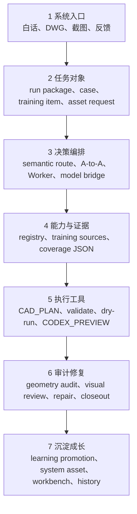
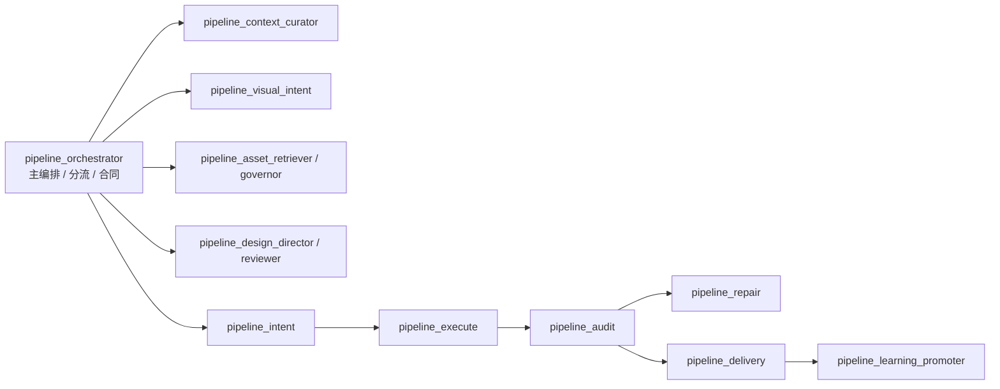
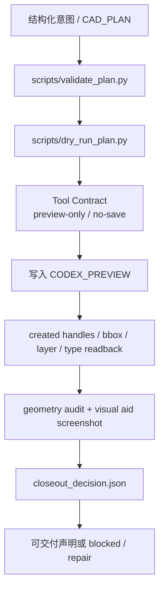
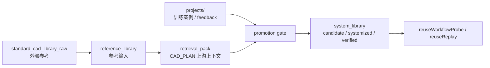
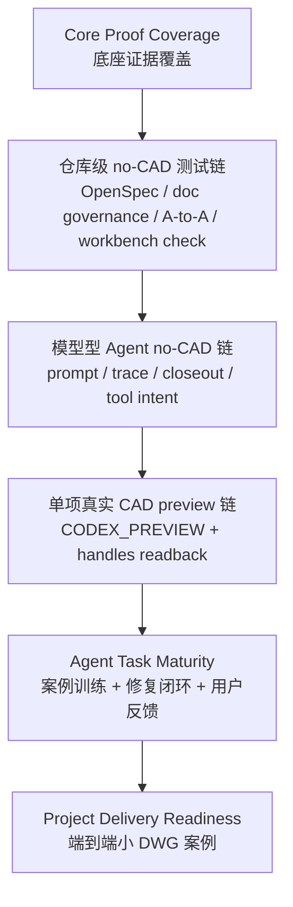

# CAD Agent Core Lab

CAD Agent Core Lab 是一个可迁移的 CAD Agent 开发包。它训练的不是“把一句话直接丢给 AutoCAD 的脚本”，而是一个能把极端白话需求拆成任务、责任、证据、执行和修复闭环的电子设计师系统。

当前主线是 **ARCH-CONVERGENCE-01 架构归并画布**：把旧表 A/B/C、能力证明、RCAD、训练地图、资产、多 Agent、模型桥、Worker、截图和工作台，统一归入一条任务生命周期。旧表 C 只保留为 `Core Proof Coverage`，不代表 `Agent Task Maturity` 或 `Project Delivery Readiness`。

最新训练底座补强是 `ADAPTIVE-CAPABILITY-GROWTH-TRAINING-01`：系统现在能把“某项能力训练过但输出又退回烟测”的问题拆成 repo-local 能力画像、`growth_replay` 路由、表达回归门禁和 closeout claim gate。它是 focused / formal 复训的安全底座，不等于恢复整批训练、真实 CAD 几何验证、Worker 部署或表 C 提升。

主 Agent 认知提升还有更硬的一条：任何声称“主 Agent 变聪明”的改动，都必须证明它改变了真实任务里的判断；否则只是机制建设。

## 一眼看懂

```mermaid
flowchart LR
  U["用户白话 / DWG / 截图 / 反馈"] --> C["request context / run package"]
  C --> R["semantic route"]
  R --> O["Orchestrator Host / A-to-A contract"]
  O --> G["required agents + hard gates"]
  G --> P["CAD_PLAN / asset workflow / training route"]
  P --> V["validate / dry-run / tool contract"]
  V --> E["CODEX_PREVIEW / 系统资产 DWG"]
  E --> A["created handles readback / audit / visual aid"]
  A --> D["Reviewer Host / delivery claims"]
  D --> S["learning promotion / sync / archive"]
```

这条链路有两个硬边界：白话不能直接落 CAD；截图、dry-run、模型通过、工作台页面都不能替代真实 CAD readback。执行结果必须回到 `verification / closeout` 再决定交付、修复或沉淀。

## 七层生命周期

每个模块都必须说明自己在哪一层、输入是什么、输出给谁、不能替代哪一层。架构干净不等于训练成熟；训练成熟也不等于真实项目交付准备完毕。

## Agent 协作图

主 Agent 只负责识别任务、生成 `a_to_a_task_contract`、动态加派已登记 Agent、收集 hard gate 输出并阻断虚假完成。模型型 Agent 可以判断、分发、复审和建议修复，但不能直接写 CAD、保存 DWG、删除实体、修改正式图层或替代 readback。

## CAD 执行证据链

正式 CAD 口吻必须靠同一条链闭合。fake driver、no-CAD draft、截图非空或模型 pass 只能作为预检 / 视觉辅助，不能冒充真实 CAD 几何证明。

## 资产与训练关系

`reference_library` 和 raw 图库只说明参考来源；`system_library` 才承载系统自产资产。资产要称为 `verified`，必须有 sourceSpec、native visible evidence、reuseWorkflowProbe 或 reuseReplay，不能只靠截图或 metadata-only。

## 成熟度与测试链

当前判断：系统架构已经干净，可以进入测试性链；不建议直接恢复整批正式训练或真实项目交付。真实 AutoCAD 未连接时，可以跑 no-CAD 治理链，但不能声称真实 CAD preview 链已通过。

## 目录分层

| 路径 | 责任 |
| --- | --- |
| `core/` | CAD IO、执行、安全、schema、审计、训练 gate、能力登记等通用底座 |
| `agents/cad_designer/` | CAD Designer Agent 成长路径、基础课程、证据边界 |
| `agents/pipeline/` | 全局多 Agent 流水线、Prompt Pack、A-to-A 责任 |
| `agents/<scenario>/` | 住宅、商业、展陈等轻量场景偏好，不复制 Core |
| `libraries/` | 共享样式、系统资产、reference / system library |
| `projects/` | 训练案例、brief、feedback、runs、expected |
| `scripts/` | validate、dry-run、coverage、工作台同步、审计入口 |
| `output/` | 机器证据和派生快照；不是长期计划入口 |
| `docs/` | 架构、训练、治理、状态、交接和历史 |

## 安全边界

- 默认只写 `CODEX_PREVIEW`，默认不保存当前业务 DWG。
- 不覆盖原始 DWG，不修改正式图层，不删除未被证据锁定的对象。
- 局部错误优先按 handle / bbox 做原位 `repair_plan`，不默认整块重画。
- 系统资产沉淀默认写系统资产 DWG，不授权保存当前业务 DWG。
- 工作台 HTML 和 `capability-map-data.js` 只是派生显示器，不是训练事实源。

## 关键入口

- `AGENTS.md`：仓库级 Agent 规则和 CAD 安全边界。
- `CORE_CONTEXT_BRIEF.md`：新会话短上下文入口。
- `CORE_RESTRUCTURE_PLAN.md`：唯一 PlanMD / 主计划。
- `docs/architecture/system-architecture-convergence.md`：架构归并画布完整说明。
- `docs/training/cad-designer-growth-path.md`：CAD Designer Agent 成长路径。
- `agents/pipeline/README.md`：多 Agent 流水线和模型型 Agent 入口。
- `docs/planning/任务清单.md`：执行台账和用户口令映射。
- `capability-map.html`：训练工作台派生视图；刷新用 `scripts/sync_training_workbench.py`。
