# CAD Agent Core Lab

当前主线：**CAD Agent vNext Migration**。

## vNext Gate 0 入口

2026-06-22 起，新的 vNext 迁移执行文档位于 `docs/vnext/`：

- `docs/vnext/ARCHITECTURE_DECISION.md`
- `docs/vnext/IMPLEMENTATION_MASTER_PLAN.md`
- `docs/vnext/MIGRATION_STATE.json`
- `docs/vnext/baseline.md`

Gate 0 前，旧 orchestrator / training / workbench / coverage 只作为 frozen legacy evidence 使用；新增行为必须从实施主计划的 active Work Package 进入。真实 CAD 默认仍只允许 `CODEX_PREVIEW`、created-handle readback 和 `savedCurrentDwg=false`，不得保存当前业务 DWG 或写正式图层。

本仓库现在定位为 **Legacy Core + Evidence Harness**：旧系统里已经沉淀的 `CAD_PLAN`、validate / dry-run、`CODEX_PREVIEW`、created handles readback、A-to-A gate、训练事实源、资产 registry、coverage JSON 和失败教训都继续作为迁移底座，不能被重启式新架构抹掉。

迁移期外部母标准是用户提供的 `CAD_AGENT_vNext_v2_2_FINAL.docx`。它决定 vNext 迁移的阶段顺序、文件边界、禁止事项和验收口径；仓库内仍以 `CORE_RESTRUCTURE_PLAN.md` 作为唯一 PlanMD。

两份中文目标架构文档已归位到 `docs/rfcs/`，作为 **Target Architecture RFC source**。它们提供目标蓝图，包括中立工程数据内核、Agent Runtime、Tool Gateway、Governance Plane、Evidence Ledger、Workbench 和原生插件边界；它们不直接替代 PlanMD，也不定义当前 next。

当前架构快照（2026-06-21）：P8 Workbench 只读化、P9 单项真实 `CODEX_PREVIEW` preview/readback、P10B 真实 2-run focused rehearsal、P11 ToolCard / Adapter Registry、P12 Mock Plugin Transaction、P13 Native Thin Backend 合同链和 P13F minimal real native thin live spike 均已 closed。P13F 的 verified evidence 位于 `output/validation_runs/phase13f-native-thin-live-spike-20260621-160230/`：AutoCAD Core Console 加载 `NativeThinBackend.dll`，只写一个 `CODEX_PREVIEW` `LWPOLYLINE`，created handle `2CF` 已 readback，bbox `[100,200,0] -> [1300,800,0]`，layer/entity audit verified，rollback `rolled_back`，`savedCurrentDwg=false`。P14 Engineering Kernel / BIM minimal DiffPackage 也已 closed：`engineering-kernel.diff-package` adapter 和 `engineering-kernel-diff` harness command 会生成 task / geometry / semantic / version / evidence graphs 与 DiffPackage，证据位于 `output/validation_runs/phase14-engineering-kernel-diff-package-20260621-162452/`，状态为 `ready` / `not_verified`，`cadWritesAttempted=false`、`nativePluginInvoked=false`、`cadGeometryVerified=false`。P14 只消费 P13F source，`cad_session_host` / DXF / geometry kernel / IFC 在该 closeout 中仍是 candidate / not_run。PlanMD 暂未定义 P15；本仓库仍不恢复训练、不推进表 C、不证明生产级 native plugin / BIM / DXF、不保存业务 DWG、不写正式图层。

## 当前读法

1. 先读 `AGENTS.md` 的仓库安全边界。
2. 再读 `CORE_CONTEXT_BRIEF.md` 恢复当前 vNext migration 上下文。
3. 以 `CORE_RESTRUCTURE_PLAN.md` 为唯一 PlanMD。
4. 需要迁移记录时读 `docs/migration/execution-ledger.md`。
5. 需要目标蓝图时读 `docs/rfcs/` 下的 Target Architecture RFC。

## vNext 迁移原则

```mermaid
flowchart LR
  OLD["Legacy Core + Evidence Harness"] --> P0["Phase 0 Baseline & Inventory"]
  P0 --> P1["Phase 1 主线改旗"]
  P1 --> P2["Phase 2 RFC 归位"]
  P2 --> P3["Phase 3 根目录治理"]
  P3 --> P4["Phase 4 规则压缩"]
  P4 --> P5["Phase 5 vNext Contracts"]
  P5 --> P6["Phase 6 Legacy Gateway"]
  P6 --> P7["Phase 7 Evidence Ledger"]
  P7 --> P8["Phase 8 Workbench 只读化"]
  P8 --> P9["Phase 9 单项 CAD Preview"]
  P9 --> P10["Phase 10 Focused Harness Rehearsal"]
  P10 --> P11["Phase 11 ToolCard / Adapter Registry"]
  P11 --> P12["Phase 12 Mock Plugin Transaction"]
  P12 --> P13["Phase 13 Native Thin Backend"]
  P13 --> P14["Phase 14 Engineering Kernel / BIM DiffPackage"]
```



迁移不是重启仓库，也不是继续旧系统小修小补。正确路线是保留旧仓库的真实 CAD 证据链，把目标架构 RFC 逐步拆成可 diff、可测试、可回滚的仓库控制面和运行时合同。

## 不可破坏证据

- `docs/training/training-sources.json`
- `libraries/system_library/registry.json`
- `libraries/system_library/**/assets.json`
- `libraries/system_library/**/*.dwg`
- `projects/**`
- `output/validation_runs/**`
- `output/runs/**`
- `config/entrypoint_custody_manifest.json`
- `agents/pipeline/pipeline_manifest.json`
- `docs/status/issues.md`
- `docs/status/changelog.md`
- `docs/handoffs/current.md`
- `openspec/changes/**`

这些是迁移期 protected evidence。本轮根目录治理不移动、不删除、不改写这些事实源。

## 根目录保留口径

根目录默认只保留少量活跃入口和必要本机入口：`README.md`、`AGENTS.md`、`CORE_CONTEXT_BRIEF.md`、`CORE_RESTRUCTURE_PLAN.md`、`package.json`、`package-lock.json`、`wrangler.jsonc` 和 `start_training_workbench.bat`。`CORE_STATUS.md`、`MODEL_DATA_EXPORT_AUTHORIZATION.md`、`capability-map.html`、`capability-map-data.js`、本机日志 / 快捷方式和大型 DWG 已在 `docs/migration/repo-inventory.md` 中登记，后续移动或删除必须先经过引用闭合和用户授权。

## 完成声明边界

文档入口统一只证明“控制面口径已对齐”。它不证明 CAD Agent 已能端到端画准施工图，也不证明训练恢复、表 C 提升、插件可用或完整 Workbench 产品化。Phase 9 已证明单项真实 preview/readback 闭环通过；P10B 合同链证明候选 scope、计划、确认 receipt、发车前条件、执行入口、聚合与 closeout 裁判均会 fail-closed，并已完成 scoped `CODEX_PREVIEW` 2-run live rehearsal closeout。P11 只证明 adapter registry、harness result 受控消费和 CLI 越权拦截；P12/P13 证明 mock / native thin 合同、transaction 字段、proof boundary、授权拦截和最小 scoped native live spike；P14 证明 no-CAD Engineering Kernel / DiffPackage 合同与候选 backend 对比槽位。它们都不等于训练恢复、表 C 推进、生产级 native plugin、生产级 BIM / DXF、正式图层写入或业务 DWG 保存能力。

真实 CAD 结果仍必须走结构化意图或 `CAD_PLAN`、validate、dry-run、`CODEX_PREVIEW`、created handles readback、审计和 closeout。截图、dry-run、模型 pass、工作台派生页面或旧表 C 百分比都不能替代真实 CAD 证据。

## 常用入口

| 入口 | 责任 |
| --- | --- |
| `AGENTS.md` | 仓库级 Agent 规则和 CAD 安全边界 |
| `CORE_CONTEXT_BRIEF.md` | 新会话短上下文入口 |
| `CORE_RESTRUCTURE_PLAN.md` | 唯一 PlanMD / vNext migration 路由 |
| `docs/planning/任务清单.md` | 执行台账与当前 next 镜像 |
| `docs/migration/execution-ledger.md` | 迁移执行记录 |
| `docs/migration/repo-inventory.md` | Phase 3 根目录分类清单 |
| `docs/migration/root-cleanup-ledger.md` | 根级文件移动 / 保留决策 |
| `docs/migration/deletion-ledger.md` | 删除候选登记；不表示已删除 |
| `docs/rfcs/vnext-super-cad-agent-architecture.md` | Target Architecture RFC source |
| `docs/rfcs/vnext-tool-layer-native-plugin-roadmap.md` | Tool Layer / Native Plugin RFC source |
| `docs/governance/cad-agent-rules.md` | 长期治理规则 |
| `docs/governance/arch-doc-governance-boundary-package.md` | 文档治理 / 反膨胀侧包 |
| `docs/deploy/worker-orchestrator-deploy-checklist.md` | Worker 部署停闸清单 |
| `docs/training/README.md` | 训练边界，当前默认暂停正式训练 |

## 本机 worktree 约定

当前 vNext 迁移施工区建议使用桌面 worktree：

```text
C:\Users\User\Desktop\CAD Agent WorkTree
```

该工作区使用长期施工分支 `vnext-main`。旧 `C:\Users\User\Desktop\CAD-AGENT` 保留为旧基线、证据库和回退参考。
