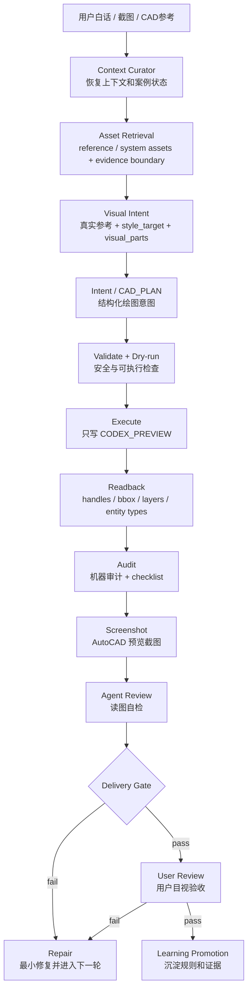

# CAD Agent Core Lab

CAD Agent Core Lab 是一个可迁移的 CAD Agent 开发包，用来训练“白话需求 -> 结构化绘图意图 -> CAD 预览落图 -> 机器审计 -> 截图自检 -> 用户验收”的完整闭环。它不把一句自然语言直接丢给 AutoCAD 硬画，而是把 CAD 生成拆成可审计、可回放、可修复、可跨机器迁移的工程链路。

当前最新架构是 **CAD Designer Agent 成长路径 + Visual-First + CAD 常识底座 + 资产智能管线 + 多 Agent 编排**：

- **CAD Designer Agent**：把系统当作电子设计师训练，从基础图元、选择、移动、旋转、偏移、修剪、图层、闭合和回读开始，逐步进入对象符号、房间平面、专业表达和施工图。
- **Visual-First**：先看真实参考、截图裁剪或 CAD 参考块，再生成 `style_target`、`visual_parts` 和绘图约束。
- **CAD 常识底座**：把“沙发要有座面和靠背”“参考不等于复制”等基础知识沉淀为可查、可测、可声明边界的规则候选。
- **资产智能管线**：把 `standard_cad_library_raw/`、`reference_library`、`system_library`、`retrieval_pack`、promotion gate 串起来，区分“参考输入”和“系统已验证自产能力”。
- **多 Agent 编排**：由 Context / Asset Retrieval / Visual Intent / Intent / Execute / Audit / Repair / Delivery / Learning Promotion 分工协作，但所有落图仍必须经过 Core 验证链。
- **证据优先**：截图、dry-run、Markdown、图库命中都不能单独证明真实 CAD 能力；对外声称完成前必须有结构化意图、真实输出、created handles 回读、审计和必要截图。

一句话：这个仓库训练的不是“会画一张图的脚本”，而是一个能调用流程 Agent、场景规则和资产库，并在真实 CAD 约束下逐轮变准的电子设计师。

## 最新端到端架构



这条链路有两个硬约束：

1. `CAD_PLAN` 或结构化绘图意图必须先于真实 CAD 执行。
2. 资产检索、常识命中、参考图命中只算上游证据，不能跳过 validate、dry-run、`CODEX_PREVIEW`、readback 和 audit。

同一口径收束为：

```text
User Request -> semantic route -> A-to-A contract -> CAD_PLAN / asset workflow / training route -> execution -> verification -> promotion/sync
```
其中 `semantic route` 先识别普通绘图、系统资产复用 / 沉淀、训练 / 复训、局部修复等语义；复杂或高风险任务必须生成 `a_to_a_task_contract`，由必需 Agent 输出和 hard gate 决定是否能继续。下游只能进入 `CAD_PLAN`、`asset workflow` 或 `training route` 之一；无论哪条路，执行后都要回到 verification，并按证据边界决定是否 promotion / sync。

## 架构分层

- `core/`：通用能力层，负责 CAD IO、执行、安全、schema、审计、训练 gate 和能力登记。
- `agents/cad_designer/`：总设计师 Agent 契约，定义成长阶段、第一阶段毕业目标、基础课程和证据边界。
- `agents/pipeline/`：全局多 Agent 流水线，定义理解、视觉约束、意图、执行、审计、修复、交付、学习晋升等角色。
- `agents/<scenario>/`：轻量场景 Agent，保存住宅、展陈、医疗等场景偏好和词汇，不复制 Core 能力。
- `standard_cad_library_raw/`：用户下载的标准 CAD 图库原始文件，允许随 git 迁移，但只算 raw reference input。
- `libraries/`：共享样式、图层、尺寸、材料、块库和可复用资源；资产智能链路区分 `reference_library` 与 `system_library`。
- `projects/`：真实或脱敏训练案例，每个案例保存 brief、feedback、expected、runs 和必要脚本。
- `scripts/`：验证、gate、coverage、CAD smoke、截图和迁移检查入口。
- `tests/`：单元测试、契约测试、训练 gate 测试和回归测试。
- `docs/`：架构、训练、治理、状态、交接和历史记录。

当前架构边界快照见 `docs/architecture/current-module-boundaries.md`。后续重构先按 `Stable Core`、`Training Experiments`、`Case-Only` 三类判断归属，再决定是否迁移代码；`openspec/changes/architecture-boundary-hardening-01/` 只记录本轮边界加固契约，不替代 `CORE_RESTRUCTURE_PLAN.md`。

## 资产智能管线

资产智能不是“把图库塞进仓库就算会画”，而是把外部参考、自产对象和可执行证据分开管理：

```text
standard_cad_library_raw
  -> reference_library
  -> knowledge / benchmarks
  -> system_library
  -> retrieval_pack
  -> OBJECT_SPEC / SYMBOL_SPEC / visual_parts
  -> CAD_PLAN
  -> CODEX_PREVIEW
  -> audit / feedback
  -> promotion
```

核心口径：

- `standard_cad_library_raw/`：用户确认可随 git 迁移的原始标准图库，只是 raw reference input。
- `libraries/reference_library/`：参考资产和来源边界，能说明“参考过什么”，不能证明系统已学会。
- `libraries/system_library/`：系统自产资产，必须有 schema、lineage、生成方法、验证状态和 evidence boundary。
- `retrieval_pack`：在 `CAD_PLAN` 前生成，汇总 object family、archetype、required parts、known failures、assumptions 和 not_checked。
- promotion gate：只有经过来源门、结构门、执行门、审计门和泛化门，资产才可能从案例候选晋升为系统级能力。

当前已落地基础目录、schema、轻量检索、raw intake、资产检索 Agent 和 promotion gate；这仍是架构与基础设施，不等同于表 C 或真实 CAD 实力自动提升。

## Visual-First 训练

Visual-First 的核心要求是：**先看真实参考，再画 CAD**。对 reference-match 任务，`style_target` 不能是凭空生成的示意图，必须来自 AutoCAD 截图裁剪、用户提供参考图或真实 CAD 参考块。典型 round 产物保存在 `projects/<case_id>/runs/`：`visual_parts`、`intent`、`execution_summary`、`vector_readback`、`geometry_audit`、`preview`、`agent_review` 和 `style_compare`。

## 历史训练样例

`projects/residential_sofa_2seat_20260528/` 是第一条完整训练闭环样例，不是当前唯一主线。当前主线以 `CAD Designer Agent` 成长路径、V2 训练地图和 `docs/planning/任务清单.md` §0 为准；沙发 round14 只作为历史证据和训练教训来源。

这个案例的主要价值不是“仓库里多了一个沙发脚本”，而是把训练期教训推进到全局链路：

- reference profile 不能退化成圆角矩形。
- 相邻部件要共享边，不能重复画线造成亮线 / 白线。
- 沙发方向、靠背、坐垫和扶手语义必须进入 visual parts 和 audit checklist。
- 机器审计通过仍不等于用户目视 pass，交付必须说明 checked、not_checked 和 assumptions。

## 安全边界

- 默认只写 `CODEX_PREVIEW`。
- 默认不保存当前 DWG。
- 不覆盖原始 DWG。
- 不修改正式图层，不删除用户原有实体。
- 截图只能作为视觉辅助，不能替代 geometry/readback 证据。
- 对外声称 CAD 完成前，必须有结构化意图、validate、dry-run、真实输出、created handles 回读、审计和必要截图。

## 换电脑继续

仓库按可迁移开发包设计。新电脑 clone 后，需要恢复 AutoCAD / CAD-MCP / Python 环境，打开对应案例 DWG，再读取 `CORE_CONTEXT_BRIEF.md`、`docs/architecture/current-module-boundaries.md` 和案例 `feedback.md`，从最后一个 round 继续。用户确认要两地同步的标准图库原始文件放 `standard_cad_library_raw/` 并可随 git 携带；它们仍只是参考输入，不等于系统能力。非敏感、脱敏且体积可控的案例 DWG/DXF 可以作为训练 fixture 随案例提交；`.codegraph/`、Understand Anything 生成图、`output/`、缓存、CAD 锁文件和备份文件不会提交。

换机前不要只看 `git clone` 是否成功，还要确认当前工作树已经形成可复现 checkpoint：先跑 `git status --short`，把有效源码、文档、Agent 契约、OpenSpec、系统资产索引和必要 fixture 纳入 commit；未确认来源和再分发边界的第三方 DWG 仍留在本机或 raw intake 区，不直接 push。提交后推送当前分支，再在新电脑重新安装 AutoCAD / CAD-MCP / Python 依赖，并重建 `.codegraph/`。

换机后建议先用固定 CAD-MCP venv 跑最小复验：`scripts/self_check.py`、`scripts/render_preview.py --check`、`scripts/run_repo_audit.py --max-python-lines 500 --fail-on-severity medium`、`scripts/run_capability_coverage.py --output output/validation_runs/capability-lab/cad_capability_coverage.json`。仓库不依赖本机 `output/`、`.codegraph/` 或 venv 缓存来继续开发；真实 CAD 能力声明仍以 validate / dry-run / `CODEX_PREVIEW` / created handles 回读 / audit 为准。

## 关键入口

- `AGENTS.md`：Agent 行为规则和 CAD 安全边界。
- `CORE_CONTEXT_BRIEF.md`：短上下文入口，新会话优先读。
- `CORE_RESTRUCTURE_PLAN.md`：唯一 PlanMD / 主计划。
- `CORE_STATUS.md`：能力状态和表 C 口径。
- `docs/training/README.md`：训练期主链路。
- `docs/training/cad-designer-growth-path.md`：总设计师 Agent 成长路径和第一批基础 CAD 课程。
- `docs/training/global-agent-pipeline.md`：多 Agent 流水线说明。
- `docs/architecture/cad-asset-intelligence-architecture.md`：参考图库、自产图库、检索、审计和晋升架构。
- `docs/planning/cad-commonsense-asset-dev-plan-01.md`：标准图库 raw 输入到自产图库晋升的计划书。
- `capability-map.html`：具体图块和基础绘图能力的训练工作台，作为训练计划视图，不替代内部证据文档；日常打开优先用 `start_training_workbench.bat`，或先跑 `scripts/sync_training_workbench.py` 刷新数据。
- `scripts/sync_training_workbench.py`、`scripts/run_training_workbench_agent_check.py`：刷新训练工作台数据快照并校验是否跑偏。
- `scripts/run_asset_raw_intake.py`、`scripts/run_asset_retrieval_pack.py`、`scripts/run_asset_promotion_gate.py`：标准图库自动 intake、资产检索包和晋升 gate 的基础入口。
- `docs/planning/任务清单.md`：当前训练 backlog 和 next。
- `docs/status/current.md`：当前状态摘要。
- `docs/status/issues.md`：失败教训和活跃风险。
- `docs/handoffs/current.md`：最近包交接。
