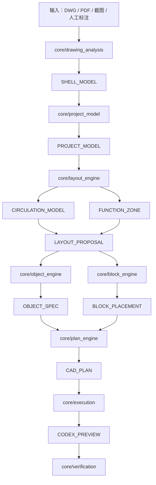
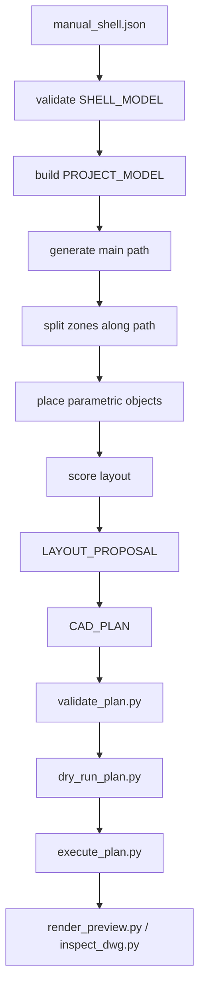
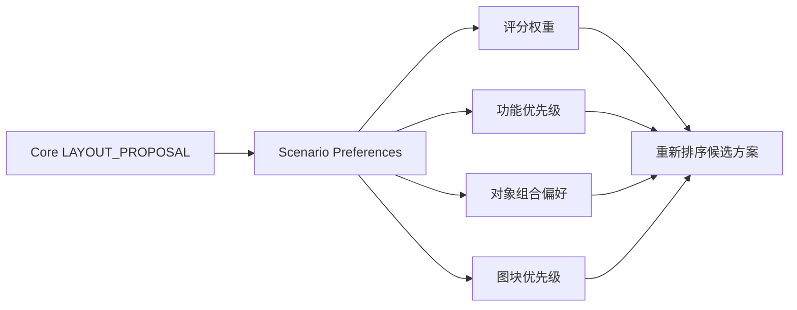
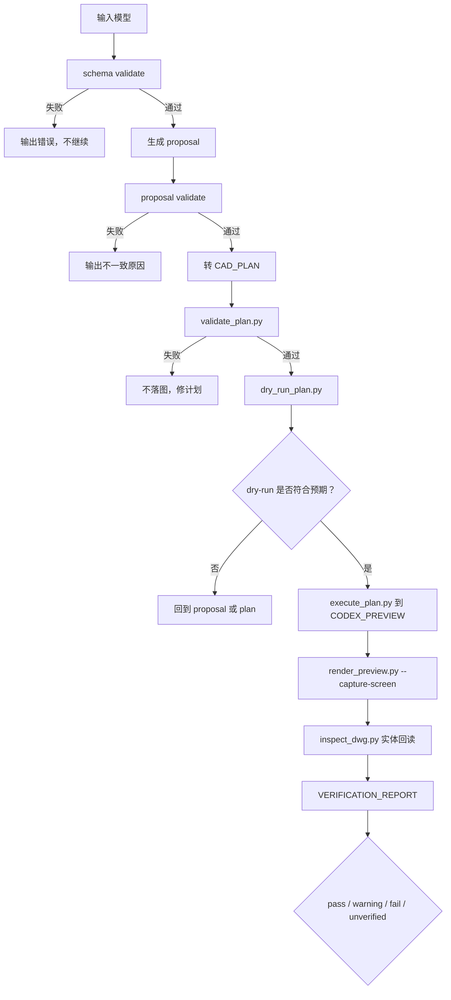

# 空壳布局底座设计说明

最后更新：2026-05-26
状态：**HISTORY-ONLY / 设计参考**（空壳布局思想已部分进入 Core；本文不作为当前执行主计划）

## 0. 文档用途

本文是 `通用空壳空间理解与布局底座` 的设计上下文和边界说明。它最初是后续开发蓝图；截至 2026-05-25，核心思路已经被 `CORE_RESTRUCTURE_PLAN.md` 纳入 Phase P-V，并部分落地为可运行的 blank-shell pipeline。

本文仍不是某个公司业务场景的专用需求文档，也不是当前执行主计划。后续需要执行开发时，以 `CORE_RESTRUCTURE_PLAN.md` 为主；需要理解空壳布局的设计边界、数据模型和验收思想时，再读取本文。

本文中的英文标识如 `SHELL_MODEL`、`LAYOUT_PROPOSAL`、`CAD_PLAN` 是建议的数据模型或接口名，不代表面向用户输出要使用英文。

## 0.1 当前落地状态

当前已经落地的部分：

- `SHELL_MODEL`、`CIRCULATION_MODEL`、`FUNCTION_ZONE` 已有 schema、example 和 invalid fixture。
- `core/drawing_analysis/shell_loader.py` 已支持人工空壳 JSON 规范化。
- `core/project_model/project_builder.py` 已支持 `DESIGN_BRIEF + SHELL_MODEL` 合成 `PROJECT_MODEL`。
- `core/layout_engine/path_generation.py` 已支持直线、L 型和沿边动线候选。
- `core/layout_engine/zone_splitter.py` 已支持基于 path surface 的功能区切分。
- `core/layout_engine/placement.py` 已支持多类对象、block metadata 优先和 `OBJECT_SPEC` fallback。
- `core/workflows/blank_shell_pipeline.py` 已串联到 `CAD_PLAN`、dry-run 和 `VERIFICATION_REPORT(unverified)`。
- `examples/benchmarks/blank_shell_core_benchmark.json` 已覆盖 **8** 个非 CAD case（含狭长/障碍 pass 与 structured blocked failure）。
- **`Y-MULTI-CANDIDATE` 已收口（2026-05-26）**：`candidate_sets.json` 保留多 circulation/zone/placement 候选；`design_proposal.comparison_detail` 输出覆盖率、失败分布与排序原因；benchmark 硬断言见 `docs/verification/blank_shell_multi_candidate_boundaries.md`。

当前仍未完成的部分：

- 自动 DWG / PDF 空壳识别。
- 复杂多边形、曲线和 CAD kernel 级几何。
- **完整多候选布局设计脑**（当前仅为 Alpha 硬化：多候选可解释 + 单条主路线落图，非自动最终决策）。
- 足够多的真实项目回归样本（已有 hand-authored 近真实/失败 shell，规模仍不足）。
- 真实项目级 CAD 几何回归（Phase W baseline 仅覆盖受控样本与部分 composition cases）。

因此，本文后续应作为 Phase Y 继续硬化空壳布局的设计参考，而不是重复记录每天的开发流水。

## 1. 一句话目标

从空户型或空壳 CAD 底图中提取边界、入口、柱子、门洞、消防设施等约束，生成可解释的动线骨架、功能区候选和家具/图块布置方案，最终转成可校验、可 dry-run、可预览落图、可验证的 `CAD_PLAN`。

```text
空壳图纸
-> 图纸理解 / 人工补充
-> 空壳模型
-> 项目约束
-> 动线骨架
-> 功能区切分
-> 对象/图块布置
-> 布局方案
-> CAD_PLAN
-> CODEX_PREVIEW 预览
-> 截图 / 回读验证
```

## 2. 与仓库大框架的关系

这部分能力属于 Core 的一个子能力组合，不应写成单一公司业务 Agent。



### 2.1 放入 Core 的内容

以下能力应放入 `core/`，因为多个场景都会复用：

- 空壳边界表达。
- 外轮廓、内墙、门洞、入口、柱子、消防构件等建筑要素抽取。
- 可布置区 / 不可布置区计算。
- 主动线、次动线、环形动线、沿边动线等通用动线生成。
- 沿动线两侧切分功能区候选。
- 通道宽度、碰撞、门洞避让、消防避让等几何检查。
- 参数化家具和图块插入协议。
- 布局评分与方案解释。
- `LAYOUT_PROPOSAL` 到 `CAD_PLAN` 的转换。
- 预览落图和验证报告。

### 2.2 放入 agents 的内容

以下内容属于场景差异，应放入 `agents/<scenario>/`，不要污染 Core：

- 公司某类平面方案的功能偏好。
- 某类项目更重视展示面、房间重复率、工位密度、餐位数或动线体验。
- 方案评分权重。
- 公司出图习惯、标注偏好、图块优先级。
- 业务流程名称，例如 `blank_shell_to_layout`。

### 2.3 放入 libraries 的内容

以下内容属于跨场景资源，应放入 `libraries/`：

- 家具和设备块。
- 参数化对象默认尺寸。
- 人体工学尺寸。
- 通道宽度标准。
- 图层标准。
- 材料、风格、图块分类。
- 门、窗、柱、消防设施等建筑元素元数据。

### 2.4 放入 projects 的内容

以下内容属于真实项目或样例项目资料，应放入 `projects/`：

- 某个项目的 DWG / PDF / 截图。
- 人工标注的边界、入口、柱子、消防门等输入。
- 参考方案图。
- 项目上下文 `cad_context.json`。
- 该项目的验收记录和截图。

## 3. 关键边界

### 3.1 不直接做公司专用方案生成器

公司截图方案只能作为灵感和验收样本。Core 不应默认假设所有项目都要采用截图中的动线、功能区或家具组合。

正确做法：

```text
Core 负责：
  识别空间、生成动线、切分功能区、碰撞检查、输出候选方案。

场景 Agent 负责：
  公司偏好、业务权重、功能命名、图块优先级、出图风格。
```

### 3.2 不让 LLM 直接猜坐标

LLM 适合：

- 理解用户需求。
- 生成方案说明。
- 解释布局理由。
- 选择策略。
- 总结不确定点。
- 决定是否需要用户确认。

确定性几何算法负责：

- 坐标计算。
- 多边形切分。
- 碰撞检查。
- 通道宽度检查。
- 门洞、柱子、消防设施避让。
- 家具占地范围和操作空间计算。

### 3.3 第一版允许半自动输入

不要把第一版目标卡死在“完全自动读懂任意 DWG”。第一版应允许人工标注或 JSON 输入：

- 外轮廓。
- 入口。
- 门洞。
- 柱子。
- 消防门。
- 卷帘。
- 不可布置区。
- 必须连通点。

这样可以先跑通布局价值，再逐步把人工输入替换为自动识别。

### 3.4 输出先是布局方案，不是最终施工图

第一版输出应是：

- `LAYOUT_PROPOSAL`
- `CAD_PLAN`
- `CODEX_PREVIEW` 预览落图
- 方案说明
- 验证报告

不应承诺一次性生成正式施工图、材料表、完整尺寸标注和所有专业图层。

## 4. 总流程

```mermaid
flowchart LR
  A["空壳 CAD / PDF / 截图"] --> B{"能自动识别吗？"}
  B -->|"能"| C["图纸实体抽取"]
  B -->|"不能或不全"| D["人工标注补充"]
  C --> E["SHELL_MODEL"]
  D --> E
  E --> F["PROJECT_MODEL"]
  F --> G["生成动线候选"]
  G --> H["切分功能区候选"]
  H --> I["选择对象/图块"]
  I --> J["布局检查与评分"]
  J --> K["DESIGN_PROPOSAL / LAYOUT_PROPOSAL"]
  K --> L{"用户确认？"}
  L -->|"需调整"| G
  L -->|"确认"| M["转 CAD_PLAN"]
  M --> N["validate"]
  N --> O["dry-run"]
  O --> P["CODEX_PREVIEW 落图"]
  P --> Q["截图 / 实体回读"]
  Q --> R["VERIFICATION_REPORT"]
```



## 5. 数据模型建议

这些模型名称是建议，后续可在 `core/schemas/` 中正式化。

### 5.1 SHELL_MODEL

用途：描述空壳空间本身，不包含具体业务功能。

建议字段：

```json
{
  "version": "0.1",
  "source": {
    "type": "dwg|pdf|image|manual_json|mixed",
    "path": "projects/example/input.dwg",
    "unit": "mm",
    "scale": 1
  },
  "boundary": {
    "id": "outer_boundary_1",
    "type": "polygon",
    "points": [[0, 0], [10000, 0], [10000, 6000], [0, 6000]],
    "confidence": 0.95
  },
  "building_elements": [],
  "fixed_obstacles": [],
  "openings": [],
  "required_connections": [],
  "no_place_zones": [],
  "uncertainties": []
}
```

建筑元素示例：

```json
{
  "id": "column_1",
  "type": "column",
  "geometry": {
    "shape": "rect",
    "points": [[1200, 2000], [1500, 2000], [1500, 2300], [1200, 2300]]
  },
  "source_layer": "COL",
  "confidence": 0.9
}
```

建议类型：

- `outer_wall`
- `inner_wall`
- `opening`
- `door`
- `entrance`
- `window`
- `column`
- `fire_door`
- `fire_shutter`
- `stair`
- `elevator`
- `shaft`
- `equipment`
- `unknown`

### 5.2 PROJECT_MODEL

用途：把空壳和用户需求合并成布局引擎能用的项目模型。

建议字段：

```json
{
  "version": "0.1",
  "domain": "generic|residential|office|retail|restaurant|exhibition|custom",
  "shell": {},
  "requirements": {
    "target_functions": [],
    "capacity_targets": [],
    "style_preferences": [],
    "must_have": [],
    "avoid": []
  },
  "constraints": {
    "minimum_main_aisle_width": 1200,
    "minimum_secondary_aisle_width": 900,
    "door_clearance": 900,
    "fire_clearance": 1200,
    "keep_existing_elements": true
  },
  "scenario_preferences": {},
  "uncertainties": []
}
```

### 5.3 CIRCULATION_MODEL

用途：表达动线骨架，不只是画线。

建议字段：

```json
{
  "version": "0.1",
  "circulation_type": "straight_spine|l_spine|loop|perimeter|hybrid",
  "main_paths": [
    {
      "id": "main_path_1",
      "polyline": [[500, 500], [5000, 500], [9000, 3000]],
      "width": 1200,
      "connects": ["main_entrance", "fire_exit_1"],
      "confidence": 0.8
    }
  ],
  "secondary_paths": [],
  "path_surface": [],
  "blocked_reasons": [],
  "score": 0.0
}
```

### 5.4 FUNCTION_ZONE

用途：表达可布置区或功能区候选。Core 可以只生成候选，不一定命名具体业务功能。

建议字段：

```json
{
  "id": "zone_1",
  "geometry": {
    "type": "polygon",
    "points": [[0, 0], [3000, 0], [3000, 2500], [0, 2500]]
  },
  "side_of_path": "left|right|end|independent",
  "area": 7500000,
  "depth": 2500,
  "frontage": 3000,
  "candidate_functions": ["display", "living", "desk_area", "storage"],
  "constraints": [],
  "score": 0.0
}
```

### 5.5 OBJECT_SPEC

用途：参数化家具或设备对象，不依赖真实 DWG 图块。

建议字段：

```json
{
  "id": "object_1",
  "type": "sofa|bed|desk|cabinet|shelf|table|chair|counter|display_unit",
  "name": "参数化沙发",
  "size": {
    "width": 2200,
    "depth": 900,
    "height": 800
  },
  "placement_rules": {
    "can_attach_wall": true,
    "front_clearance": 600,
    "side_clearance": 100,
    "allowed_rotations": [0, 90, 180, 270]
  },
  "drawing_style": {
    "layer": "CODEX_PREVIEW",
    "label": true
  }
}
```

### 5.6 BLOCK_LIBRARY

用途：登记真实公司图块或标准块，让布局引擎可选择和插入。

建议字段：

```json
{
  "block_id": "desk_1400x700_a",
  "category": "desk",
  "dwg_block_name": "DESK_1400_A",
  "source_file": "libraries/blocks/office/desks.dwg",
  "size": {
    "width": 1400,
    "depth": 700
  },
  "insert_point": [0, 0],
  "clearance": {
    "front": 800,
    "left": 100,
    "right": 100,
    "back": 0
  },
  "allowed_rotations": [0, 90, 180, 270],
  "applicable_domains": ["office", "generic"],
  "fallback_object_spec": "desk_basic_1400x700"
}
```

### 5.7 LAYOUT_PROPOSAL

用途：布局引擎的主要输出，包含候选方案、评分、解释和可转 CAD_PLAN 的对象清单。

建议字段：

```json
{
  "version": "0.1",
  "proposal_id": "layout_a",
  "summary": "主动线连接主入口与消防门，两侧切分 6 个功能区。",
  "circulation": {},
  "zones": [],
  "placements": [],
  "scores": {
    "overall": 0.78,
    "circulation": 0.85,
    "collision": 1.0,
    "fire_safety": 0.9,
    "space_utilization": 0.7,
    "scenario_fit": 0.65
  },
  "checks": [],
  "assumptions": [],
  "uncertainties": [],
  "needs_confirmation": true
}
```

### 5.8 VERIFICATION_REPORT

用途：记录预览落图后的证据。没有证据时不得声称准确完成。

建议字段：

```json
{
  "version": "0.1",
  "target": "layout_a",
  "validated_plan": true,
  "dry_run_passed": true,
  "executed_to_preview": true,
  "screenshot_path": "output/previews/layout_a.png",
  "entity_readback": {
    "available": false,
    "reason": "not_implemented"
  },
  "geometry_checks": [],
  "status": "pass|warning|fail|unverified"
}
```

## 6. 模块职责

### 6.1 core/drawing_analysis

职责：

- 从 DWG、PDF、截图或人工标注中生成 `SHELL_MODEL`。
- 输出不确定点，不强行猜测。
- 第一版可以只支持人工标注 JSON。
- 后续逐步增加 DWG 实体回读和图层识别。

不负责：

- 决定空间功能。
- 生成家具。
- 画图。

### 6.2 core/project_model

职责：

- 合并 `SHELL_MODEL`、用户需求、场景偏好和项目上下文。
- 生成布局约束。
- 标记可布置区、不可布置区、必须连通点。

不负责：

- 具体布置算法。
- 图块插入。

### 6.3 core/layout_engine

职责：

- 生成动线候选。
- 切分功能区候选。
- 计算可布置区。
- 进行通道、碰撞、避让、连通性检查。
- 输出一个或多个 `LAYOUT_PROPOSAL`。

不负责：

- 读取 CAD。
- 直接调用 AutoCAD。
- 写死某公司业务偏好。

### 6.4 core/object_engine

职责：

- 根据功能区和需求生成参数化家具/设备对象。
- 在没有真实图库时提供可落图的占位对象。
- 输出 `OBJECT_SPEC`。

### 6.5 core/block_engine

职责：

- 管理真实 DWG 图块元数据。
- 根据用途、尺寸、场景、旋转规则选择图块。
- 在找不到真实图块时回退到参数化对象。

### 6.6 core/plan_engine

职责：

- 将 `LAYOUT_PROPOSAL`、`OBJECT_SPEC`、`BLOCK_PLACEMENT` 转为一个或多个 `CAD_PLAN`。
- 支持 validate 和 dry-run。
- 保证所有绘制默认走 `CODEX_PREVIEW`。

### 6.7 core/execution

职责：

- 执行 `CAD_PLAN`。
- 只接收结构化几何和绘图指令。
- 不做自然语言理解。
- 不保存 DWG。

### 6.8 core/verification

职责：

- 截图。
- 实体回读。
- 对比预期与实际输出。
- 生成 `VERIFICATION_REPORT`。

## 7. 第一版最小闭环

第一版不要做全自动。建议目标：

```text
人工标注空壳 JSON
-> SHELL_MODEL 校验
-> PROJECT_MODEL
-> 生成一条主动线
-> 沿主动线两侧切分功能区
-> 放置少量参数化家具
-> 输出 LAYOUT_PROPOSAL
-> 转 CAD_PLAN
-> validate
-> dry-run
-> CODEX_PREVIEW 落图
-> 截图或回读验证
```



### 7.1 第一版输入样例

可以先在 `projects/sample_blank_shell/` 放：

```text
projects/sample_blank_shell/
  input/
    shell.manual.json
  expected/
    expected_notes.md
  output/
    layout_proposal.json
    cad_plan.json
    verification_report.json
```

### 7.2 第一版输出要求

至少输出：

- 一个 `SHELL_MODEL`。
- 一个 `PROJECT_MODEL`。
- 一个 `CIRCULATION_MODEL`。
- 若干 `FUNCTION_ZONE`。
- 若干参数化家具对象。
- 一个 `LAYOUT_PROPOSAL`。
- 一个或多个 `CAD_PLAN`。
- dry-run 文本或 JSON 摘要。
- 截图或说明为什么无法截图。

## 8. 后续增强路线

### 阶段 A：模型与协议

目标：

- 建立 schema。
- 建立 example。
- 建立 validate。
- 不依赖 CAD 环境。

验收：

- `SHELL_MODEL` example 可校验。
- `PROJECT_MODEL` example 可校验。
- `LAYOUT_PROPOSAL` example 可校验。
- 单元测试覆盖必需字段和边界条件。

### 阶段 B：人工标注闭环

目标：

- 从人工标注 JSON 生成第一版布局方案。

验收：

- 可生成主动线。
- 可切分至少 2 个功能区。
- 可放置至少 3 类参数化对象。
- 可输出 `LAYOUT_PROPOSAL`。
- 可转 `CAD_PLAN`。

### 阶段 C：几何检查

目标：

- 增加碰撞、通道宽度、门洞避让、柱子避让。

验收：

- 家具不与柱子重叠。
- 家具不压住门洞。
- 主通道宽度不小于设定值。
- 检查失败时能解释失败原因。

### 阶段 D：多方案与评分

目标：

- 生成多个候选布局。
- 按通用评分维度排序。

验收：

- 至少生成 2 个不同动线方案。
- 每个方案有评分。
- 每个方案有优点、风险、待确认点。

### 阶段 E：DWG 实体读取

目标：

- 从当前 CAD 文档或 DWG 提取基础实体。
- 自动生成部分 `SHELL_MODEL`。

验收：

- 能列出图层、线、多段线、块、文字。
- 能识别候选外轮廓。
- 能识别候选柱子。
- 自动识别不确定时能要求人工确认。

### 阶段 F：真实图块库

目标：

- 登记公司或通用图块。
- 支持按用途选块。
- 支持图块插入。

验收：

- 能从 `BLOCK_LIBRARY` 选择匹配块。
- 找不到块时能回退到 `OBJECT_SPEC`。
- 插入点、旋转和避让范围正确。

### 阶段 G：场景 Agent 接入

目标：

- 让 `agents/<scenario>/` 提供场景偏好。

验收：

- Core 不写死公司逻辑。
- 公司场景 Agent 可调整评分权重。
- 家装或办公 Agent 可复用同一套 Core。

## 9. 几何算法建议

后续可按能力逐步选用库或自研简单算法。

### 9.1 多边形处理

用途：

- 外轮廓。
- 可布置区。
- 不可布置区扣除。
- 动线面。
- 功能区切分。

建议：

- 优先使用成熟几何库。
- 如果引入依赖，应记录在环境和换机清单中。
- 初期可用简单矩形 / 正交多边形算法，不必一次支持任意复杂曲线。

### 9.2 动线生成

可选策略：

- 入口到出口最短路径。
- 入口到空间深处主轴。
- 沿外轮廓内偏移生成环形动线。
- 基于关键点的折线路径。
- 基于网格的 A* 路径。

初期建议：

```text
正交多边形 + 入口点 + 目标点
-> 生成一条 L 型或折线主动线
-> buffer 成动线面
-> 用动线面切分左右区域
```

### 9.3 功能区切分

可选策略：

- 沿主动线法线方向切分。
- 按墙面可用长度切分。
- 按柱网切分。
- 按最小面积和最大深度合并。

### 9.4 家具放置

可选策略：

- 靠墙优先。
- 沿动线朝向对齐。
- 入口展示优先。
- 中心留空。
- 先放大件，再放小件。
- 先满足必须对象，再填充可选对象。

### 9.5 评分维度

通用评分：

- `circulation_score`：动线是否连续，绕行是否过长。
- `clearance_score`：通道宽度是否达标。
- `collision_score`：对象是否碰撞。
- `fire_safety_score`：是否避让消防门、卷帘和出口。
- `zone_quality_score`：功能区面积、深度、开口是否合理。
- `utilization_score`：空间利用率是否合适。
- `uncertainty_penalty`：不确定点越多分数越低。

场景评分：

- `scenario_fit_score`：由 Agent 提供权重和偏好。

## 10. 场景 Agent 如何接入

场景 Agent 不应重写布局算法，只提供偏好。



场景偏好示例：

```json
{
  "scenario": "company_plan",
  "function_priorities": ["main_display", "experience_area", "storage", "service"],
  "layout_preferences": {
    "prefer_zones_along_main_path": true,
    "prefer_entry_visual_focus": true,
    "avoid_dead_end_paths": true
  },
  "score_weights": {
    "circulation": 0.25,
    "fire_safety": 0.25,
    "space_utilization": 0.15,
    "scenario_fit": 0.25,
    "uncertainty": 0.1
  }
}
```

家装 Agent 可以使用同一 Core，只换偏好：

```json
{
  "scenario": "residential",
  "function_priorities": ["living", "bedroom", "kitchen", "storage"],
  "layout_preferences": {
    "prefer_bed_head_against_solid_wall": true,
    "prefer_living_room_near_balcony": true,
    "avoid_bed_facing_door": true
  }
}
```

## 11. 执行与自检全链路

任何阶段都不能绕过验证。推荐执行门如下：



### 11.1 开发自检命令

```powershell
$env:PYTHONIOENCODING='utf-8'
[Console]::OutputEncoding = [System.Text.Encoding]::UTF8
$py = "$env:USERPROFILE\.codex\mcp\CAD-MCP\.venv\Scripts\python.exe"

& $py scripts\self_check.py
& $py scripts\render_preview.py --check
& $py -m unittest discover -s tests
```

### 11.2 落图前必跑

```powershell
& $py scripts\validate_plan.py <plan.json>
& $py scripts\dry_run_plan.py <plan.json>
```

### 11.3 落图后必留证据

```powershell
& $py scripts\render_preview.py --capture-screen --output output\previews\<name>.png
```

实体回读完成后还应补：

```powershell
& $py scripts\inspect_dwg.py --plan <plan.json> --report output\verification\<name>.json
```

如果 CAD、截图或回读不可用，必须在 `VERIFICATION_REPORT` 中标记 `unverified`，不能声称准确完成。

## 12. 验收标准

### 12.1 模型验收

- `SHELL_MODEL` example 能通过 schema 校验。
- `PROJECT_MODEL` example 能通过 schema 校验。
- `LAYOUT_PROPOSAL` example 能通过 schema 校验。
- 不确定点能被结构化记录。
- 输入缺少必要边界时，系统拒绝继续布局并给出原因。

### 12.2 布局验收

- 能生成至少一种主动线。
- 能将动线面从可布置区中扣除。
- 能沿动线两侧生成若干功能区候选。
- 能放置至少 3 类参数化对象。
- 对象不与柱子、门洞、消防门、动线面重叠。
- 主通道和次通道宽度满足设定值。
- 每个候选方案有评分和说明。

### 12.3 CAD_PLAN 验收

- 生成的 `CAD_PLAN` 可被 `scripts/validate_plan.py` 校验。
- dry-run 输出和 `LAYOUT_PROPOSAL` 一致。
- 所有绘制默认使用 `CODEX_PREVIEW`。
- 预览落图不修改正式图层、不保存 DWG、不覆盖原图。

### 12.4 视觉与几何验收

- 截图能落盘。
- 预览图中能看到动线、功能区、家具/图块。
- 实体回读完成后，能检查图层、数量、主要尺寸、位置和碰撞。
- 截图和实体回读冲突时，以实体回读为准。

### 12.5 文档与记录验收

只要开发了这部分能力，应同步更新：

- `CORE_STATUS.md`
- `docs/roadmap/current.md`
- `docs/status/current.md`
- `docs/status/changelog.md`
- `docs/status/issues.md`，如果涉及失败、风险或调试教训

## 13. 风险与反跑偏规则

### 13.1 风险：过早公司专用化

表现：

- Core 中出现公司专属功能区名称。
- Core 中写死截图方案的动线样式。
- Core 中写死公司图块名称。

处理：

- 移到 `agents/<scenario>/` 或 `libraries/`。
- Core 只保留通用几何和布局协议。

### 13.2 风险：过度依赖 LLM

表现：

- LLM 直接输出大量坐标。
- 没有碰撞检查。
- 没有通道宽度检查。

处理：

- LLM 只输出策略和解释。
- 坐标和检查由几何算法完成。

### 13.3 风险：自动读图目标过大

表现：

- 第一版必须自动识别任意 DWG。
- 没有人工补充路径。

处理：

- 第一版支持人工标注。
- 自动识别逐步增强。

### 13.4 风险：没有验证就声称完成

表现：

- 只生成 proposal 就说完成。
- 只看到截图就说几何准确。

处理：

- 必须区分 `generated`、`dry_run_passed`、`executed`、`screenshot_captured`、`geometry_verified`。

## 14. 推荐目录草案

等 Core 框架稳定后，可按以下方向落地：

```text
core/
  schemas/
    shell_model.schema.json
    circulation_model.schema.json
    function_zone.schema.json
    layout_proposal.schema.json
  drawing_analysis/
    shell_model.py
    manual_shell_loader.py
    dwg_entity_reader.py
  project_model/
    build_project_model.py
  layout_engine/
    circulation.py
    zone_splitter.py
    placement.py
    scoring.py
    collision.py
  object_engine/
    parametric_objects.py
  block_engine/
    block_library.py
  plan_engine/
    layout_to_cad_plan.py
  verification/
    layout_verification.py

examples/
  shell_layout/
    manual_shell.example.json
    layout_proposal.example.json
    cad_plan.example.json

projects/
  sample_blank_shell/
    input/
    output/
    README.md
```

## 15. 给后续 Codex 的启动提示

后续新对话可以这样启动：

```text
读取 `docs/architecture/shell-layout-foundation-design.md`，以及根目录 `README.md`、`CORE_STATUS.md`、`docs/roadmap/current.md`。
不要直接开发公司专用方案 Agent。
请围绕“空壳布局底座”制定 Core 实施计划：
第一版允许人工标注空壳输入，输出 SHELL_MODEL、PROJECT_MODEL、CIRCULATION_MODEL、FUNCTION_ZONE、LAYOUT_PROPOSAL，并能转 CAD_PLAN。
所有结果必须经过 validate、dry-run、CODEX_PREVIEW 预览和验证报告。
```

## 16. 最小成功定义

当后续实现完成第一版时，至少应能做到：

```text
给一个人工标注的空壳边界 + 入口 + 柱子 + 消防门
-> 生成一条合理主动线
-> 动线两侧切出功能区
-> 放入若干参数化家具
-> 输出布局方案说明
-> 转成 CAD_PLAN
-> dry-run 可解释
-> 画到 CODEX_PREVIEW
-> 留下截图或回读报告
```

这就是“空壳布局底座”的第一版闭环。后续公司业务场景、家装场景、办公场景都应在这个闭环之上扩展，而不是复制一套新逻辑。
