# 超级 CAD Agent 系统架构参考文档

> 目标：构建一套类似“超级应用”的 CAD 智能体系统。它能理解任务、拆解任务、分发智能体、调用 CAD 工具、回读证据、自动修复、持续学习，并逐步沉淀为可复用的 CAD / BIM 能力平台。

本文按独立空白系统构思，不绑定任何现有仓库、代码或单一 CAD 工具。系统中心不应是某个调用接口，而应是 **中立工程数据内核 + 生产级 Agent 运行时 + 工具网关 + 治理控制平面 + 可视化工作台**。

技术校准日期：2026-06-10。

---

## 1. 总体定位

这不是一个“会说话的 CAD 插件”，而是一套 **CAD 智能体操作系统**。

它的核心不是直接把自然语言变成 CAD 命令，而是建立一条稳定链路：

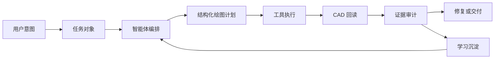

一句话原则：

> 大模型负责判断，计划层负责表达，工具层负责执行，证据层负责证明。

---

## 2. 核心框架

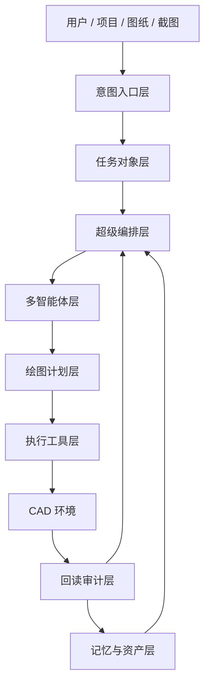

---

## 3. 系统分层

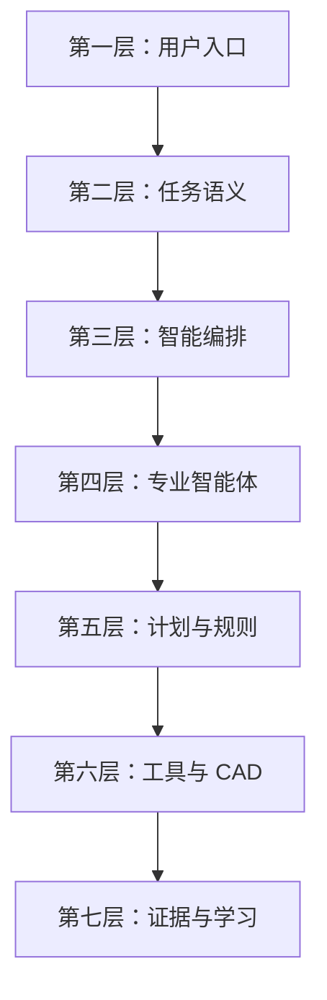

| 层级 | 职责 |
| --- | --- |
| 用户入口 | 接收文字、图纸、截图、表格、语音或历史项目 |
| 任务语义 | 把白话变成任务对象 |
| 智能编排 | 判断流程、分派智能体、控制权限 |
| 专业智能体 | 执行规划、审查、修复、资产、规范等子任务 |
| 计划与规则 | 生成结构化绘图计划和校验规则 |
| 工具与 CAD | 调用 CAD、几何库、图纸解析器、截图器 |
| 证据与学习 | 回读、审计、纠错、沉淀经验 |

---

## 4. 超级智能体内部结构

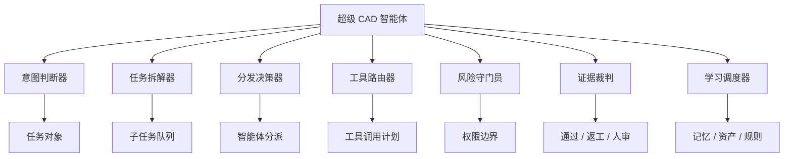

---

## 5. 多智能体角色图

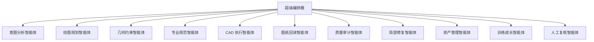

---

## 5A. 编排器模块与专业 Agent 的映射

第 4 节描述的是超级编排器内部职能，第 5 节描述的是可派发的专业 Agent 角色。两者不是二选一：内部职能负责判断和调度，专业 Agent 负责产出可审计结果。

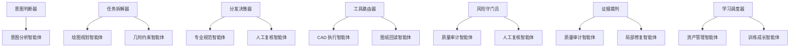

实现口径：

| 总控模块 | 主要职责 | 可派发 Agent |
| --- | --- | --- |
| 意图判断器 | 把用户输入转成任务对象 | 意图分析智能体 |
| 任务拆解器 | 拆子任务、形成计划请求 | 绘图规划、几何约束 |
| 分发决策器 | 选择参与者和协作方式 | 规范、人工复核 |
| 工具路由器 | 选择工具后端和 Tool Contract 生成路径 | CAD 执行、图纸回读 |
| 风险守门员 | 判断权限、保存、删除、外发风险 | 质量审计、人工复核 |
| 证据裁判 | 根据证据决定通过、返工或人审 | 质量审计、局部修复 |
| 学习调度器 | 判断是否沉淀、复训或更新资产 | 资产管理、训练成长 |

---

## 6. 智能体协作拓扑

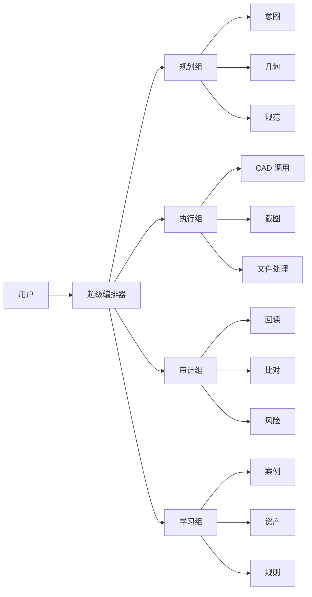

---

## 6A. 事件驱动协调层预留

当前阶段仍以超级编排器作为主控入口，保证 CAD 写入、删除、保存、回滚和权限审批受中心治理。但长期不应把所有 Agent 通信都锁死在星型拓扑里。系统应预留事件驱动协调层，让低风险、可并行、可回放的 Agent 协作可以通过事件总线完成。

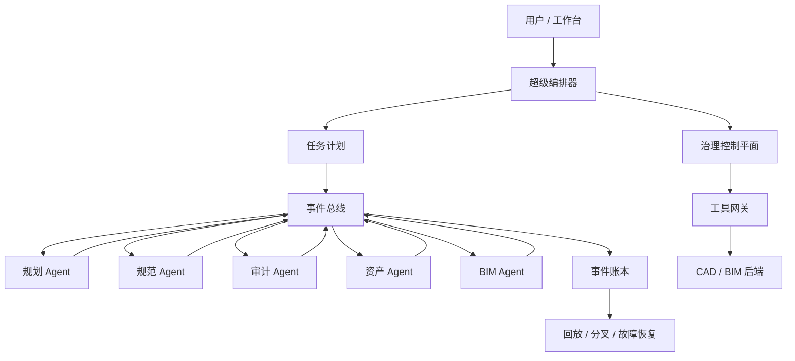

设计口径：

- 中央编排器负责目标分解、风险裁决、最终聚合和高风险授权。
- 事件总线负责 Agent 间的异步协作、状态通知、低风险并行任务和可回放事件。
- CAD 写入、删除、保存、导出等动作仍必须经过工具网关和治理控制平面。
- 事件日志不是普通运行日志，而是任务恢复、失败定位、成本归因和评测回放的基础材料。
- 未来可兼容 A2A 风格的 Agent 发现、Agent Card 和对等委托，但当前阶段不强制实现完全去中心化。

Agent 通信范围：

| Agent 类型 | 是否适合事件总线 | 说明 |
| --- | --- | --- |
| 意图分析 | 部分适合 | 可发布理解摘要，但任务入口仍由编排器接收 |
| 绘图规划 / 几何约束 / 专业规范 | 适合 | 可并行给出方案、约束和规范意见 |
| CAD 执行 | 不直接适合 | 必须经工具网关和写入队列 |
| 图纸回读 | 适合只读事件 | 可发布回读完成、差异包、截图状态 |
| 质量审计 | 适合 | 可订阅回读和 diff 事件 |
| 局部修复 | 部分适合 | 可订阅失败事件，但写入仍经工具网关 |
| 资产管理 / 训练成长 | 适合 | 可异步处理沉淀、样本和评测 |
| 人工复核 | 不作为自动 Agent 广播 | 由风险守门员或证据裁判显式触发 |

---

## 7. 任务生命周期

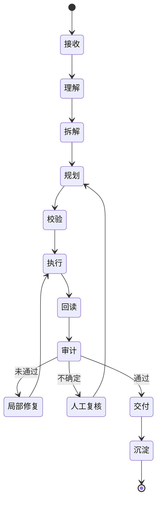

---

## 8. 任务对象结构

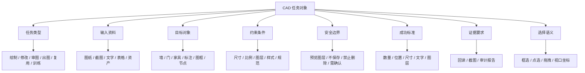

---

## 8A. Schema 版本演进策略

`CAD_PLAN`、任务对象、Tool Contract、证据包和 Agent 输出都必须带版本。系统不能假设所有 Agent、工具网关和后端永远使用同一版 Schema。

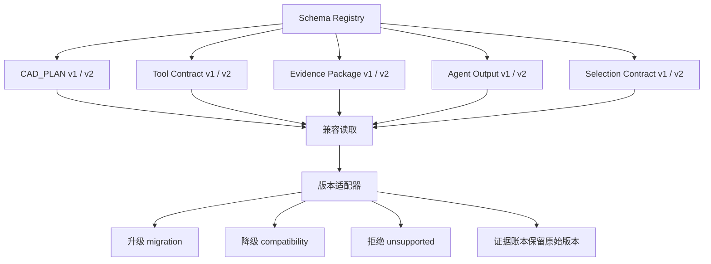

版本规则：

- 每个结构化对象必须包含 `schemaVersion`。
- 新版运行时应尽量能读取旧版证据，但不能静默改写历史证据。
- 旧版 Agent 输出进入新工具网关前，必须经过版本适配或拒绝。
- 破坏性 Schema 变更需要评测集回归和迁移说明。
- 证据账本保存原始对象和适配后对象，方便复盘版本差异。

---

## 9. 分发机制

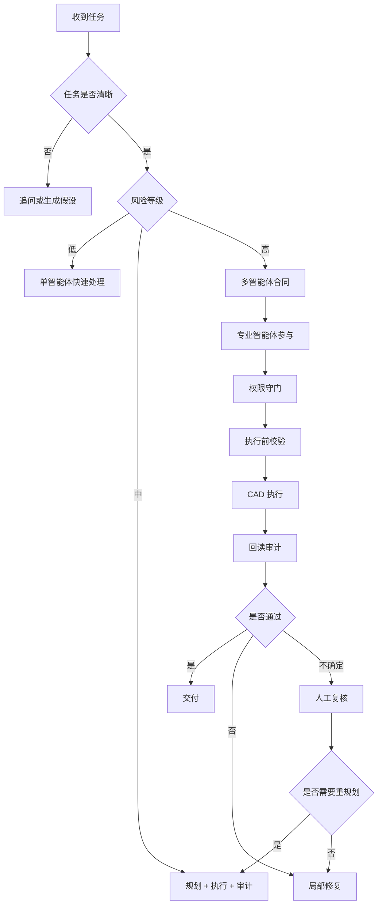

---

## 10. 分发决策矩阵

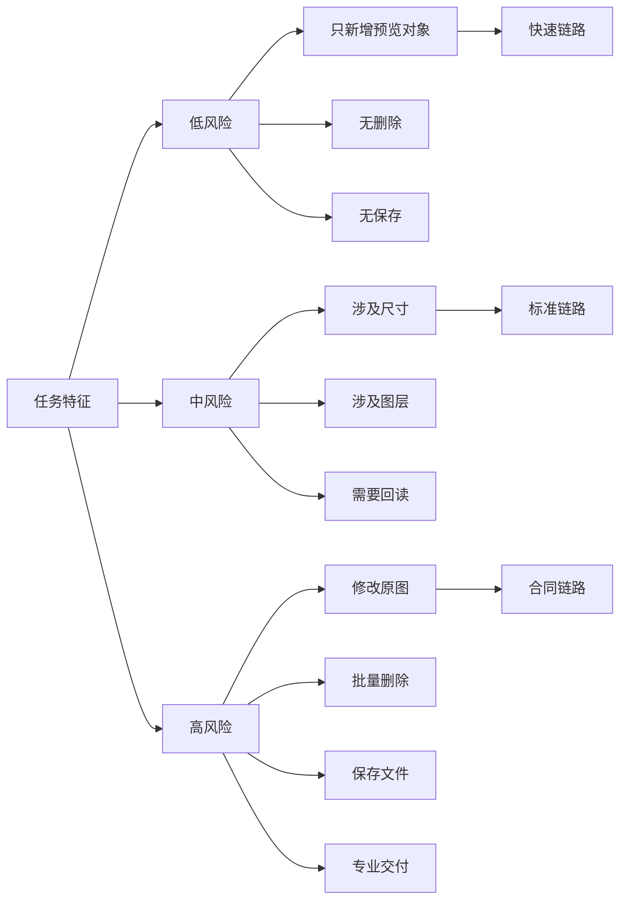

---

## 11. 工具调用架构

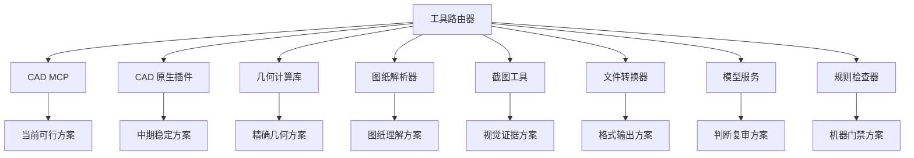

---

## 11A. CAD_PLAN 到 Tool Contract 的转换器

绘图计划描述“要画什么、为什么、验什么”，Tool Contract 描述“本次允许哪个工具对哪个范围做什么”。两者之间必须有显式转换器，不能让工具网关直接理解自然语言或完整 CAD_PLAN。

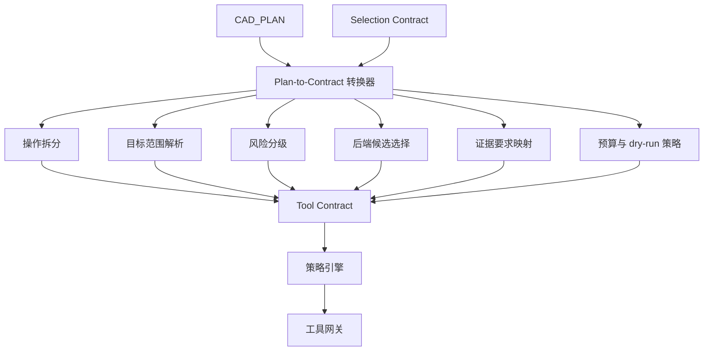

转换归属：

| 输入 | 输出字段 | 说明 |
| --- | --- | --- |
| 对象类型、语义对象 | `operation`、`adapter` 候选 | 判断创建、修改、审计还是导出 |
| 坐标、尺寸、目标对象 | `targetScope` | 绑定文档、空间、图层、handles、bbox |
| Selection Contract | `targetScope.handles` / `targetScope.bbox` / `targetScope.documentId` | 把框选、点选、拖拽转换为可验证目标范围 |
| 依附关系、约束 | `preconditions` / `validationRules` | 进入 dry-run 和审计 |
| 允许误差、回读标准 | `evidenceRequired` / `tolerance` | 决定回读和审计要求 |
| 保存、删除、导出意图 | `riskLevel` / `approvalRequired` | 决定是否需要人工授权 |
| 预览要求 | `previewStrategy` | 选择预览图层、影子 DWG、内存事务或 overlay |

转换器属于 Agent Runtime / 规划层和工具网关之间的接口层：规划 Agent 可以提出建议，工具网关负责最终校验和拒绝非法合同。

---

## 12. CAD 后端演进

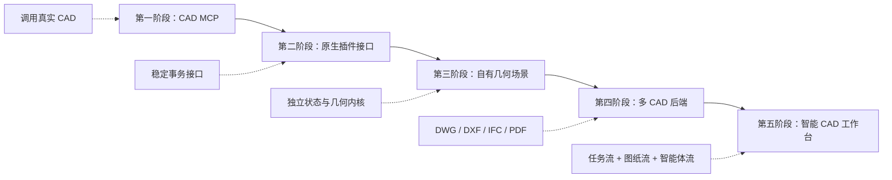

---

## 13. 绘图计划层

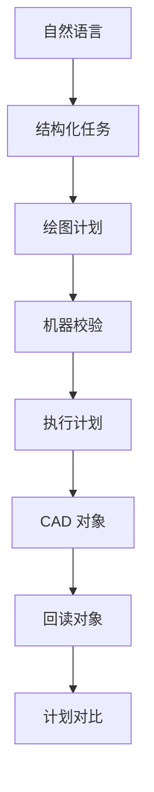

绘图计划至少表达：

- 对象类型
- 坐标和尺寸
- 图层和样式
- 标注和文字
- 依附关系
- 允许误差
- 回读标准

---

## 14. 绘图计划对象关系

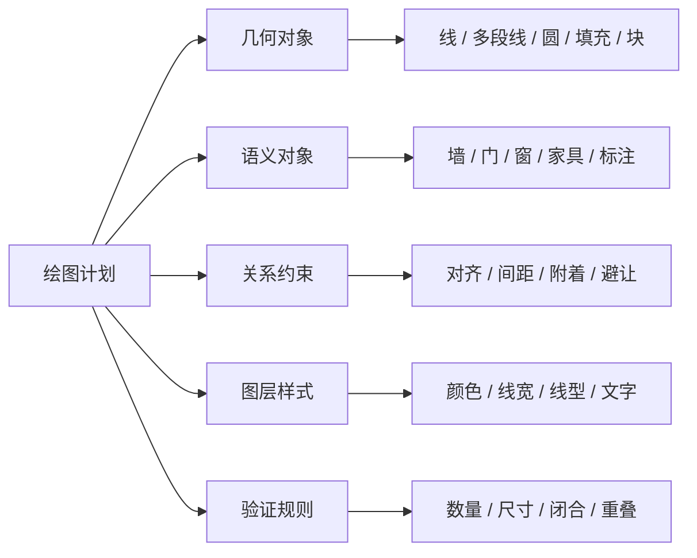

计划要素与对象模型对应关系：

| 绘图计划要素 | 对象模型归属 | 说明 |
| --- | --- | --- |
| 对象类型 | 语义对象 + 几何对象 | 例如“门”同时是语义对象，也会展开为线、弧、块等几何表达 |
| 坐标和尺寸 | 几何对象 | 记录基点、bbox、长度、半径、角度、单位 |
| 图层和样式 | 图层样式 | 颜色、线型、线宽、文字样式、标注样式 |
| 标注和文字 | 语义对象 + 图层样式 | 标注既有业务语义，也有可见样式 |
| 依附关系 | 关系约束 | 对齐、附着、间距、避让、跟随对象 |
| 允许误差 | 验证规则 | 每类对象和尺寸应有 tolerance |
| 回读标准 | 验证规则 | 指定 handles、bbox、props、text、screenshot 等证据要求 |

---

## 15. 证据闭环

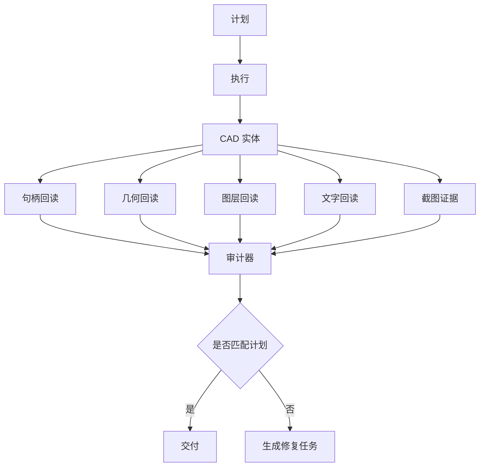

---

## 15A. 回读、差异计算与碰撞输入

回读数据不能直接等同于审计结论。系统需要一个差异计算器，把计划预期和实际回读转换为审计可消费的差异包。

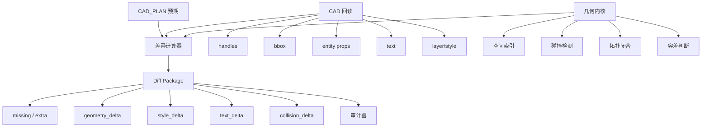

差异计算归属：

- 工具层负责返回原始回读和后端可提供的 diff。
- 几何内核负责碰撞、闭合、空间关系和容差计算。
- 审计器负责根据差异包判断通过、返工、人审或局部修复。
- 回读缺失或 CAD 会话进入 `in_flight_unknown` 时，Diff Package 必须标记 `comparisonStatus=partial | unavailable`，不能假装完整审计。
- `comparisonStatus` 不是 `complete` 时，审计结论只能是失败、人审或重连复验，不能直接交付。

---

## 16. 审计机制

```mermaid
flowchart LR
  A["预期"] --> C["审计器"]
  B["实际"] --> C
  C --> D["对象数量"]
  C --> E["尺寸误差"]
  C --> F["图层合规"]
  C --> G["文字正确"]
  C --> H["重叠碰撞"]
  C --> I["视觉可读"]
  D --> J["审计结论"]
  E --> J
  F --> J
  G --> J
  H --> J
  I --> J
```

---

## 17. 局部修复机制

```mermaid
flowchart TB
  A["审计失败"] --> B["定位失败对象"]
  B --> C["锁定句柄"]
  C --> D{"错误类型"}
  D -->|缺失| E["补画"]
  D -->|位置错| F["移动"]
  D -->|尺寸错| G["重建局部"]
  D -->|文字错| H["改文字"]
  D -->|图层错| I["改图层"]
  E --> J["回读复验"]
  F --> J
  G --> J
  H --> J
  I --> J
```

局部修复只适合对象级失败。下列属于全局失败，应进入重规划或人工复核：

- 单位系统错误
- 全局比例错误
- 坐标系或基点错误
- 全局线型比例 / 标注比例错误
- 图层状态或可见性策略错误
- 视口配置错误
- XRef 路径或绑定策略错误

---

## 18. 学习规则机制

```mermaid
flowchart TB
  A["任务结果"] --> B{"是否有价值"}
  B -->|否| C["只保留短期日志"]
  B -->|是| D["抽取经验"]

  D --> E["成功模式"]
  D --> F["失败模式"]
  D --> G["用户偏好"]
  D --> H["规范规则"]
  D --> I["资产候选"]

  E --> J["能力记忆"]
  F --> K["反例库"]
  G --> L["用户记忆"]
  H --> M["规则库"]
  I --> N["资产库"]

  J --> O["下次调度"]
  K --> O
  L --> O
  M --> O
  N --> O
```

---

## 18A. 学习产物到下次任务的复用链路

学习沉淀不是终点。经验要被下一次任务使用，必须经过检索、匹配、注入和审计。

```mermaid
flowchart TB
  A["新任务对象"] --> B["上下文构建器"]
  B --> C["记忆检索器"]
  B --> D["资产检索器"]
  B --> E["规则检索器"]
  B --> F["反例检索器"]

  C --> G["候选经验"]
  D --> G
  E --> G
  F --> G

  G --> H["相关性匹配"]
  H --> I["最小上下文包"]
  I --> J["Agent Runtime"]
  J --> K["规划 / 分发 / 审计"]
  K --> L["新证据"]
  L --> M["是否更新记忆"]
```

复用规则：

- 记忆检索由上下文构建器触发，不由工具层触发。
- 经验只能作为建议上下文，不能自动覆盖当前任务证据。
- 失败反例优先用于提醒风险和生成审计点。
- 被注入上下文的记忆必须保留来源、版本和证据引用。

---

## 19. 训练机制

```mermaid
flowchart TB
  A["训练需求"] --> B["选择能力点"]
  B --> C["生成训练任务"]
  C --> D["执行绘图"]
  D --> E["机器审计"]
  E --> F{"是否通过"}
  F -->|否| G["诊断失败"]
  G --> H["修正规则或提示"]
  H --> C
  F -->|是| I["人工抽检"]
  I --> J{"是否认可"}
  J -->|否| G
  J -->|是| K["沉淀能力"]
  K --> L["更新记忆与资产"]
```

---

## 20. 训练状态机

```mermaid
stateDiagram-v2
  [*] --> 候选
  候选 --> 训练中
  训练中 --> 失败诊断: 未通过
  失败诊断 --> 训练中: 已修正
  训练中 --> 待复核: 机器通过
  待复核 --> 训练中: 人工退回
  待复核 --> 已沉淀: 人工认可
  已沉淀 --> 回归复训: 后续失败
  回归复训 --> 训练中
  已沉淀 --> [*]
```

---

## 21. 记忆与资产架构

```mermaid
flowchart TB
  M["长期记忆中心"] --> A["用户偏好"]
  M --> B["项目上下文"]
  M --> C["能力经验"]
  M --> D["失败案例"]
  M --> E["规范规则"]
  M --> F["系统资产"]

  F --> F1["图块"]
  F --> F2["构件"]
  F --> F3["线型"]
  F --> F4["标注样式"]
  F --> F5["图框"]
  F --> F6["节点"]
```

---

## 22. 资产复用链路

```mermaid
flowchart LR
  A["复用请求"] --> B["检索资产"]
  B --> C["匹配语义"]
  C --> D["检查来源"]
  D --> E["生成插入计划"]
  E --> F["预览写入"]
  F --> G["回读验证"]
  G --> H{"是否可用"}
  H -->|是| I["完成复用"]
  H -->|否| J["候选退回"]
```

资产复用必须先做兼容性检查：

| 检查项 | 示例 |
| --- | --- |
| 单位与比例 | 英制资产插入公制图纸、比例因子不一致 |
| CAD 版本 | 块定义或实体类型当前后端不支持 |
| 图层与样式 | 目标图纸缺少线型、文字样式、标注样式 |
| 外部依赖 | 资产引用 XRef、字体、图片或外部块 |
| 坐标与基点 | 插入基点、旋转、镜像、UCS/WCS 不匹配 |
| 权限范围 | 资产是否允许写入当前文档和空间 |

兼容性失败时，应生成转换计划、替代候选或人工确认请求，不得直接插入。

---

## 23. 安全边界

```mermaid
flowchart TB
  A["用户请求"] --> B{"是否修改原图"}
  B -->|否| C["预览图层"]
  B -->|是| D{"是否有明确范围"}
  D -->|否| E["阻断并追问"]
  D -->|是| F{"是否涉及删除或保存"}
  F -->|否| G["执行前校验"]
  F -->|是| H["人工确认"]
  H --> G
  G --> I["执行"]
  I --> J["回读"]
```

---

## 24. 权限控制

```mermaid
flowchart LR
  A["操作"] --> B["新增预览"]
  A --> C["修改预览"]
  A --> D["修改原图"]
  A --> E["删除对象"]
  A --> F["保存文件"]

  B --> B1["默认允许"]
  C --> C1["需要句柄"]
  D --> D1["需要范围"]
  E --> E1["需要确认"]
  F --> F1["需要确认"]
```

---

## 25. 人工复核机制

```mermaid
flowchart TB
  A["系统不确定"] --> B{"不确定来源"}
  B -->|语义不清| C["问用户意图"]
  B -->|专业判断| D["请求人工审图"]
  B -->|高风险操作| E["请求授权"]
  B -->|证据不足| F["补充回读或截图"]

  C --> G["继续规划"]
  D --> G
  E --> G
  F --> G
```

---

## 26. 工作台界面框架

```mermaid
flowchart TB
  UI["CAD 智能工作台"] --> A["任务面板"]
  UI --> B["图纸视窗"]
  UI --> C["智能体面板"]
  UI --> D["证据面板"]
  UI --> E["资产面板"]
  UI --> F["规则面板"]

  A --> A1["当前任务 / 子任务 / 状态"]
  B --> B1["CAD 画面 / 预览 / 对比"]
  C --> C1["分发记录 / 决策原因"]
  D --> D1["回读 / 截图 / 审计"]
  E --> E1["检索 / 复用 / 沉淀"]
  F --> F1["规范 / 权限 / 训练"]
```

---

## 27. 双入口总体架构

系统需要两个入口：

- **开发入口**：由 Codex 使用，用来开发、调试、修复、升级系统。
- **体验入口**：由可视化工作台承载，用来模拟未来用户真实使用 CAD 智能体。

```mermaid
flowchart LR
  U1["开发者"] --> C["Codex 开发入口"]
  C --> D["代码 / 规则 / 测试 / 日志"]
  D --> K["CAD 智能体内核"]

  U2["未来用户"] --> W["可视化工作台入口"]
  W --> T["CAD 任务"]
  T --> K

  K --> O["超级编排器"]
  O --> A["多智能体系统"]
  A --> X["CAD 工具层"]
  X --> R["CAD 回读证据"]
  R --> W
  R --> C
```

---

## 28. 两个入口的职责边界

```mermaid
flowchart TB
  A["系统入口"] --> B["Codex 开发入口"]
  A --> C["可视化工作台入口"]

  B --> B1["改代码"]
  B --> B2["改规则"]
  B --> B3["跑测试"]
  B --> B4["查日志"]
  B --> B5["诊断失败"]
  B --> B6["升级智能体"]

  C --> C1["输入 CAD 指令"]
  C --> C2["查看任务状态"]
  C --> C3["查看 Agent 联络"]
  C --> C4["查看 CAD 预览"]
  C --> C5["查看审计证据"]
  C --> C6["确认高风险动作"]
```

| 入口 | 本质 | 主要用户 | 适合做什么 |
| --- | --- | --- | --- |
| Codex 开发入口 | 系统建造与调试入口 | 开发者 | 开发、修复、测试、分析 |
| 可视化工作台入口 | CAD 智能体产品入口 | 未来用户 | 下指令、看过程、验结果 |

---

## 29. Codex 开发入口

Codex 不应成为最终 CAD 产品本身。它更像系统的开发驾驶舱。当前阶段还可以增加一个开发态职责：通过 `Codex Bridge` 临时充当 CAD Agent 的高智能模型后端，用 Codex 当前推荐的 `gpt-5.5` 支撑总控、分发、诊断和复审。

```mermaid
flowchart TB
  C["Codex"] --> A["读取架构"]
  C --> B["修改代码"]
  C --> D["运行测试"]
  C --> E["检查日志"]
  C --> F["修复失败"]
  C --> G["生成文档"]
  C --> H["Codex Bridge"]
  H --> H1["gpt-5.5 开发态推理"]

  A --> K["CAD 智能体内核"]
  B --> K
  D --> K
  E --> K
  F --> K
  G --> K
  H1 --> K
```

开发入口可以发内部指令，例如：

- 跑一组回归测试
- 检查某个 Agent 输出
- 查看 CADMCP 调用日志
- 修改任务分发规则
- 新增审计器
- 修复工作台显示问题
- 通过 Codex Bridge 执行一次 Agent 分发或复审

它不负责模拟普通用户的完整体验。普通用户体验仍应通过可视化工作台观察；只是开发期工作台的智能判断可以先路由到 Codex Bridge，而不是立刻接生产模型 API。

---

## 30. 可视化工作台入口

工作台才是未来用户真正使用 CAD 智能体的地方。

```mermaid
flowchart TB
  W["可视化工作台"] --> I["指令输入区"]
  W --> S["任务状态区"]
  W --> A["Agent 联络区"]
  W --> V["CAD 预览区"]
  W --> E["证据审计区"]
  W --> H["人工确认区"]

  I --> I1["画 / 改 / 查 / 标注 / 复用 / 训练"]
  S --> S1["理解中 / 规划中 / 执行中 / 审计中"]
  A --> A1["谁在处理 / 为什么分发 / 下一步是什么"]
  V --> V1["CAD 截图 / 预览图层 / 高亮错误"]
  E --> E1["句柄 / 数量 / 尺寸 / 图层 / 差异"]
  H --> H1["允许执行 / 允许删除 / 允许保存 / 要求返工"]
```

---

## 31. 工作台指令流程

```mermaid
sequenceDiagram
  participant U as 用户
  participant W as 工作台
  participant O as 超级编排器
  participant P as 规划智能体
  participant E as 执行智能体
  participant G as 工具网关
  participant A as CAD Adapter
  participant C as CAD
  participant Q as 审计智能体

  U->>W: 输入 CAD 指令
  W->>O: 创建任务对象
  O->>P: 请求绘图计划
  P->>O: 返回计划与风险
  O->>E: 执行已批准计划
  E->>G: 提交 Tool Contract
  G->>A: 校验后路由
  A->>C: 执行 CAD 操作
  C-->>A: CAD 回读
  A-->>G: 结构化结果 / Diff
  G-->>Q: 证据包
  Q->>W: 返回审计结论
  W->>U: 展示结果或修复建议
```

---

## 32. 开发与体验联动

开发阶段要让工作台持续模拟未来用户体验。Codex 负责修系统，工作台负责暴露真实体验问题。

```mermaid
flowchart LR
  A["在工作台输入真实 CAD 指令"] --> B["系统执行"]
  B --> C["工作台展示过程"]
  C --> D{"体验是否顺畅"}
  D -->|是| E["记录可通过案例"]
  D -->|否| F["暴露问题"]
  F --> G["Codex 开发入口诊断"]
  G --> H["修改代码 / 规则 / 界面"]
  H --> A
```

---

## 33. 测试入口分层

```mermaid
flowchart TB
  A["测试方式"] --> B["单元测试"]
  A --> C["命令行测试"]
  A --> D["Codex 调试测试"]
  A --> E["工作台体验测试"]

  B --> B1["验证函数和规则"]
  C --> C1["验证批量链路"]
  D --> D1["定位复杂失败"]
  E --> E1["模拟真实用户"]

  B1 --> F["底层正确"]
  C1 --> F
  D1 --> G["开发可修"]
  E1 --> H["产品可用"]
```

---

## 34. 用户体验闭环

```mermaid
flowchart TB
  A["用户输入"] --> B["系统理解"]
  B --> C["展示理解结果"]
  C --> D{"用户是否认可"}
  D -->|否| E["用户修正"]
  E --> B
  D -->|是| F["生成计划"]
  F --> G["展示执行预案"]
  G --> H{"是否高风险"}
  H -->|是| I["请求确认"]
  H -->|否| J["执行"]
  I --> J
  J --> K["回读审计"]
  K --> L["展示证据"]
  L --> M{"是否满意"}
  M -->|否| N["局部返工"]
  N --> J
  M -->|是| O["完成"]
```

---

## 35. 推荐开发期使用方式

```mermaid
flowchart LR
  A["想开发能力"] --> B["进 Codex"]
  A2["想体验功能"] --> C["进工作台"]
  A3["想查失败原因"] --> B
  A4["想像用户一样下指令"] --> C

  B --> D["代码 / 测试 / 日志 / 修复"]
  C --> E["输入 / 状态 / 预览 / 审计 / 确认"]

  D --> F["系统变强"]
  E --> G["体验变清楚"]
  F --> C
  G --> B
```

---

## 36. 系统最小内核

```mermaid
flowchart LR
  A["输入"] --> B["任务对象"]
  B --> C["绘图计划"]
  C --> D["校验"]
  D --> E["CAD 执行"]
  E --> F["回读"]
  F --> G["审计"]
  G --> H["局部修复"]
  G --> I["交付"]
```

最小版本只需要七件事：

1. 任务对象
2. 绘图计划
3. 工具调用
4. CAD 写入
5. 实体回读
6. 机器审计
7. 局部修复

---

## 37. 成熟度路线

```mermaid
flowchart LR
  A["一级：会调用 CAD"] --> B["二级：会生成计划"]
  B --> C["三级：会回读审计"]
  C --> D["四级：会局部修复"]
  D --> E["五级：会多智能体协作"]
  E --> F["六级：会资产复用"]
  F --> G["七级：会持续训练"]
  G --> H["八级：成为 CAD 智能系统"]
```

---

## 38. 关键设计原则

```mermaid
flowchart TB
  A["设计原则"] --> B["不直连命令"]
  A --> C["先计划后执行"]
  A --> D["先回读再完成"]
  A --> E["先局部修复"]
  A --> F["高风险需授权"]
  A --> G["经验可沉淀"]
  A --> H["资产可复用"]
```

---

## 39. 推荐建设顺序

```mermaid
flowchart TB
  A["第一步：任务对象"] --> B["第二步：绘图计划"]
  B --> C["第三步：CAD 工具适配"]
  C --> D["第四步：回读审计"]
  D --> E["第五步：局部修复"]
  E --> F["第六步：多智能体编排"]
  F --> G["第七步：资产与记忆"]
  G --> H["第八步：训练闭环"]
  H --> I["第九步：智能工作台"]
```

第 39 节是 **最小实现顺序**，强调先把端到端闭环跑起来；第 72 节是 **升级版工程阶段**，强调系统如何成长为可运维、可扩展、可交付的平台。两者不是两套主线，而是同一条路线的不同粒度。

工作台位置裁决：

- 第 72 节第二阶段的“工作台体验闭环”是早期观察台和测试入口：用于输入命令、显示任务时间线、展示预览、证据和失败原因。
- 第 39 节第九步的“智能工作台”是完整产品化工作台：包括可交互 CAD 画布、Selection Contract、多用户任务队列、权限面板、人工复核和交付归档。
- 因此早期必须有工作台壳来模拟未来用户体验，但完整智能工作台应在 CAD 闭环、审计修复、多 Agent、资产记忆和训练闭环稳定后再产品化。

---

## 40. 基础最终形态

```mermaid
flowchart TB
  A["超级 CAD 智能系统"] --> B["能理解"]
  A --> C["能规划"]
  A --> D["能调用"]
  A --> E["能执行"]
  A --> F["能证明"]
  A --> G["能修复"]
  A --> H["能学习"]
  A --> I["能沉淀"]
  A --> J["能协同"]

  B --> K["从白话到任务"]
  C --> L["从任务到计划"]
  D --> M["从计划到工具"]
  E --> N["从工具到 CAD"]
  F --> O["从 CAD 到证据"]
  G --> P["从错误到修复"]
  H --> Q["从案例到经验"]
  I --> R["从经验到资产"]
  J --> S["从单体到系统"]
```

最终目标不是替代 CAD，而是让 CAD 从“绘图软件”升级成“可协作、可验证、可成长的智能设计环境”。

---

## 41. 多视角升级结论

从开发者、使用者、CAD 专业人员、企业管理者、安全运维者五个角度看，超级 CAD Agent 的理想架构应升级为：

> 工作台入口 + 编排运行时 + 中立工程数据内核 + 专家 Agent 网络 + 工具网关 + CAD/BIM 后端 + 治理控制平面 + 证据账本 + 训练评测系统。

```mermaid
flowchart TB
  A["多视角审阅"] --> B["开发者视角"]
  A --> C["使用者视角"]
  A --> D["CAD/BIM 专业视角"]
  A --> E["安全治理视角"]
  A --> F["企业运维视角"]

  B --> B1["运行时 / 调试 / 回放 / 测试"]
  C --> C1["工作台 / 透明过程 / 可控确认"]
  D --> D1["工程数据内核 / 几何 / IFC / 交付"]
  E --> E1["权限 / 事务 / 证据 / 风险"]
  F --> F1["部署 / 队列 / 版本 / 告警"]

  B1 --> G["理想架构"]
  C1 --> G
  D1 --> G
  E1 --> G
  F1 --> G
```

---

## 42. 当前技术可实现边界

这套系统不应建立在“模型直接画准一切”的假设上。当前可实现的可靠路径是：

- 用大模型做理解、规划、分发、解释和复审。
- 用结构化计划表达 CAD 意图。
- 用确定性工具完成几何、写入、校验和回读。
- 用证据账本证明结果。
- 用评测和人审控制能力晋升。

```mermaid
flowchart LR
  A["大模型能力"] --> B["理解 / 分发 / 解释"]
  C["结构化输出"] --> D["CAD_PLAN / 审计结果 / 工具参数"]
  E["工具协议"] --> F["MCP / 函数工具 / 远程服务"]
  G["CAD 自动化"] --> H["AutoCAD / 云端自动化 / 插件"]
  I["开源几何与 BIM"] --> J["FreeCAD / IfcOpenShell / OpenCascade"]
  K["安全与观测"] --> L["权限 / Trace / 指标 / 告警"]

  B --> M["可实现的超级 CAD Agent"]
  D --> M
  F --> M
  H --> M
  J --> M
  L --> M
```

关键边界：

- 自然语言到简单 CAD 已经可行，但复杂拓扑、复杂约束和真实工程交付仍必须依赖工具审计。
- CADMCP 可以作为早期真实 CAD 适配器，但不能成为系统中心。
- 生产系统必须把 CAD 写入当成高风险事务，而不是普通工具调用。

---

## 43. 最理想目标总图

```mermaid
flowchart TB
  U["使用者工作台"] --> R["CAD Agent 运行时"]
  D["Codex 开发入口"] --> R
  O2["企业运维入口"] --> R

  R --> O["超级编排器"]
  O --> S["任务状态与检查点"]
  O --> A["Agent 注册中心"]
  O --> C["上下文构建器"]
  O --> P["策略引擎"]
  O --> T["工具网关"]

  C --> K["中立工程数据内核"]
  K --> K1["任务图"]
  K --> K2["几何图"]
  K --> K3["语义图"]
  K --> K4["图纸图"]
  K --> K5["版本图"]
  K --> K6["证据图"]

  A --> A1["规划 / 几何 / 规范 / 执行 / 审计 / 修复 / 资产 Agent"]
  T --> T1["CADMCP"]
  T --> T2["AutoCAD 插件"]
  T --> T3["云端自动化"]
  T --> T4["几何内核"]
  T --> T5["IFC / BIM 工具"]
  T --> T6["Viewer / 截图 / 文件转换"]

  T1 --> CAD["CAD / BIM 后端"]
  T2 --> CAD
  T3 --> CAD
  T4 --> CAD
  T5 --> CAD
  T6 --> CAD

  CAD --> E["证据账本"]
  E --> Q["审计与评测"]
  Q --> O
  Q --> M["记忆 / 资产 / 训练"]
  M --> C
```

---

## 44. 中立工程数据内核

超级 CAD Agent 不应直接依赖某一个 CAD 软件。系统中心应是中立工程数据内核，统一承载任务、几何、语义、图纸、版本、证据和交付物。

```mermaid
flowchart TB
  A["用户任务"] --> B["任务图"]
  B --> C["工程数据内核"]
  C --> D["几何图"]
  C --> E["语义图"]
  C --> F["图纸图"]
  C --> G["版本图"]
  C --> H["证据图"]
  C --> I["交付图"]

  D --> D1["点 / 线 / 面 / 块 / BRep / Mesh"]
  E --> E1["墙 / 门 / 窗 / 空间 / 系统 / 属性"]
  F --> F1["布局 / 视口 / 标注 / 图框 / 出图"]
  G --> G1["版本 / 变更 / 分支 / 签发"]
  H --> H1["回读 / 截图 / 审计 / 人审"]
  I --> I1["DWG / IFC / PDF / 报告 / 问题清单"]
```

---

## 45. CAD 文件真实结构

真实 DWG 不是一堆线。系统必须理解 CAD 数据库结构，否则很难安全修改真实图纸。

```mermaid
flowchart TB
  A["CAD 文件"] --> B["模型空间"]
  A --> C["图纸空间"]
  A --> D["布局"]
  A --> E["视口"]
  A --> F["图层"]
  A --> G["块与属性"]
  A --> H["外部参照"]
  A --> I["标注样式"]
  A --> J["文字样式"]
  A --> K["线型线宽"]
  A --> L["坐标系统"]
  A --> M["扩展数据"]

  B --> N["几何实体"]
  C --> O["出图表达"]
  G --> P["可复用构件"]
  H --> Q["跨文件依赖"]
  L --> R["UCS / WCS / 单位 / 比例"]
```

---

## 45A. XRef 与多文档安全模型

真实项目常包含外部参照和跨文件依赖。系统不能把所有操作都简化为“当前 DWG”。

```mermaid
flowchart TB
  A["图纸任务"] --> B["主 DWG"]
  B --> C["XRef 源文件"]
  B --> D["图纸集 / Sheet Set"]
  B --> E["目标 DWG"]

  C --> C1["被多个父图引用"]
  D --> D1["发布 / 批量出图"]
  E --> E1["跨文档复制 / 插入"]

  A --> F["多文档 Tool Contract"]
  F --> G["sourceDocuments"]
  F --> H["targetDocuments"]
  F --> I["xrefPolicy"]
  F --> J["writeScope"]
  F --> K["impactAnalysis"]
```

高风险操作：

| 操作 | 风险 |
| --- | --- |
| 修改 XRef 源文件 | 影响所有引用它的父 DWG |
| 绑定 / 拆离 XRef | 改变文件依赖和交付结构 |
| 跨 DWG 复制对象 | 涉及单位、图层、块定义、样式兼容 |
| 图纸集发布 | 影响多个布局、PDF、签发版本 |

多文档规则：

- 多文档、XRef、图纸集发布和跨文件复制必须使用 `tool-contract/v2`，不得混入单文档 `targetScope.documentId`。
- Tool Contract 必须区分 `sourceDocuments` 和 `targetDocuments`。
- 修改 XRef 源文件必须先做影响分析，列出受影响父图。
- 只读读取多个 DWG 可以并行；写入多个 DWG 必须排序、加锁并逐个提交。
- 保存 XRef 源文件比保存普通预览 DWG 风险更高，默认需要人工授权。

---

## 46. BIM 语义层

如果系统要进入真实工程交付，就不能只做 2D 绘图，还要理解 BIM 语义。

```mermaid
flowchart TB
  A["BIM 语义层"] --> B["构件类型"]
  A --> C["构件实例"]
  A --> D["空间与楼层"]
  A --> E["属性集"]
  A --> F["材料"]
  A --> G["分类"]
  A --> H["专业系统"]
  A --> I["模型联合"]
  A --> J["交付要求"]

  B --> B1["墙 / 梁 / 柱 / 板 / 门 / 窗 / 设备"]
  E --> E1["Pset / 数量 / 性能 / 编码"]
  G --> G1["bSDD / 企业分类 / 项目分类"]
  J --> J1["IDS / 项目标准 / 审图要求"]
```

---

## 47. 格式与后端策略

不同格式的角色必须明确：谁是源文件、谁可回写、谁只读、谁用于交付。

```mermaid
flowchart LR
  A["中立工程数据内核"] --> B["DWG / DXF"]
  A --> C["IFC"]
  A --> D["Revit / 专有 BIM"]
  A --> E["PDF / 图片"]
  A --> F["STEP / BRep"]
  A --> G["云端 AEC 数据"]

  B --> B1["可读写 / 强事务 / 需保护原图"]
  C --> C1["openBIM / 语义交付 / 合规检查"]
  D --> D1["专业模型 / 原生编辑 / 企业协作"]
  E --> E1["只读证据 / 出图交付 / 视觉审查"]
  F --> F1["3D 几何 / 制造 / 复杂形体"]
  G --> G1["协同 / 权限 / 批处理"]
```

---

## 48. CAD/BIM 格式适配层

CADMCP 是早期适配器之一，理想系统应支持多后端。

```mermaid
flowchart TB
  A["统一工程数据内核"] --> B["AutoCAD / CADMCP 适配器"]
  A --> C["AutoCAD 原生插件适配器"]
  A --> D["云端自动化适配器"]
  A --> E["DWG/DXF 文件适配器"]
  A --> F["IFC 适配器"]
  A --> G["BIM 平台适配器"]
  A --> H["PDF / Viewer 适配器"]
  A --> I["几何内核适配器"]

  B --> B1["桌面 CAD 实时执行"]
  C --> C1["稳定事务写入"]
  D --> D1["批量出图 / 标准检查"]
  E --> E1["无 CAD 解析和转换"]
  F --> F1["openBIM 读写与校验"]
  G --> G1["企业模型数据"]
  H --> H1["Web 预览与交付"]
  I --> I1["拓扑 / 布尔 / 碰撞"]
```

---

## 49. 几何内核与约束系统

大模型不应直接承担几何正确性的最终责任。几何必须交给确定性内核和约束系统。

```mermaid
flowchart TB
  A["几何内核"] --> B["2D 拓扑"]
  A --> C["3D BRep"]
  A --> D["Mesh"]
  A --> E["空间索引"]
  A --> F["约束求解"]
  A --> G["碰撞检测"]
  A --> H["容差管理"]
  A --> I["坐标转换"]
  A --> J["面积体量"]

  B --> B1["闭合 / 相交 / 偏移 / 面域"]
  C --> C1["面 / 边 / 壳 / 体"]
  F --> F1["平行 / 垂直 / 等距 / 依附"]
  H --> H1["单位 / 精度 / 误差范围"]
```

---

## 49A. CAD 高级能力路线：装配、仿真与 BIM 合规

基础 CAD Agent 先解决 2D 图面、对象回读、局部修复和证据闭环。更高阶段需要进入 CAD 专项智能：装配体关系、物理仿真反馈和 BIM 合规管道。

```mermaid
flowchart TB
  A["CAD 高级能力"] --> B["装配体推理"]
  A --> C["物理 / 结构仿真"]
  A --> D["BIM 合规检查"]
  A --> E["合成数据生成"]

  B --> B1["Connector"]
  B1 --> B2["连接点 / 关节 / 运动约束"]
  B2 --> B3["先关系后几何"]

  C --> C1["CAD 几何"]
  C1 --> C2["FEA / CAE"]
  C2 --> C3["应力 / 位移 / 冲突"]
  C3 --> C4["修改建议"]
  C4 --> C1

  D --> D1["规范条文解析 Agent"]
  D1 --> D2["IFC 实体对齐 Agent"]
  D2 --> D3["模型语义转文本 Agent"]
  D3 --> D4["合规审查 Agent"]

  E --> E1["参数化任务"]
  E1 --> E2["可执行 CAD 序列"]
  E2 --> E3["训练 / 评测样本"]
```

阶段边界：

- 装配体任务应在绘图计划层显式表达连接点、关节类型、运动范围和依附关系。
- 物理仿真不替代图面审计，而是作为结构可靠性、制造约束或工程优化的高级审计插件。
- BIM 合规检查应拆为规范理解、实体对齐、语义转译、规则验证和人工复核，不应只靠单次大模型判断。
- 合成数据可用于训练和评测储备，但必须和真实项目样本、人工验收样本隔离。

---

## 50. 生产级 Agent 运行时

超级 CAD Agent 不是一次聊天，而是可暂停、可恢复、可回放、可分叉的任务运行时。

```mermaid
flowchart TB
  A["Chief CAD Agent"] --> B["工作流运行时"]
  B --> C["任务状态库"]
  B --> D["检查点"]
  B --> E["分支与回放"]
  B --> F["失败重试"]
  B --> G["人工中断"]
  B --> H["Agent 注册中心"]
  B --> I["工具网关"]
  B --> J["策略引擎"]
  B --> K["Trace / Eval Sink"]

  C --> C1["当前阶段 / 输入 / 输出 / 证据"]
  D --> D1["恢复 / 复盘 / 回滚"]
  E --> E1["方案 A / B / C 对比"]
```

---

## 50A. 智能提示与 Codex Bridge 开发态接入原则

所有涉及智能判断的提示都必须通过统一的模型调用边界实现，但 **不把 OpenAI API 当成当前阶段的死规定**。在开发状态下，推荐先用 `Codex Bridge` 接入 Codex 当前可用的高推理模型，例如官方当前推荐的 `gpt-5.5`，让 Codex 充当 CAD Agent 系统的开发态 LLM 后端。

Prompt 是 Agent Runtime 的受控资产，不是 UI 文案，也不是插件内部逻辑。未来若进入面向多用户的稳定生产服务，可以把同一层替换为 OpenAI API、企业模型代理、本地模型或混合路由；但当前阶段先以 `codex_bridge_dev` 为默认 Provider。

```mermaid
flowchart TB
  A["用户命令 / 工作台事件"] --> B["Agent Runtime"]
  B --> C["Prompt Registry"]
  B --> D["上下文构建器"]
  C --> E["模型调用网关"]
  D --> E
  E --> P["Provider Router"]
  P --> PB["codex_bridge_dev"]
  PB --> S["Codex SDK / app-server / codex exec"]
  S --> M55["Codex gpt-5.5"]
  P -.-> PA["OpenAI API / 企业代理 / 本地模型"]
  M55 --> F["模型任务路由"]
  PA -.-> F
  F --> F1["高推理任务"]
  F --> F2["中等推理任务"]
  F --> F3["轻量任务"]
  F --> F4["视觉 / 结构任务"]

  F1 --> G["意图理解 / 任务分解 / 审计复审"]
  F2 --> H["计划归一化 / 文案解释 / 常规检查"]
  F3 --> I["分类 / 摘要 / 字段抽取"]
  F4 --> J["截图理解 / 图纸视觉线索"]

  G --> K["结构化决策"]
  H --> K
  I --> K
  J --> K
  K --> L["策略引擎"]
  L --> M["工具网关"]
  M --> N["CAD / BIM / 几何后端"]
```

强制规则：

- 智能提示、系统提示、Agent Prompt、复审 Prompt、分发 Prompt 必须登记在 `Prompt Registry`。
- Prompt 调用必须经过模型调用网关，当前开发态默认走 `codex_bridge_dev`。
- `codex_bridge_dev` 可以通过 Codex SDK、`codex app-server` 或 `codex exec` 形成桥接，但必须保留模型、版本、输入摘要、输出结构、额度 / 成本估计和 trace。
- 工作台只能提交任务、展示结果和承载人工确认，不能直接拼接隐式 Prompt 绕过模型调用网关。
- CAD 插件不能内置自然语言理解、模型调用、任务分发或学习晋升逻辑。
- 模型输出必须转成结构化对象，再进入策略引擎和工具网关。
- 几何正确性、写入事务和完成声明不能只依赖模型判断，必须由确定性校验和证据账本闭环。
- `gpt-5.5` 是当前开发态推荐配置，不应写成不可升级的永久常量；模型名应放在配置层或 Provider Registry。
- 当前不展开面向多用户的生产 SLA、计费、限流和企业合规模型网关。

模型智能度采用分层策略：

| 节点 | 推荐模型智能度 | 原因 |
| --- | --- | --- |
| 总控 Agent、任务分解、跨专业分发 | 极高 | 决策错误会影响整条任务链 |
| 几何异常诊断、规范冲突解释、最终复审 | 极高 | 需要长上下文、多约束推理和反例意识 |
| 绘图计划归一化、字段补全、常规说明 | 中高 | 需要稳定结构化输出，但风险较低 |
| 分类、摘要、日志压缩、简单抽取 | 中低 | 任务窄，可由规则和 schema 约束 |
| CAD 写入、回读、碰撞、约束求解 | 不靠模型智能度 | 应由工具、插件、几何内核和审计器承担 |

开发态推荐策略：

- 总控 Agent、任务分解、跨专业分发、复杂诊断和最终复审，优先使用 Codex 当前推荐的高推理模型，如 `gpt-5.5`。
- 常规摘要、日志压缩、字段抽取等轻量任务，可以暂时也走 `gpt-5.5` 以减少早期路由复杂度；等系统稳定后再拆成轻量模型或本地模型。
- Codex Bridge 适合开发期、内部测试期和架构验证期；它不是未来生产服务的唯一答案，也不应让工作台、插件或工具层依赖 Codex 私有会话细节。

结论：关键智能节点需要极高智能度模型；当前开发阶段可以先借 Codex Bridge 调用 `gpt-5.5`，把 CAD Agent 的智能能力跑通。长期架构保留模型调用网关和 Provider Router，避免把系统锁死在某一种 API、某一个模型名或某一个客户端形态上。

---

## 51. 上下文与记忆治理

上下文不能全部塞进模型。系统需要分层上下文包。

```mermaid
flowchart TB
  A["上下文构建器"] --> B["任务短上下文"]
  A --> C["项目上下文"]
  A --> D["CAD 状态摘要"]
  A --> E["用户偏好"]
  A --> F["相关资产"]
  A --> G["历史失败案例"]
  A --> H["工具能力"]
  A --> I["权限范围"]

  B --> J["当前 Agent 最小上下文包"]
  C --> J
  D --> J
  H --> J
  I --> J

  E --> K["长期记忆"]
  F --> K
  G --> K
```

记忆分级：

| 类型 | 用途 | 是否自动晋升 |
| --- | --- | --- |
| 会话记忆 | 当前任务临时信息 | 可以 |
| 项目记忆 | 项目标准、图层、尺寸体系 | 需确认 |
| 用户偏好 | 表达方式、工作习惯 | 需确认 |
| 失败反例 | 防止重复犯错 | 需审计 |
| 正式规则 | 影响所有任务 | 需发布门禁 |

---

## 51A. 记忆治理、上下文压缩与证据边界

上下文压缩、长期记忆和证据账本是三套不同机制，不能混在一个“大记忆中心”里。

```mermaid
flowchart TB
  A["运行中任务"] --> B["上下文压缩 Compaction"]
  A --> C["记忆管理器 Memory Manager"]
  A --> D["证据账本 Evidence Ledger"]

  B --> B1["当前线程继续运行"]
  B --> B2["摘要 / 决策 / 未完成事项"]
  B --> B3["可丢弃噪声"]

  C --> C1["工作记忆"]
  C --> C2["情景记忆"]
  C --> C3["语义记忆"]
  C --> C4["程序性记忆"]
  C --> C5["检索 / 晋升 / 遗忘"]

  D --> D1["CAD handles"]
  D --> D2["回读结果"]
  D --> D3["截图 / diff"]
  D --> D4["审计报告"]
  D --> D5["不可由压缩替代"]

  B --> E["最小上下文包"]
  C --> E
  D --> F["证据引用"]
  F --> E
```

治理规则：

- `Compaction` 只解决当前长任务如何继续，不等于长期记忆。
- `Memory` 负责未来任务如何复用经验，必须有晋升、撤销、过期和污染检查。
- `Evidence Ledger` 保存证明材料，不能被摘要替代，也不能被模型记忆覆盖。
- 最小上下文包应优先引用证据索引，而不是把完整证据全文塞进模型。
- 记忆管理器需要决定：存什么、取什么、压缩什么、丢弃什么、何时要求人工确认。

---

## 52. 工具网关

所有工具调用都必须先经过工具网关。Agent 不能直接越过网关调用 CAD。

```mermaid
flowchart LR
  A["Agent 请求工具"] --> B["工具网关"]
  B --> C["工具注册检查"]
  C --> D["Schema 校验"]
  D --> E["权限检查"]
  E --> F["Dry-run / 影响评估"]
  F --> G{"是否需确认"}
  G -->|是| H["人工授权"]
  G -->|否| I["执行"]
  H --> I
  I --> J["回读"]
  J --> K["审计"]
  K --> L["写入证据账本"]
```

工具网关职责：

- 工具注册和版本管理
- 参数强校验
- 危险动作拦截
- 出网和文件访问控制
- 执行前影响评估
- 执行后回读与审计
- 全链路 Trace

---

## 52A. 工具网关失效模式

工具网关是 CAD Agent 的安全边界。它不可用时，系统不能默认放行 CAD 写入。

```mermaid
flowchart TB
  A["工具网关状态"] --> B{"是否健康"}
  B -->|健康| C["正常工具调用"]
  B -->|部分异常| D["降级模式"]
  B -->|不可用| E["Fail-closed"]

  D --> D1["允许只读"]
  D --> D2["允许状态查询"]
  D --> D3["允许证据读取"]
  D --> D4["阻断写入 / 删除 / 保存 / 导出"]

  E --> E1["阻断所有 CAD 写入"]
  E --> E2["暂停任务"]
  E --> E3["记录故障事件"]
  E --> E4["提示人工介入"]

  C --> F["证据账本"]
  D1 --> F
  E3 --> F
```

默认策略：

| 网关状态 | 允许动作 | 禁止动作 |
| --- | --- | --- |
| 正常 | 按 Tool Contract 执行 | 合同外动作 |
| 降级 | 只读、回读、截图、状态查询 | 写入、删除、保存、导出 |
| 不可用 | 暂停、解释、人工接管 | 任何绕过网关的 CAD 操作 |

工具网关故障不得触发“Agent 直接调用 CAD”作为兜底。真正的兜底是暂停、回放、降级只读和人工接管。

---

## 52B. Tool Card Registry

Agent 合同描述“谁能做什么”，Tool Card 描述“哪个后端能安全执行什么”。工具网关应基于 Tool Card 选择后端，而不是只靠 Prompt 记忆工具能力。

```mermaid
flowchart TB
  A["工具网关"] --> B["Tool Card Registry"]
  B --> C["CADMCP Card"]
  B --> D["AutoCAD Plugin Card"]
  B --> E["Geometry Kernel Card"]
  B --> F["IFC / BIM Card"]
  B --> G["Cloud Automation Card"]

  C --> H["操作能力"]
  D --> H
  E --> H
  F --> H
  G --> H

  H --> I["风险策略"]
  H --> J["证据能力"]
  H --> K["回滚能力"]
  H --> L["资源画像"]
  H --> M["评测画像"]
  M --> N["后端选择 / 降级 / 冻结"]
```

Tool Card 最少包含：

- `toolId`
- `adapterType`
- `operations`
- `riskPolicy`
- `evidenceCapabilities`
- `rollbackCapabilities`
- `resourceProfile`
- `evalProfile`
- `schemaVersion`

---

## 53. 治理控制平面

企业级 CAD Agent 必须有治理控制平面。它决定能不能做、怎么做、做了什么、能不能上线。

```mermaid
flowchart TB
  U["用户 / 工作台 / Codex"] --> G["治理控制平面"]
  G --> P["策略引擎"]
  G --> I["身份与权限"]
  G --> R["风险分级"]
  G --> A["审批与授权"]
  G --> E["证据账本"]
  G --> V["版本与发布"]
  G --> O["观测与告警"]

  G --> K["CAD Agent 内核"]
  K --> T["工具网关"]
  T --> C["CAD / 几何 / 文件后端"]
  C --> B["回读与差异"]
  B --> E
  E --> G
```

---

## 53A. 模型资源治理与调用预算

即使开发态先用 Codex Bridge，也不能把模型调用看成无限资源。系统需要把模型额度、token、耗时、工具调用次数、失败重试和人工等待都纳入资源治理。

```mermaid
flowchart TB
  A["任务请求"] --> B["资源治理器"]
  B --> C["任务复杂度评估"]
  B --> D["模型路由预算"]
  B --> E["Token / 上下文预算"]
  B --> F["工具调用预算"]
  B --> G["重试预算"]
  B --> H["耗时预算"]

  C --> I["是否允许直接执行"]
  D --> J["Codex Bridge / 轻量模型 / 本地模型"]
  E --> K["压缩 / 摘要 / 分批"]
  F --> L["dry-run / execute / readback 限额"]
  G --> M["熔断 / 人工复核"]
  H --> M

  I --> N["任务运行"]
  J --> N
  K --> N
  L --> N
  M --> O["暂停 / 升级 / 解释"]
```

资源治理指标：

| 指标 | 作用 |
| --- | --- |
| `model_calls_per_task` | 防止多 Agent 互相调用导致失控 |
| `token_budget` | 控制上下文膨胀和 Codex Bridge 额度消耗 |
| `tool_call_budget` | 限制 CAD 写入、截图、回读和重试次数 |
| `retry_budget` | 防止失败任务无限自修 |
| `cost_or_credit_estimate` | 记录 API 成本或 Codex 额度消耗估计 |
| `cost_per_resolved_outcome` | 衡量一次有效完成的真实资源消耗 |

当前阶段可以先不做复杂计费，但必须记录资源 trace。否则系统变大后，很难判断问题来自模型能力、编排浪费、工具失败还是上下文污染。

归属边界：

- 治理控制平面的资源治理器负责决策：预算上限、是否放行、何时熔断、是否升级人工复核。
- 模型调用网关负责记录模型侧用量：模型、上下文、调用次数、输出结构、额度估计。
- 工具网关负责执行工具侧预算：dry-run、写入、截图、回读、重试、耗时。
- 证据账本和事件账本负责沉淀资源 trace，供评测和优化使用。

---

## 54. 权限与授权矩阵

```mermaid
flowchart LR
  A["操作类型"] --> B["只读"]
  A --> C["新增预览"]
  A --> D["修改预览"]
  A --> E["修改原图"]
  A --> F["删除对象"]
  A --> G["保存文件"]
  A --> H["导出交付"]
  A --> I["上传云端"]

  B --> B1["默认允许"]
  C --> C1["低风险"]
  D --> D1["需句柄范围"]
  E --> E1["需范围授权"]
  F --> F1["强确认"]
  G --> G1["强确认 + 快照"]
  H --> H1["交付权限"]
  I --> I1["数据外发审批"]
```

授权必须绑定：

- 用户身份
- 项目空间
- 图纸文件
- CAD 空间：模型空间、布局空间、视口或块定义
- 对象范围
- 图层范围
- 操作类型
- 有效时间
- 审批记录

空间权限原则：

- 模型空间写入、布局空间标注、图框修改、块定义编辑应视为不同权限。
- 允许在模型空间预览，不等于允许在布局空间提交。
- 跨空间复制、块定义修改、全局样式修改必须提升风险等级。

---

## 55. CAD 写入事务机制

真实 CAD 写入必须像数据库事务一样处理。

```mermaid
flowchart TB
  A["绘图计划"] --> B["写前快照"]
  B --> C["影子图纸 / 预览图层"]
  C --> D["执行写入"]
  D --> E["回读差异"]
  E --> F{"审计通过"}
  F -->|否| G["回滚或局部修复"]
  F -->|是| H{"是否提交原图"}
  H -->|否| I["保留预览结果"]
  H -->|是| J["人工确认"]
  J --> K["事务提交"]
  K --> L["版本快照"]
```

每次写入必须有：

- 写入批次号
- 写前快照
- 写入对象清单
- 修改对象清单
- 回滚方案
- 前后差异
- 审计结论

---

## 55A. 预览隔离、保存语义与并发写入

“预览图层”不是一个模糊口号，而是一组可替换的隔离策略。不同阶段可以选择不同实现，但必须明确语义。

```mermaid
flowchart TB
  A["CAD 写入请求"] --> B["预览隔离策略"]
  B --> C["真实预览图层"]
  B --> D["临时 DWG / 影子图纸"]
  B --> E["内存事务 / 未提交对象"]
  B --> F["Viewer Overlay"]

  C --> C1["适合桌面 CAD 快速预览"]
  D --> D1["适合高风险修改和回滚"]
  E --> E1["适合原生插件事务"]
  F --> F1["适合只读审阅"]

  B --> G["文档锁队列"]
  G --> H["同一 DWG 串行写入"]
  G --> I["不同只读任务可并行"]

  H --> J["写后回读"]
  J --> K["审计"]
  K --> L{"是否允许提交保存"}
  L -->|否| M["保留预览 / 回滚"]
  L -->|是| N["人工授权保存"]
```

预览策略对照：

| 策略 | 优点 | 风险 | 推荐阶段 |
| --- | --- | --- | --- |
| 真实预览图层 | 快、可见、易截图 | 仍写入当前 DWG 数据库 | 早期 CAD 闭环 |
| 临时 DWG / 影子图纸 | 原图隔离强 | 需要同步和 diff | 高风险修改 |
| 内存事务 | 回滚干净 | 依赖插件能力 | 原生插件阶段 |
| Viewer Overlay | 不触碰 CAD 文件 | 不能证明真实写入 | 只读审阅 |

保存语义：

- `no-save guard` 是默认硬保护：任何未授权保存都必须被插件或工具网关阻断。
- 人工确认后可以通过受控 `commit_save` / `save_copy` 操作保存，但必须绑定任务、文档、对象范围、版本快照和证据包。
- 保存不是普通工具调用，而是高风险提交动作。

并发语义：

- 同一 DWG 的写入任务默认串行排队。
- 只读回读、截图、diff 可以并行，但不能读取未提交或未隔离的半成品状态。
- 多 Agent 对同一文档写入时，必须由工具网关合并为有序写入队列，而不是让 Agent 直接抢文档锁。
- 即使写入不同预览图层，只要共享同一个 DWG 数据库，也默认串行；并行只优先开放给影子 DWG、Viewer Overlay、离线 diff 或只读任务。

崩溃恢复：

- CAD 会话或插件在事务中崩溃时，任务进入 `in_flight_unknown`。
- 系统先读取写前快照、事件账本和最近回读，再判断是回滚、重连复验还是人工接管。
- 不得在崩溃后凭模型推断继续写入。

---

## 56. 证据账本

完成声明必须来自证据账本，而不是模型自信。

```mermaid
flowchart TB
  A["任务"] --> B["计划证据"]
  A --> C["工具证据"]
  A --> D["CAD 回读证据"]
  A --> E["视觉证据"]
  A --> F["人工签核证据"]
  A --> G["Trace 证据"]

  B --> H["证据包"]
  C --> H
  D --> H
  E --> H
  F --> H
  G --> H

  H --> I["审计"]
  H --> J["回放"]
  H --> K["评测"]
  H --> L["交付归档"]
```

证据包示例：

```json
{
  "taskId": "...",
  "planVersion": "...",
  "modelVersion": "...",
  "toolVersions": {},
  "approvalRecords": [],
  "createdHandles": [],
  "modifiedHandles": [],
  "beforeAfterDiff": {},
  "screenshots": [],
  "auditResult": {},
  "traceId": "..."
}
```

---

## 56A. 事件账本与证据账本分工

事件账本和证据账本都支撑回放，但回答的问题不同。

```mermaid
flowchart TB
  A["任务运行"] --> B["事件账本"]
  A --> C["证据账本"]

  B --> B1["发生了什么"]
  B --> B2["按什么顺序"]
  B --> B3["谁批准"]
  B --> B4["哪个工具版本"]
  B --> B5["哪里中断"]

  C --> C1["结果是否正确"]
  C --> C2["对象是否匹配"]
  C --> C3["尺寸是否合格"]
  C --> C4["回读是否完整"]
  C --> C5["是否可交付"]

  B --> D["故障定位 / 回放 / 资源归因"]
  C --> E["审计 / 验收 / 交付归档"]
  D --> F["任务复盘"]
  E --> F
```

分工规则：

- 事件账本记录顺序、状态、授权、工具版本、耗时、异常和中断点。
- 证据账本记录计划、回读、diff、截图、人工签核和审计结论。
- 事件账本可以解释“为什么卡住”，证据账本可以证明“结果对不对”。
- 崩溃恢复优先读事件账本定位中断，再读证据账本判断已经产生的 CAD 结果是否可信。

---

## 57. 使用者画像与入口权限

```mermaid
flowchart TB
  A["系统用户"] --> B["CAD 设计师"]
  A --> C["审图人"]
  A --> D["项目负责人"]
  A --> E["资产管理员"]
  A --> F["开发者"]
  A --> G["企业运维"]

  B --> B1["画图 / 改图 / 标注 / 出图"]
  C --> C1["审查 / 批注 / 问题关闭"]
  D --> D1["任务分派 / 进度 / 交付"]
  E --> E1["资产入库 / 版本 / 复用"]
  F --> F1["开发 / 调试 / 回归"]
  G --> G1["权限 / 成本 / 队列 / 告警"]
```

---

## 58. 命令输入体系

未来用户不应只靠聊天框。理想输入是组合式的。

```mermaid
flowchart TB
  A["用户输入"] --> B["自然语言"]
  A --> C["快捷命令"]
  A --> D["图纸交互"]
  A --> E["参数表单"]
  A --> F["多模态输入"]

  B --> G["画一组会议桌椅并标注"]
  C --> H["/audit /repair /asset /export"]
  D --> I["框选对象 / 点选基准 / 拖拽位置"]
  E --> J["尺寸 / 数量 / 图层 / 样式"]
  F --> K["截图 / 草图 / 语音 / 表格"]

  G --> L["任务对象"]
  H --> L
  I --> L
  J --> L
  K --> L
```

---

## 58A. Selection Contract

工作台中的框选、点选、拖拽和视口定位不能直接变成 CAD 写入命令。它们必须先沉淀为 `Selection Contract`，再并入任务对象、CAD_PLAN 和 Tool Contract。

```mermaid
flowchart TB
  A["用户图纸交互"] --> B["Selection Contract"]
  B --> C["任务对象"]
  C --> D["CAD_PLAN"]
  D --> E["Tool Contract"]
  E --> F["工具网关"]

  A --> A1["框选"]
  A --> A2["点选"]
  A --> A3["拖拽"]
  A --> A4["视口定位"]

  B --> B1["屏幕坐标"]
  B --> B2["CAD 坐标"]
  B --> B3["文档 / 布局"]
  B --> B4["句柄 / bbox"]
  B --> B5["置信度 / 证据"]
```

建议结构：

```json
{
  "schemaVersion": "selection-contract/v1",
  "source": "workbench_viewer | cad_viewport | screenshot",
  "documentId": "string",
  "viewportId": "string",
  "selectionMode": "bbox | point | handles | polygon | drag",
  "screenSpace": {
    "bbox": null,
    "points": []
  },
  "cadSpace": {
    "space": "model | paper",
    "ucs": "string",
    "bbox": null,
    "points": [],
    "handles": []
  },
  "confidence": "confirmed | inferred",
  "evidenceRefs": []
}
```

使用规则：

- 来自真实 CAD 句柄的选择可进入高置信任务。
- 来自截图或 Viewer 推断的选择只能作为候选，需要回读或人工确认后才能写入。
- Selection Contract 不表达“要做什么”，只表达“用户指的是哪里、哪些对象、证据是什么”。

---

## 59. 可视化工作台升级

工作台不应展示模型的内心独白，而应展示可执行任务链、关键证据和可操作决策。

```mermaid
flowchart LR
  A["指令区"] --> B["任务时间线"]
  B --> C["CAD 画布"]
  C --> D["证据与差异"]
  D --> E["确认与修复"]

  F["Agent 决策摘要"] --> B
  G["开发者 Trace"] -.-> B
  G -.-> D
```

核心区域：

| 区域 | 内容 |
| --- | --- |
| 指令区 | 自然语言、快捷命令、参数、框选、参考图 |
| 任务时间线 | 理解、规划、校验、执行、回读、审计、修复 |
| CAD 画布 | 原图、预览、错误高亮、前后对比 |
| 决策摘要 | 当前 Agent、分发原因、下一步 |
| 证据与差异 | 句柄、尺寸、图层、文字、bbox、截图 |
| 确认与修复 | 执行、删除、保存、返工、人工接管 |

---

## 59A. 工作台 CAD 画布同步模式

工作台里的 CAD 画布必须明确同步模式，不能同时假设它是截图、Viewer 和真实 CAD 控件。

```mermaid
flowchart TB
  A["工作台 CAD 画布"] --> B["截图镜像模式"]
  A --> C["独立 Viewer 模式"]
  A --> D["嵌入式 CAD 模式"]

  B --> B1["单向同步 / 只读"]
  C --> C1["读取 DWG / overlay / 可交互选择"]
  D --> D1["双向交互 / 高权限"]

  B1 --> E["适合证据展示"]
  C1 --> F["适合框选 / 高亮 / 对比"]
  D1 --> G["适合深度集成但风险最高"]

  F --> H["交互事件"]
  G --> H
  H --> I["Selection Contract"]
  I --> J["任务对象 / Tool Contract"]
```

默认建议：

- 第一阶段优先用截图镜像和只读 Viewer，避免工作台直接操控 CAD。
- 框选、点选、拖拽应先转为 `Selection Contract`，再进入任务对象和 Tool Contract。
- 嵌入式 CAD 模式必须走更高权限、文档锁和操作审计。

---

## 60. 任务透明度协议

每个任务阶段都要让用户知道系统在做什么，但不能噪声过高。

```mermaid
flowchart TB
  A["任务透明度"] --> B["当前阶段"]
  A --> C["当前 Agent"]
  A --> D["分发原因"]
  A --> E["调用工具"]
  A --> F["产生证据"]
  A --> G["风险提示"]
  A --> H["下一步"]

  B --> I["用户可读状态"]
  C --> I
  D --> I
  E --> I
  F --> I
  G --> I
  H --> I
```

显示原则：

- 默认显示关键决策，不展示冗长推理。
- 风险、失败、权限、差异必须明确显示。
- 用户可暂停、撤销、接管、重试、局部返工。

---

## 61. 失败解释与修复体验

失败时不能只说“审计不通过”，必须说明哪里失败、为什么失败、影响什么、如何修。

```mermaid
flowchart TB
  A["失败"] --> B["哪里失败"]
  A --> C["为什么失败"]
  A --> D["影响范围"]
  A --> E["能否自动修"]
  A --> F["需要用户做什么"]

  B --> G["对象 / 尺寸 / 图层 / 文字 / 权限"]
  C --> H["证据不足 / 计划冲突 / 执行失败"]
  D --> I["局部 / 整体 / 保存风险"]
  E --> J["自动修 / 建议修 / 不能修"]
  F --> K["确认 / 补尺寸 / 重选范围 / 人工接管"]
```

---

## 62. 动态子 Agent 生命周期

超级 Agent 可以创建临时子 Agent，但不能让临时 Agent 直接变成长期规则。

```mermaid
stateDiagram-v2
  [*] --> 临时候选
  临时候选 --> 本轮可用: 编排器批准
  本轮可用 --> 丢弃: 低复用价值
  本轮可用 --> 待评测: 多次复用或表现关键
  待评测 --> 已登记: 通过评测
  已登记 --> 已认证: 通过回归集
  已认证 --> 降级: 失败率升高
  降级 --> 待评测
```

---

## 63. Agent 合同机制

每个 Agent 都必须有明确合同，而不是只靠角色描述。

```mermaid
flowchart TB
  A["Agent 合同"] --> B["职责"]
  A --> C["输入 Schema"]
  A --> D["输出 Schema"]
  A --> E["可用工具"]
  A --> F["禁止动作"]
  A --> G["证据要求"]
  A --> H["失败责任"]
  A --> I["评测指标"]
```

合同必须说明：

- 它能做什么
- 不能做什么
- 可以调用哪些工具
- 需要哪些证据
- 失败后交给谁

---

## 63A. Agent Card 与 A2A 兼容预留

Agent 合同是内部治理文件，Agent Card 是对外或跨系统发现能力的标准化摘要。系统不必在第一阶段实现完整 A2A，但应让 Agent 注册中心具备兼容 Agent Card 的结构。

```mermaid
flowchart TB
  A["Agent 注册中心"] --> B["内部 Agent 合同"]
  A --> C["Agent Card"]
  A --> D["身份与权限"]
  A --> E["能力发现"]
  A --> F["调用端点"]
  A --> G["评测与声誉"]

  C --> C1["name / version"]
  C --> C2["skills"]
  C --> C3["input / output"]
  C --> C4["auth / risk"]
  C --> C5["evidence policy"]

  E --> H["内部编排器"]
  E --> I["事件总线"]
  E -.-> J["外部 A2A Agent"]

  H --> K["任务委托"]
  I --> K
  J -.-> K
```

建议字段：

| 字段 | 说明 |
| --- | --- |
| `agentId` | 稳定身份 |
| `capabilities` | 能力、技能、适用场景 |
| `inputSchema` / `outputSchema` | 结构化输入输出 |
| `riskLevel` | 是否可能触发 CAD 写入、删除、保存 |
| `toolScopes` | 可用工具和禁止工具 |
| `evidencePolicy` | 必须返回哪些证据 |
| `evalProfile` | 评测集、通过率、失败类型 |
| `interop` | 是否可通过 A2A / 事件总线 / 内部 RPC 调用 |

这样做的价值是：内部 Agent 能被治理，外部专业 Agent 能被接入，未来系统不会被单一编排框架锁死。

---

## 64. 专业审图与交付闭环

```mermaid
flowchart TB
  A["CAD/BIM 结果"] --> B["几何检查"]
  A --> C["语义检查"]
  A --> D["图面检查"]
  A --> E["规范检查"]
  A --> F["交付检查"]

  B --> G["碰撞 / 闭合 / 距离 / 面积"]
  C --> H["构件 / 属性 / 分类 / 材料"]
  D --> I["文字 / 标注 / 线型 / 布局"]
  E --> J["IDS / 企业标准 / 项目规则"]
  F --> K["DWG / IFC / PDF / 报告 / 问题清单"]

  G --> L["审查结论"]
  H --> L
  I --> L
  J --> L
  K --> L
```

---

## 65. BIM 协同与问题管理

```mermaid
flowchart LR
  A["审计失败"] --> B["创建问题"]
  B --> C["定位视图"]
  C --> D["关联构件 GUID / CAD Handle"]
  D --> E["分派责任专业"]
  E --> F["修改模型或图纸"]
  F --> G["复验"]
  G --> H{"是否关闭"}
  H -->|否| E
  H -->|是| I["归档到交付记录"]
```

问题管理应支持：

- 图纸问题
- 模型问题
- 构件定位
- 责任专业
- 修改记录
- 关闭证据
- 交付归档

---

## 66. 训练与评测治理

训练不是“系统自己觉得学会了”。必须有数据治理、评测隔离和发布门禁。

```mermaid
flowchart LR
  A["失败案例"] --> B["候选样本"]
  B --> C["数据清洗"]
  C --> D["训练集"]
  C --> E["评测集"]
  C --> F["红队集"]
  D --> G["规则 / Prompt / 模型更新"]
  G --> H["回归评测"]
  E --> H
  F --> H
  H --> I{"是否晋升"}
  I -->|是| J["发布新能力"]
  I -->|否| K["回滚到候选"]
```

硬规则：

- 评测集不得进入训练。
- 失败反例必须长期保留。
- 记忆、资产、规则晋升前必须经过证据门禁。
- 人审样本必须独立于训练样本。

---

## 66A. 规则学习与 RL 训练轨道

训练体系不应只有一种学习方式。规则学习和强化学习适合不同目标，应并行存在、互相约束。

```mermaid
flowchart TB
  A["失败与样本"] --> B["规则学习轨道"]
  A --> C["RL / 策略训练轨道"]

  B --> B1["安全边界"]
  B --> B2["权限规则"]
  B --> B3["规范合规"]
  B --> B4["Prompt / 审计器修订"]

  C --> C1["工具选择策略"]
  C --> C2["几何推理链"]
  C --> C3["多步修复策略"]
  C --> C4["CAD / CAE 闭环优化"]

  B --> D["发布门禁"]
  C --> D
  D --> E["固定回归集"]
  D --> F["对抗样本集"]
  D --> G["真实 CAD 验证"]
  E --> H{"是否晋升"}
  F --> H
  G --> H
```

边界：

- 规则学习优先处理安全、权限、规范、证据边界和不可违反的工程约束。
- RL 训练适合学习工具调用顺序、几何构造策略、局部修复路径和仿真反馈优化。
- RL 产物不能绕过工具网关、权限控制、证据账本和人审门禁。
- 当前开发阶段以规则学习和案例回归为主，RL 轨道作为高级研究路线预留。

---

## 67. CAD Agent 评测体系

```mermaid
flowchart TB
  A["评测体系"] --> B["理解评测"]
  A --> C["规划评测"]
  A --> D["工具评测"]
  A --> E["几何评测"]
  A --> F["图面评测"]
  A --> G["安全评测"]
  A --> H["体验评测"]

  B --> B1["意图识别准确率"]
  C --> C1["计划可执行率"]
  D --> D1["工具选择正确率"]
  E --> E1["尺寸 / 拓扑 / 碰撞"]
  F --> F1["文字 / 标注 / 布局"]
  G --> G1["越权阻断率"]
  H --> H1["确认次数 / 撤销次数 / 完成时长"]
```

核心指标：

| 指标 | 含义 |
| --- | --- |
| 指令理解准确率 | 用户意图是否被正确结构化 |
| 计划可执行率 | 计划是否能通过工具执行 |
| 一次审计通过率 | 执行后是否一次通过 |
| 局部修复成功率 | 是否只修错处并通过复验 |
| 误修改率 | 是否错误修改非目标对象 |
| 越权阻断率 | 是否拦住高风险动作 |
| 证据完整率 | 是否能复盘任务结果 |

---

## 67A. 连续评测、Judge 校准与漂移监控

CAD Agent 不能只靠一次离线评测。模型版本、Prompt、Codex Bridge、CAD 插件、CADMCP、图纸标准和检索索引都会变化，系统需要连续评测闭环。

```mermaid
flowchart TB
  A["代码 / Prompt / Agent 变更"] --> B["CI 离线评测"]
  B --> C["固定回归集"]
  B --> D["对抗样本集"]
  B --> E["CAD 后端烟测"]

  C --> F["发布门禁"]
  D --> F
  E --> F
  F -->|通过| G["开发态工作台试运行"]
  G --> H["Trace 抽样"]
  H --> I["LLM-as-Judge"]
  I --> J["人工校准集"]
  J --> K["Judge Rubric 调整"]
  H --> L["7 日滚动指标"]
  L --> M["漂移检测"]
  M --> N{"是否退化"}
  N -->|是| O["冻结晋升 / 回滚 / 复测"]
  N -->|否| P["继续观察"]
```

评测治理要求：

- 对抗样本集必须包含提示注入、错误图层、错误单位、冲突尺寸、缺失参照、恶意块属性和权限越界。
- LLM-as-Judge 只能做辅助评审；关键通过结论必须有规则检查、CAD 回读、几何审计或人工校准集支撑。
- Judge Rubric 应固定版本，并用人工标注样本校准一致性。
- 漂移监控至少跟踪一次通过率、修复成功率、误修改率、工具失败率、平均模型调用数和平均完成时长。
- 当模型或 Codex Bridge 推荐模型变化时，应触发核心回归集重跑。

---

## 68. 安全风险地图

```mermaid
flowchart TB
  A["安全风险"] --> B["提示注入"]
  A --> C["工具越权"]
  A --> D["脚本执行风险"]
  A --> E["令牌泄漏"]
  A --> F["数据外发"]
  A --> G["版本覆盖"]
  A --> H["记忆污染"]
  A --> I["审计误判"]

  B --> J["图纸文字 / PDF / 块属性"]
  C --> K["删除 / 保存 / 导出"]
  D --> L["LISP / Shell / 插件命令"]
  E --> M["MCP / 云端工具"]
  F --> N["客户图纸 / 构造节点"]
  G --> O["多人协作冲突"]
  H --> P["错误经验长期化"]
  I --> Q["错误计划被判通过"]
```

---

## 69. 部署拓扑

```mermaid
flowchart TB
  A["部署形态"] --> B["本地桌面版"]
  A --> C["企业内网版"]
  A --> D["云端批处理版"]
  A --> E["混合后端版"]

  B --> B1["本机 CAD / 本地插件 / 本地工作台"]
  C --> C1["内网模型网关 / 图纸库 / 权限中心"]
  D --> D1["云端 CAD Worker / 批量出图 / 标准检查"]
  E --> E1["本地实时 + 云端重任务"]
```

---

## 70. 企业运维架构

```mermaid
flowchart TB
  A["企业运维"] --> B["任务队列"]
  A --> C["CAD Worker 池"]
  A --> D["许可证管理"]
  A --> E["模型与工具成本"]
  A --> F["Trace 与日志"]
  A --> G["告警"]
  A --> H["灰度发布"]
  A --> I["回滚"]

  B --> J["吞吐"]
  C --> J
  D --> K["资源约束"]
  E --> K
  F --> L["可观测"]
  G --> L
  H --> M["安全上线"]
  I --> M
```

---

## 71. 上线发布链路

```mermaid
flowchart TB
  A["开发版本"] --> B["离线评测"]
  B --> C["安全红队"]
  C --> D["影子运行"]
  D --> E["小范围灰度"]
  E --> F["企业发布"]
  F --> G["监控告警"]
  G --> H["回滚 / 禁用 / 修复"]
```

发布门禁：

- CAD benchmark 通过率
- 安全阻断率
- 误修改率
- 回滚成功率
- 人工审批命中率
- 平均任务耗时
- CAD Worker 崩溃率
- 证据完整率

---

## 72. 推荐建设路线升级版

```mermaid
flowchart TB
  A["第一阶段：单机真实 CAD 闭环"] --> B["第二阶段：工作台体验闭环"]
  B --> C["第三阶段：中立工程数据内核"]
  C --> D["第四阶段：生产级 Agent Runtime"]
  D --> E["第五阶段：工具网关与治理控制平面"]
  E --> F["第六阶段：CAD/BIM 多后端"]
  F --> G["第七阶段：企业评测与安全门禁"]
  G --> H["第八阶段：协同交付与 CDE 集成"]
```

阶段目标：

| 阶段 | 目标 |
| --- | --- |
| 单机真实 CAD 闭环 | 能计划、写入、回读、审计、局部修复 |
| 工作台体验闭环 | 能像未来用户一样使用和验收 |
| 工程数据内核 | 让 CAD/BIM/图纸/证据有共同事实源 |
| Agent Runtime | 支持暂停、恢复、回放、分支、追踪 |
| 工具网关 | 所有工具统一权限、校验、审计 |
| 多后端 | 连接桌面 CAD、云端 CAD、IFC、几何内核 |
| 评测安全 | 建立 benchmark、红队、发布门禁 |
| 协同交付 | 支持问题管理、签发、归档、企业部署 |

---

## 72A. 主线阶段与工具层阶段对照

主文档描述系统建设主线，工具演进文档描述工具层能力成熟路线。两者不是互相替代，而是交错推进。工具治理不是等到第五阶段才“突然出现”，而是从第一阶段开始轻量存在，在第五阶段升级为完整工具网关。

```mermaid
flowchart TB
  A["主线 1：真实 CAD 闭环"] --> A1["轻量治理：Schema / 日志 / no-save"]
  B["主线 2：工作台体验闭环"] --> B1["工具状态可视化 / 人工确认"]
  C["主线 3：中立工程数据内核"] --> C1["对象图 / 版本图 / 证据图"]
  D["主线 4：Agent Runtime"] --> D1["事件账本 / 恢复 / 模型调用边界"]
  E["主线 5：完整工具网关"] --> E1["权限 / 预算 / Tool Card / 漂移监控"]
  F["主线 6：多后端"] --> F1["插件 / 几何 / 云端 / IFC"]

  A1 --> B1
  B1 --> C1
  C1 --> D1
  D1 --> E1
  E1 --> F1
```

统一口径：

| 能力 | 早期最小形态 | 完整形态 |
| --- | --- | --- |
| 工具治理 | Schema 校验、日志、no-save、手工确认 | 工具网关、Tool Card、预算、漂移监控 |
| 工程数据内核 | 任务对象、回读对象、证据索引 | 几何图、语义图、版本图、证据图 |
| 模型调用治理 | Codex Bridge 单 Provider、Prompt Registry 雏形 | Provider Router、模型路由、成本 / 额度治理 |
| 事件记录 | 关键工具事件 | 全链路事件账本、恢复、回放 |
| CAD 写入 | 预览图层 + 回读 | 事务、影子图纸、并发队列、崩溃恢复 |

因此，工具演进文档中的“工具网关阶段”应理解为 **工具治理能力的成熟阶段**；主文档中的第五阶段应理解为 **完整工具网关产品化阶段**。早期不能没有治理，但也不要求一次性做完整网关。

成熟度与建设路线大致对应：

| 成熟度等级 | 主要能力 | 对应建设阶段 |
| --- | --- | --- |
| 一级：会调用 CAD | 能触达真实 CAD | 单机真实 CAD 闭环 |
| 二级：会生成计划 | 能产出 CAD_PLAN | 单机真实 CAD 闭环 |
| 三级：会回读审计 | 能回读、diff、审计 | 单机真实 CAD 闭环 / 工作台体验闭环 |
| 四级：会局部修复 | 能原位修复并复验 | 工作台体验闭环 |
| 五级：会多智能体协作 | 能多 Agent 分工 | Agent Runtime |
| 六级：会资产复用 | 能检索和插入资产 | 工程数据内核 / 多后端 |
| 七级：会持续训练 | 能评测、回归、沉淀 | 企业评测与安全门禁 |
| 八级：成为 CAD 智能系统 | 能协同交付和治理 | 协同交付与 CDE 集成 |

---

## 73. 技术依据索引

本方案按 2026-06-10 可查的公开技术基线校准：

- [Autodesk APS Automation API](https://aps.autodesk.com/automation-apis)：可在云端运行 AutoCAD、Revit、Inventor 等自动化任务。
- [Model Context Protocol 最新规范](https://modelcontextprotocol.io/specification)：当前规范版本为 2025-11-25，支持资源、提示、工具、进度、取消、日志和安全授权机制。
- [MCP Authorization](https://modelcontextprotocol.io/specification/2025-11-25/basic/authorization)：强调授权发现、最小权限、资源参数、令牌受众校验和禁止令牌透传。
- [Codex Models](https://developers.openai.com/codex/models)：Codex 当前推荐从 `gpt-5.5` 开始，用于复杂编码、计算机使用、知识工作和研究工作流。
- [Codex App Server](https://developers.openai.com/codex/app-server)：提供 JSON-RPC 形式的程序化控制入口，可作为 `Codex Bridge` 的实现依据之一。
- [Codex SDK](https://developers.openai.com/codex/sdk)：支持在应用、CI/CD 或内部工具中程序化控制 Codex 线程。
- [Codex Non-interactive Mode](https://developers.openai.com/codex/noninteractive)：`codex exec` 可用于脚本化、非交互式开发态调用。
- [OpenAI Agents SDK](https://developers.openai.com/api/docs/guides/agents)：支持 Agent 工具调用、协作、状态和编排模式。
- [OpenAI Tools](https://developers.openai.com/api/docs/guides/tools)：支持函数调用、远程 MCP、文件搜索、工具搜索、计算机使用等工具形态。
- [Coordination as an Architectural Layer](https://arxiv.org/abs/2605.03310)：提示多 Agent 系统的关键风险常来自协调层，而不仅是基础模型能力。
- [Solace Agent Mesh Architecture](https://solacelabs.github.io/solace-agent-mesh/docs/documentation/getting-started/architecture/)：展示事件驱动 Agent Mesh、A2A 发现和异步协作架构。
- [A2A Specification](https://google-a2a.github.io/A2A/specification/)：可作为未来 Agent Card、跨 Agent 通信和互操作预留参考。
- [ToolCAD](https://arxiv.org/abs/2604.07960)：展示文本到 CAD 工具使用 Agent 的强化学习训练路径。
- [ArtiCAD](https://arxiv.org/abs/2604.10992)：展示装配体 CAD 生成中 Connector、连接点和关节参数的建模思路。
- [COSMO-Agent](https://arxiv.org/abs/2604.05547)：展示 CAD-CAE 闭环优化与仿真反馈的 Agent 训练方向。
- [buildingSMART IDS](https://www.buildingsmart.org/standards/bsi-standards/information-delivery-specification-ids/)：IDS 1.0 已成为 buildingSMART 官方标准，可表达 IFC 信息交付要求。
- [IfcOpenShell](https://docs.ifcopenshell.org/)：提供 IFC 解析、API、几何和校验能力。
- [FreeCAD API](https://www.freecad.org/api/)：提供可脚本化的开源 CAD 能力，适合实验和几何验证。
- [Text2CAD-Bench](https://arxiv.org/abs/2605.18430)：提示当前文本到 CAD 在基础几何上较可行，但复杂拓扑和高级特征仍明显退化。
- [CAD-Assistant](https://arxiv.org/abs/2412.13810)：展示了视觉语言模型 + FreeCAD 工具增强的 CAD Agent 路径。
- [OWASP LLM Top 10](https://genai.owasp.org/resource/owasp-top-10-for-llm-applications-2025/)：适合做 LLM 应用安全风险基线。
- [NIST AI RMF](https://www.nist.gov/itl/ai-risk-management-framework)：适合做 AI 风险治理框架。
- [OpenTelemetry](https://opentelemetry.io/docs/)：适合做跨服务 Trace、指标、日志和告警。

---

## 74. 最终升级判断

```mermaid
flowchart TB
  A["超级 CAD Agent"] --> B["不是聊天式 CAD 助手"]
  A --> C["不是单一 CADMCP 调用器"]
  A --> D["不是模型直接画图"]

  A --> E["是 CAD/BIM 智能操作系统"]
  E --> F["以工程数据内核为中心"]
  E --> G["以 Agent Runtime 为大脑"]
  E --> H["以工具网关连接真实 CAD"]
  E --> I["以治理平面保护图纸"]
  E --> J["以证据账本证明结果"]
  E --> K["以评测训练持续成长"]
  E --> L["以工作台承载用户体验"]
```

最理想且可实现的超级 CAD Agent，不是“让模型直接替人画图”，而是让 CAD 工作进入一个可理解、可规划、可执行、可审计、可回滚、可协同、可学习的智能工程系统。
