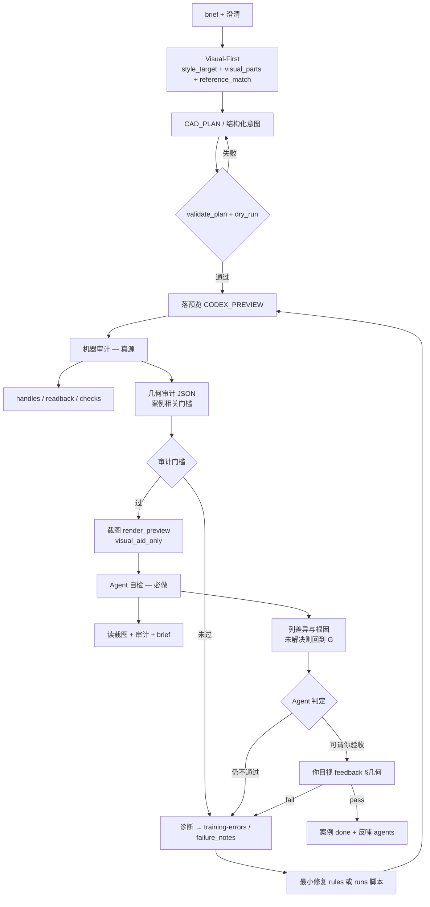

# Agent 训练阶段（方案 A）

最后更新：2026-06-07（ARCH-CONVERGENCE-01：正式对象训练暂缓；adaptive capability growth 已落为 focused / formal 复训门禁，不等于恢复整批训练）

Core Lab 施工已收口。本目录是训练入口：用 CAD Designer Agent 成长路径和真实/脱敏案例训 Agent「指哪打哪」，而不是再开 V-PROOF / 三轨施工包。

## 架构归并期暂停边界

当前仓库级主线是 `ARCH-CONVERGENCE-01` 架构归并画布工程。正式对象训练、整批训练和新的家装案例轮次默认暂缓，先把旧表 A/B/C、Core proof、训练地图、资产库、多 Agent、Worker / bridge、GPT-5.5 模型桥、工作台和证据治理统一归入七层任务生命周期。总设计见 `../architecture/system-architecture-convergence.md`，执行主线见 `../../CORE_RESTRUCTURE_PLAN.md` §0.2，OpenSpec 契约见 `../../openspec/changes/unify-system-architecture-canvas/`。

这不是取消训练。训练恢复条件是：规则、状态、PlanMD、工作台派生显示和关键脚本口径都已区分 `Core Proof Coverage`、`Agent Task Maturity` 和 `Project Delivery Readiness`。用户明确要求覆盖暂停时，仍按 quick / focused / formal 原有边界执行，并且不得把旧表 C 当作训练成熟度。

下一步若进入家具测试，默认按**家具 focused rehearsal**处理，而不是整批正式训练恢复。只选一个家具族或一个点名能力，先证明主 Agent 会正确分流、限定 scope、读取必要历史 profile、选择 quick / focused / formal、阻断越权完成；真实 CAD 可用时再只写 `CODEX_PREVIEW` 并回读 created handles。若测试目标同时声称“主 Agent 更聪明”，还必须留下 route / dispatch / tool choice / blocking / requiredAgents / replay 的 before / after 证据。

## 30 秒入口边界

- 开基础课：读本节、`cad-designer-growth-path.md` 和 `agents/cad_designer/rules.md` 即可，不默认全文展开旧案例。
- 开家装案例：再读 `residential-primary.md`、案例 `brief.md` / `feedback.md` 和必要的 `expected/`。
- 查训练事实源：读 `training-sources.json`；`capability-map-data.js` 与 `capability-map.html` 只是派生快照。查训练前 / 收尾数据体积风险时，先看 data-bloat / retention 诊断报告的 protected / candidate / blocked 摘要，但它们不得当训练事实源。
- 跨电脑迁移：本私人仓库的 `.gitignore` 默认放行可迁移训练 / 证据目录，包括 `output/training_queues/**`、`output/training_learning/**`、`output/validation_runs/**`、`output/previews/**`、`output/runs/**` 和 `output/model_reviews/**`；仍忽略 `output/debug/`、`output/test_artifacts/`、`.env`、虚拟环境、缓存、日志和 CAD 锁文件。换电脑后先恢复这些事实源并同步工作台，不要因为页面显示 0 个已结束项就直接重训。
- 查历史方案：`visual-first-agent-plan.md` 等标记为 HISTORY-ONLY 的文件只作背景，不当作当前待执行 Phase。

## 总训练对象

当前总训练对象是 **CAD Designer Agent**（`agents/cad_designer/`）：把系统当作一个从 CAD 基础课成长起来、会调用场景规则、资产库、执行、审计和修复流程的电子设计师。

第一阶段毕业目标采用“电子设计师雏形”：基础命令、家装对象和审计自检一起练；但第一批课程必须从 CAD 基础操作开始铺开。详细路径见 [`cad-designer-growth-path.md`](cad-designer-growth-path.md)。

正式训练前的计划已扩为 **V2 训练地图**：工作台保留 `CAD 基础操作 / 基础家具 / 储位家具 / 厨卫对象 / 基础绘图 / 标注表达` 六类，但扩为 217 个训练计划项，足够支撑连续、分层的正式训练。V2.1 已补训练批次依赖图和机器验收器骨架，用来组织先后关系和应检项。详细口径见 [`cad-designer-training-plan-v2.md`](cad-designer-training-plan-v2.md)。V2 / V2.1 只是训练地图，不提升表 C，也不代表已经具备施工图交付能力。

## 主训场景

| 项 | 约定 |
| --- | --- |
| **总训练对象** | **CAD Designer Agent（`agents/cad_designer/`）** |
| **当前主场景插件** | **家装（`agents/residential/`）** |
| **其它场景** | 保留配置，默认 **paused**（见 `agents/AGENT_TRAINING_STATUS.md`） |
| **底座** | `core/` 不动算法；成长路径改 `agents/cad_designer/`，场景训练改 `agents/residential/rules.md`、`preferences.json` 与 `projects/<case>/` |
| **白话落图** | 必须先变成 `CAD_PLAN` 或结构化意图 → validate → dry-run → `CODEX_PREVIEW` → handles 回读 |

家装专项约定：`docs/training/residential-primary.md`。

## 白话 → CAD → 审计 → 给你 feedback（主链路 · 会迭代）

训练期**端到端**目标：你用白话描述要什么图 → Agent 落成 `CODEX_PREVIEW` → **机器审计 + 自检**过关后才请你填 `feedback.md` → 你指出不准点 → Agent **记下错因、执行修复、判断要不要改链路** → 未 pass 则进入下一轮。

**审计架构（全局 ← 案例）：** 探针在 `core/verification/training_geometry_audit.py`；阈值在 `expected/audit_checklist.json`。详见 [`audit-architecture.md`](audit-architecture.md)。

**多 Agent 流水线（全局角色）：** 全局 Agent 由 `pipeline_context_curator` / 编排 / `pipeline_visual_intent` / 意图 / 落图 / 审计 / 修复 / 交付 / `pipeline_learning_promoter` + 场景 plugin 组成。详见 [`global-agent-pipeline.md`](global-agent-pipeline.md) 与 `agents/pipeline/pipeline_manifest.json`。

**精度优先（north star）：** 不准 = 不能用。可接受体量变大、链路变长，但每层须有可验证证据。详见 [`precision-first.md`](precision-first.md)。

**变聪明逻辑（触发条件 / round20 交付什么）：** 见 [`learning-loop.md`](learning-loop.md)。

**CAD 常识底座（资料 / 图库 / 测试 / 声明边界）：** 见 [`cad-common-sense-upgrade.md`](cad-common-sense-upgrade.md)。常识不是把文件丢进仓库，而是 `source_note → knowledge_summary → object_or_rule_candidate → executable_check → evidence_boundary`。

**CAD 资产智能（参考图库 / 自产图库 / 检索 / 晋升）：** 见 [`../architecture/cad-asset-intelligence-architecture.md`](../architecture/cad-asset-intelligence-architecture.md)。参考图库只作 evidence input，自产图库必须是带 schema、lineage、check 和 evidence_boundary 的 promoted asset。

**资产 intake 默认口径：** 用户给标准图库文件夹、截图、描述或参考块时，不要求用户先填表。用户可以只给“文件夹路径 + 一句大概内容”。Agent 默认先自动扫描文件结构、文件名、可读元数据和少量样本，推断对象类型、图纸类型、适用范围、来源线索和证据边界；无法可靠判断的字段统一写 `unknown`，只能作为参考的字段写 `reference_only`。扫描结果只进入 reference intake / `retrieval_pack`，不晋升 `libraries/system_library/`，也不算能力证明。详见 [`asset-intake-template.md`](asset-intake-template.md) 与 `scripts/run_asset_raw_intake.py`。

**系统资产沉淀口径：** 用户明确说“沉淀 XX 资产 / 通用资产 / 收进资产库”时，才进入 `libraries/system_library/`。默认按 [`../architecture/system-asset-sedimentation-protocol.md`](../architecture/system-asset-sedimentation-protocol.md) 执行四件套：机器契约、CAD 原生资产位置、应用 / 验收工具、全局索引。当前通用入口是 `scripts/sediment_system_asset.py`；它可以先登记合同并预留 `*_assets.dwg`，但若 `nativeDwgExists=false`，不得声称原生 DWG 已导出或新 CAD 文件已自动具备该资产。

**资产库守门员：** 沉淀前先过 `pipeline_asset_governor`。它判断来源边界、是否能进入 clean reusable source、是否需要资产馆员 / DWG 编排员 / 复用审计员，以及收尾是否还需继续润色加固。系统资产 DWG 不得把训练面板、训练标题、临时说明、边框、尺寸线或证据文字原封不动搬进可复制源区；来源不清时进入 `metadata_only` / `03_REVIEW_QUARANTINE`。`03_REVIEW_QUARANTINE` 是系统资产 DWG 的可视复审区，不是训练证据归档区；训练 evidence / archive 不得搬进 clean asset 或 quarantine 当资产源。

**分类资产库规则：** 同类资产沉淀到同一个稳定包。比如沙发资产进入 `libraries/system_library/furniture/seating/sofas/`，沙发 A / B 连续沉淀时更新同一个 `assets.json` 和同一个 `sofa_assets.dwg` 位置；绘图标准进入 `libraries/system_library/drawing_standards/basic/`，统一线宽、线型、尺寸样式、文字和引线样式等标准。

**资产晋升门槛：** 系统资产状态必须写成 `candidate` / `systemized` / `verified` / `deprecated`。训练或沉淀刚完成时通常是 `candidate` 或 `systemized`；只有复用验收、CAD readback、插入 / 应用审计或用户验收能证明该资产稳定可用时，才可升为 `verified`。每条资产应带 `retrieval`、`native.layoutPlan`、`versioning`、`verification` 和 `feedbackLoop`；重复 asset id 出现尺寸或 blockName 冲突时，必须显式选择更新、拒绝或生成变体。

**资产源边界门禁：** 对象类资产只有来源边界精确时才允许准备 block 导出，例如用户选中实体、刚创建 handles、明确 bbox 或已有 named block；不得默认把整个 `CODEX_PREVIEW`、全模型空间、当前屏幕、全部可见对象、训练面板或全局预览 bbox 打成 block。来源不清时只登记 `metadata_only`，并在 `exportManifest` / `antiContamination` 里写明缺口。样式类资产必须走 `style_standard` / `style_export`，不做 block。

**基础操作例外：** L0 / CAD 基础操作训练不要求标准图块、参考图库命中或自产资产晋升。它训练的是命令语义、几何参数、图层纪律、created handles、bbox、端点 / 闭合和审计证据；只有明确训练 `block` 命令或参考块使用时，才进入块引用机制，不等同于标准图块资产沉淀。

**基础能力回流复训：** CAD 基础操作 31/31 通过后，不代表这些能力永久封存。复杂对象、场景案例或施工图表达训练中，只要发现基础命令、图层、闭合、回读、block、layout / plot、清理或安全回滚不稳，就要把问题回流到对应基础项：先登记失败症状和触发案例，再改脚本 / Prompt / 检查器 / 规则，随后对基础项做二次或多次加强训练，并回测原复杂任务。旧通过报告作为历史证据保留，新复训报告追加到 `training-sources.json` / learning ledger / 工作台同步链路。

**复训范围硬边界：** 加强训练必须贴近用户点名范围。用户说“任务 12”“只看这个填充图案”“按这个截图做不同比例测试”时，默认是单项 / 子图样的 lightweight focused retraining；不得借用整批脚本把 21 项或 31 项全部重跑。只有用户明确要求“全部、整批、重新跑所有、刷新整个队列”时，才执行 full batch。脚本和报告必须记录 `scope.mode`、`requestedCapabilityIds`、`scopeReason`；focused 结果只追加为补训证据，不直接覆盖整批验收状态。

**轻重链路量化路由：** 训练期不把所有 CAD 小动作都套进完整训练闭环。Agent 每次落图前先选择 `quick_trial`、`focused_retraining` 或 `formal_acceptance`，并按下表执行；能用轻链路证明的，不得默认升到重链路。

| 模式 | 触发词 / 语义 | 默认预算 | 必跑 | 默认跳过 | 不得声称 |
| --- | --- | ---: | --- | --- | --- |
| `quick_trial` | “试一下”“快画”“小动作”“先看看”“先别沉淀”“不进训练”“只画这个” | ≤ 2 分钟 | 1 次最小结构化意图、只写 `CODEX_PREVIEW`、1 次 CAD 写入、1 次关键回读（handles / bbox / 图层 / hatch pattern / scale 等） | 完整 validate / dry-run、截图、Agent 自检文档、工作台同步、learning promotion、表 C coverage | 训练通过、已沉淀、可交付准确、工作台已更新 |
| `focused_retraining` | “训练某项”“任务 X”“加深”“某图案”“某比例测试” | ≤ 8 分钟 | 仅点名能力或显式列表、focused plan / dry-run 或等价校验、真实 CAD 局部落图、关键 readback、`scope.mode=focused` 报告 | 整批队列、覆盖整批验收、完整工作台同步、无关截图 | 整批完成、全队列通过、表 C 提升 |
| `formal_acceptance` | “验收”“沉淀”“训练通过”“记入工作台”“整批”“全部”“刷新队列”“推进表 C” | 不设总时长；每个子动作仍受 30 秒 watchdog | 完整计划、validate / dry-run、`CODEX_PREVIEW`、readback / audit、必要截图、Agent 自检、报告、post-sync / coverage（按口令） | 无 | 未经证据不得声称完成 |

升级条件：`quick_trial` 若预计新增对象超过 20 个、需要修改已有实体、涉及正式图层 / 保存 / 删除、用户要求“完成 / 准确 / 训练通过”、关键回读失败，或超过 2 分钟仍无法给出关键证据，必须先说明原因并升级到 `focused_retraining` / `formal_acceptance`，或暂停让用户确认。轻链路最终回复不超过 3 句，必须写明“快试未沉淀”。

**自适应能力成长复训：** 当用户说“之前训练过但又退回烟测表达”“加深这项能力”“按历史经验改进”时，不是自动整批重训，而是先用 `capability_growth_profile` 从仓库内 active / protected 事实源生成画像，再由 `growth_replay` 对点名能力提高表达要求。画像不得使用 `output/debug`、工作台派生快照、diagnostic / retention / sync report、外部路径、缺失文件、截图或模型 pass 作为 hard baseline；报告必须包含正例、反例、required / observed features、表达差异和原任务回测边界。缺这些证据时只能 `blocked` / `not_verified`，不能说训练已经变聪明。

主 Agent 的认知提升不能只靠“写入了训练记录”证明。训练若声称让主 Agent 更聪明，必须证明后续真实任务中的分流、提问、工具选择、Agent 派发、阻断或 replay 表达因此改变；否则只能说训练机制更完整。

**临场复合任务：** 训练地图只列原子能力和代表性课程，不穷举所有组合。用户可以随时要求“截图里的沙发标注尺寸”“按参考图补门洞开启方向”“把已有柜体改宽并重标尺寸”等复合任务。Agent 默认把它们拆成已有能力节点来编排，而不是新增一条训练计划：视觉 / 读图输入 → 对象与参照识别 → 尺度来源判断 → 绘图或标注意图 → `CAD_PLAN` / 结构化意图 → validate / dry-run → `CODEX_PREVIEW` → handles 回读 / 审计 → 交付或修复。

复合任务必须声明 `evidence_source`。只有截图时，尺寸和位置属于视觉推断；截图加已知参照尺寸时，属于比例估算；有 DWG、created handles、原 `CAD_PLAN` 或用户明确尺寸时，才能进入对应的几何 / 标注审计。复合任务失败后，先写入案例反馈或 `training-errors.md`；只有重复失败、可机器检查或可泛化为课程时，才更新训练地图、检查器或规则链路。

**原位局部修复优先：** 用户指出局部不准，或 Agent 自检发现局部失败时，默认从上一轮 `roundN_execution_summary.json`、created handles、当前 CAD readback 和截图定位错误对象，生成 `repair_plan`，在原位置执行 `update` / `delete_replace` / `add_missing`。不得因为文字乱码、单条线型错误、某个 hatch 比例不对、局部缺线或局部标注错位，就在旁边再完整画一套。只有 handles 失效、对象被炸开 / 删除、局部修会破坏整体拓扑，或全局比例 / 坐标 / 布局根因错误时，才允许整块重画；重画前要说明原因。

本主链路写在 `docs/training/`，会随训练**不断修订**；修订记录见 [`pipeline-changelog.md`](pipeline-changelog.md)（只收 **链路类** 教训）。

训练主链路只覆盖训练期轮次本身。跨越普通执行、资产复用、资产沉淀、精准复训、规则同步和 A-to-A 校准的完整系统任务链路，统一看 [`../architecture/cad-agent-task-chain.md`](../architecture/cad-agent-task-chain.md)。后续遇到“白话理解 -> 子任务分发 -> 执行”和“训练完成 -> 底座规则 / 单一任务规则 / Agent 校准同步”两类问题时，应同时按该总链路判断，不得只保留其中一半。

```text
  训练目标 / 白话 brief
      → Step-1 判断 CAD Designer Agent 成长阶段：基础课程 / 对象课程 / 场景案例 / 专业表达
      → Step-1a 若是临场复合任务：拆成已有能力节点，并声明 evidence_source / not_checked
      → Step0 查常识 / 查 catalog / 查自产资产：形成 retrieval_pack，基础对象先找已有知识、对象定义、受控块边界和历史失败（CAD 基础操作可跳过资产检索；block 仅指命令 / 引用机制训练）
      → Step0b route：exact_reuse / parametric_variant / semantic_redraw / novel_with_constraints / deferred
      → Step1 需求拆分：style_target + roundN_visual_parts.json + roundN_intent.json（+ 可选 CAD_PLAN）
      → Step1b reference_match gate：缺 `visual_parts` 或款式不明则阻断 Execute
      → Step2 落预览（CODEX_PREVIEW）
      → Step3 审计环：geometry_audit.json → audit_review → 截图
      → 【仅审计通过】请你 §几何 feedback
      → 记错因 → repair_plan 原位局部修复 / 修 intent / checklist / 脚本 → 下一轮
```

| 阶段 | 你的动作 | Agent 必须留痕 |
| --- | --- | --- |
| 提需求 | 白话 / 截图 / 附件 | `brief.md` → **`runs/roundN_intent.json`** |
| 验收 | `feedback.md` §几何 pass/fail | §用户指出的错因 |
| 指错后 | 可只说一句「靠背少线」 | Agent 补全根因分析 + §修复步骤 + 是否改链路 |

**你说「记反馈」时**，Agent 默认：更新当前案例 `feedback.md` → 追加 `docs/training/training-errors.md` 一行 → 若属链路则追加 `pipeline-changelog.md` → **不**把纯几何 bug 写进链路 changelog。

---

## 三角色：现阶段简单步骤 → 后期专业 Agent

产品方向：**需求拆分 · 落图执行 · 审计** 应分角色；训练早期**不单独部署三个 bot**，先在同一个交互式 Agent 会话里**强制分步 + 固定产物**（Codex、Cursor 或同类工具均可），案例多了再拆成专业 Agent。

| 角色 | 现在（简单步骤） | 后期（专业 Agent） |
| --- | --- | --- |
| **需求拆分** | 白话 → 澄清 → 写 `runs/roundN_intent.json`（+ 能走 Core 时再写 `cad_plan.json`） | 独立需求 Agent，读 brief/附件，只输出 intent + CAD_PLAN |
| **落图执行** | 读 intent → validate/dry-run → CAD 或案例脚本 | 执行 Agent / Core execute，不改审计规则 |
| **审计** | 机器 `geometry_audit.json` + 人读 `audit_review.md`（或 `agent_review.md`） | 独立审计 Agent，只读 intent + 参考基线 + 预览证据 |

```text
【Step 1 需求拆分】 你白话
        → brief.md
        → 缺参澄清（feedback §理解）
        → runs/roundN_intent.json     ← 本轮「拆完的需求」
        → （可选）runs/roundN_cad_plan.json + validate + dry-run

【Step 2 落图】     只认 intent / CAD_PLAN，不回头改 brief  silently
        → CODEX_PREVIEW + execution_summary

【Step 3 审计环】   与落图分离：先机器 audit，再审计自检，过了才截图
        → roundN_geometry_audit.json
        → roundN_audit_review.md（对照 intent + 截图）
        → 请你 feedback §几何
```

**Step 1 通过标准（`ready_to_draw: true`）：** intent 里目标、参考、约束、执行路径无 `open_questions` 阻塞项。

**Step 3 通过标准：** `audit_pass: true` 且审计自检勾选「可请你验收」。

模板（复制案例时改 id）：

| 文件 | 用途 |
| --- | --- |
| `expected/intent.template.json` | 需求拆分输出形状 |
| `expected/audit_checklist.template.json` | 机器审计门槛（随训练加厚） |
| `expected/audit_review.template.md` | 审计环自检（审计 Agent 角色文稿） |

复杂案例（如沙发改座数）在 intent 里标 `"execution_route": "case_script"` 并指向 `runs/*.py`；**仍须**先写 intent，再跑脚本，再审计——禁止从白话直接跳脚本。

---

## 理想链路（全局 · 训练期）

**适用范围：** 本链路是 **Agent 训练阶段的默认输出流程**，适用于所有 `projects/<case_id>/` 案例轮次（家装、展陈、医疗等），**不是**某个单案例（如沙发改座数）的私有脚本路径。与 Core Lab 的 V-PROOF / RCAD / 表 C 烟囱**并行但不替代**：训练案例以你的 `feedback.md` pass 为准；抬表 C 仍走 `docs/governance/cad-agent-rules.md` 与 capability registry。

**底座关系：** `core/` 提供 validate / execute / readback / `render_preview` 等**通用能力**；场景差异在 `agents/<scenario>/rules.md`；案例几何在 `projects/<case>/runs/`。理想链路规定的是 **Agent 在训练期必须按顺序调用的工序**，不要求把训练逻辑写进 `core/`。

**常识关系：** 基础物件常识先进入 `libraries/` / `docs/training/cad-common-sense-upgrade.md` 所定义的知识、对象和测试口径；案例训练只校准参考图款式、用户偏好和失败模式。文件存在 ≠ 已学会；只有形成可执行审计或 benchmark，才算能被机器证明。

### 流程图



### 工序说明

| 顺序 | 工序 | 角色（现均为同 Agent 分步） | 通过标准 |
| --- | --- | --- | --- |
| 1 | **需求拆分** | 需求 | `roundN_intent.json`，`ready_to_draw: true` |
| 2 | 计划与校验 | 需求→执行 | `validate_plan` + `dry_run_plan`（或 intent 标明 case_script） |
| 3 | 落预览 | 执行 | 仅 `CODEX_PREVIEW`；`execution_summary` |
| 4 | **机器审计** | 审计 | `geometry_audit.json` 全绿 |
| 5 | **审计自检 + 截图** | 审计 | `audit_review.md`；仅 audit 过后截图 |
| 6 | **你验收** | 你 | `feedback.md` §几何 pass/fail |

### 每轮建议产物（`projects/<case>/runs/`）

| 文件 | 用途 |
| --- | --- |
| `roundN_intent.json` | **Step1** 需求拆分（白话→可执行） |
| `roundN_visual_parts.json` | **Step1** 款式目标、部件清单和 forbidden shortcuts |
| `roundN_cad_plan.json` | 走 Core 时的落图计划（可选） |
| `roundN_execution_summary.json` | Zoom / 截图 handles |
| `roundN_geometry_audit.json` | **Step3** 机器审计 |
| `roundN_audit_review.md` | **Step3** 审计环自检（`agent_review.md` 可同名沿用） |
| `roundN_preview.png` | 目视辅助 |

**几何审计门槛**由案例写入 `brief.md` 或 `expected/audit_checklist.json`（例如沙发：全宽底框、两座中缝竖线、靠背区线密度等）。全局最低要求：审计项必须与 **brief 语义** 一致，禁止仅「总线数 + 一条底边」。

### 审计 Agent 界定（训练期）

机器审计由 **global engine + 案例 checklist** 驱动（`audit-architecture.md`），分 **三层**：

| 层 | 查什么 | 实现位置 |
| --- | --- | --- |
| **语义** | brief + 参考 profile 容差 | checklist `checks.semantic` + core 探针 |
| **洁净度** | 微线、端点、实体上限 | checklist `checks.cleanliness` + core 探针 |
| **反模式** | schematic 偷懒等 | core `forbidden_patterns`（训练晋升） |
| **Agent 自检** | 目视款式/brief | checklist `agent_review_required`（任何案例） |

**审计 Agent 必须：**

- 读 `expected/audit_checklist.json`（schema v2），输出 `roundN_geometry_audit.json` 含 **`audit_failures`**
- 调用 `core.verification.training_geometry_audit.run_training_geometry_audit`
- **`audit_pass: false` 时 exit 非 0**，禁止截图、禁止请你验收
- **`agent_review_required` 未勾选不得请你验收**（机器绿 ≠ 可交付）

**审计 Agent 禁止：**

- 仅 `line_count` + `bottom_rail` 两项绿灯
- 为过关补假几何（单独画底边、靠背仍空）
- 把截图当成审计通过依据

案例 fail 若属「杂线 / 叠线 / 中缝毛刺」，判因类型常为 **链路**（审计项缺失）+ **几何**（裁切算法）；链路侧补 checklist，几何侧改 runs 脚本或 rules。

### 禁止（反模式）

- 落图后**直接截图**、跳过机器审计或未达标仍截图。
- 审计 JSON 已红灯仍请你「看一下」——等于把诊断推给你。
- **多轮只换截图、不改几何或审计项**（沙发案例曾犯）。
- 局部错误直接在旁边整套重画，导致旧错留在原位、画布噪声变大。
- 用表 C / Lab 烟囱 pass 代替案例 `feedback.md` pass。
- 为通过审计写「假几何」（如单独补一条底边而靠背仍空）。

### 与 Lab / 表 C 的边界

| 维度 | 训练期理想链路 | Core Lab（表 C / V-PROOF / RCAD） |
| --- | --- | --- |
| 目标 | 白话「指哪打哪」、场景 rules | 能力登记、跨机回归、registry verified |
| 通过 | 你的案例 feedback | coverage JSON + 文档 hard gate |
| 截图 | 训练自检 + 请你验收 | 证据链一环，仍服从 cad-agent-rules |
| Agent 自检 | **强制** | 报告里仍需证据，但不替代 registry |

---

## 一轮训练闭环（checklist）

与上文理想链路一致；缩写版：

1. **建案例**：复制 `projects/residential_training_template/` → `projects/<your_case_id>/`，填 `brief.md`（白话需求）、`input/shell.manual.json`（脱敏空壳）；若 DWG/DXF 是非敏感、脱敏且体积可控的训练底图，可以作为 case fixture 提交，锁文件和备份文件仍不提交。
2. **听懂**：在对话里澄清缺参；把「误解 / 漏问」记进 `feedback.md` §理解。
3. **出计划**：生成或修订 `CAD_PLAN`；跑 `validate_plan` + `dry_run_plan`；失败只改最小范围。
4. **落预览 + 机器审计**：真实 CAD 只写 `CODEX_PREVIEW`；写 `roundN_geometry_audit.json`；**审计未过不得进入步骤 5**。
5. **截图 + Agent 自检**：`render_preview` → 读图 + 审计 + brief → `roundN_agent_review.md`（或对话等效）；仍不通过则修复后回到步骤 4，**不要**请你验收。
6. **你验收**：在 `feedback.md` §几何 标 pass / 不准点；**满意才算案例 done**。
7. **反哺 Agent**：只改 `agents/<scenario>/` 的词汇与偏好；必要时登记 registry（抬表 C 时仍走 hard gate）。
8. **防回归**：改 rules 后跑 `unittest` 相关 scene 测试 + 可选 `run_capability_coverage.py`。

## 案例目录约定

```
projects/<case_id>/
  sample.manifest.json   # domain=residential
  brief.md               # 白话需求（你可直接粘贴对话框原文）
  feedback.md            # 每轮反馈（理解 / 计划 / 几何）
  input/shell.manual.json
  runs/                  # 本轮 CAD_PLAN、dry_run、verification（可 gitignore）
  expected/expected_notes.md
```

Intake 协议与扫描：`docs/runbooks/project-sample-intake.md`。

## 口令（训练期）

| 你说 | Agent 默认做 |
| --- | --- |
| **开一轮训练** / **家装案例** | Step1 写 `intent.json` → Step2 落图 → Step3 审计环 → 未过自修 |
| **试一下** / **快画** / **小动作** / **先别沉淀** | 走 `quick_trial`：≤2 分钟，只写 `CODEX_PREVIEW`，做 1 次关键回读，跳过完整训练沉淀 |
| **CAD 基础课** / **总设计师训练** | CAD 基础操作已 31/31 训练沉淀；默认进入对象课程或案例训练。若复杂任务暴露基础薄弱，回流到对应 L0 项复训，再回测原任务 |
| **跑前 10 项队列** / **监督式基础队列** | 运行 `& $py scripts\run_training_queue.py --preset cad-foundation-first-10`；每次只推进 1 项，脚本在需要你验收或反馈时暂停 |
| **记反馈** | 写 `feedback.md` §用户指出的错因 + §修复步骤；追加 `docs/training/training-errors.md`；链路类再写 `pipeline-changelog.md` |
| **优化聪明度** / **校准 Agent** | 找根因并改对应层：Prompt/Agent 配置、`visual_parts`、checklist、Core 探针或场景 rules；不能只口头总结 |
| **刷新表 C** | 只跑 coverage（Lab 回归，不代替案例 pass） |
| **画不准** | `docs/runbooks/blocker-playbook.md` |

执行台账与案例 backlog：`docs/planning/任务清单.md` §0。

### 监督式基础队列

第一版队列入口是 `scripts/run_training_queue.py`，默认预设为 `cad-foundation-first-10`，覆盖工作台框选的 10 个 CAD 基础操作训练项。它只做监督式编排：生成 / 恢复 `output/training_queues/cad-foundation-first-10/queue_state.json`，每次暂停在一个训练项，并输出需要你在 Codex 对话框验收的 checklist 和下一步命令。

```powershell
& $py scripts\run_training_queue.py --preset cad-foundation-first-10
& $py scripts\run_training_queue.py --preset cad-foundation-first-10 --decision pass --feedback "本项通过"
& $py scripts\run_training_queue.py --preset cad-foundation-first-10 --decision fail --feedback "第 X 点不准"
```

队列脚本不无人值守保存或覆盖 DWG；真实落图仍必须只写 `CODEX_PREVIEW`，并按本页理想链路保留 validate、dry-run、handles 回读、审计和用户反馈。

通过项的收尾由脚本自动做：`--decision pass` 会触发训练工作台同步，并在 JSON 输出里写入 `postTrainingSync`；中间项采用轻量同步，最后一项通过并完成队列时会跑完整 `scripts/sync_training_workbench.py`，自动完成 learning promotion、`capability-map-data.js` 重建和 Agent check。除非调试时显式传 `--no-post-sync`，不要再让用户额外提醒“同步前端 / 沉淀 Prompt”。新建或修改训练脚本还要在输出中保留 `postTrainingDataBloat` 或等价摘要：说明本轮是否产生 debug / test artifacts / 临时报告、是否只做 dry-run、是否存在 blocked 引用，不得因为派生快照体积 warning 把已通过训练改判失败；既有脚本若暂时只有 `postTrainingArtifactRetention`，必须把 data-bloat 脚本缺口标为 `pending_implementation`，不得误报 `scripts/run_data_bloat_audit.py` 已存在。

正式训练、focused 复训或纠错收尾还必须生成 `promotionGate`。它负责把“是否写训练事实源、是否刷新工作台、是否同步 Agent 校准、是否需要 reviewed package 改底座规则 / 单项规则 / 检查器、是否回测原任务、是否需要数据防膨胀门禁”写成机器可读决策。`quick_trial` 的 gate 只能是 `observation`；缺 handles/readback、缺 Agent 自检、只有截图推断或用户明确“先别沉淀”时，不得写入 Agent 校准或工作台已沉淀状态。规则 delta、检查器 delta 和数据防膨胀策略变化只进入 `needs_reviewed_package`，不能由训练脚本静默改全局规则。

剩余 21 项基础操作已改用批量无监督入口 `scripts/run_cad_foundation_remaining_training.py`。该脚本默认连接当前 AutoCAD，只写 `CODEX_PREVIEW`，生成 `cad-foundation-remaining-21` 的结构化训练计划、dry-run、execution summary、验收报告、队列状态和预览截图，并在通过后自动运行 `scripts/sync_training_workbench.py`。当前最终证据为 `output/training_queues/cad-foundation-remaining-21/remaining-21-chinese/remaining_21_report.json`，21/21 pass、235/235 句柄回读，中文标注复训后 `chinese_labels=text_labels=65 latin_terms=0`；它让 CAD 基础操作 31/31 进入训练沉淀，但不提升表 C。

### 可选流式演示模式

剩余 21 项入口默认仍按高速批量模式执行；只有显式传入 `--stream-demo` 时，才开启面向旁观查看的 hybrid streaming。该模式支持每个训练面板完成后短暂停顿、演示用 refresh 和可选 zoom，也可以在每个面板内对有限数量关键图元做短暂停顿，便于观察脚本正在画什么；默认高速模式不插入这些演示动作。

```powershell
& $py scripts\run_cad_foundation_remaining_training.py --stream-demo --stream-item-delay 0.35 --stream-operation-delay 0.12 --stream-operation-budget 5
```

如需保留停顿但不自动缩放，可加 `--stream-no-zoom`。流式演示只改变显示节奏，不改变验收口径：真实通过仍看 `CODEX_PREVIEW` handles/readback、图层守卫、dry-run、watchdog 和最终报告；不保存 DWG、不覆盖原图、不写正式图层。截图只作 visual aid，不能替代机器回读证据。

第 12 项“填充与边界”允许针对 CAD 自带 hatch 图样做加强复训：当前样板使用 8 个小方格覆盖 `ANSI31`、`ANSI32`、`ANSI37`、`AR-CONC`、`BRICK`、`GRAVEL`、`EARTH`，并用同一 `ANSI31` 做不同比例对比。验收不能只看截图，应回读 hatch pattern 和 `PatternScale`。

用户为了查看方便可以手动移动已经生成的训练面板；只要不是炸开、删除或重画，原实体句柄通常仍可回读。复训脚本应优先读取上一轮 `execution_summary` 的 created handles，并以这些 handles 的当前位置 / bbox 作为训练停放区参考，避免训练目标按全画布最右侧一路漂移。找不到旧 handles 时才退回当前 `CODEX_PREVIEW` 全局 bbox 右侧空白区，并在报告里记录 `parking_anchor.source`。

收尾后还要执行训练产物保留策略：长期只保留最终验收报告、队列状态、learning ledger / Agent memory / Prompt addendum，以及最近一份人工复核预览图；中间 retry 目录、临时 `CAD_PLAN` / dry-run / execution summary、旧截图和一次性脚本应在确认不再被引用后清理。默认入口是 `scripts/run_training_artifact_retention.py`：先 dry-run 写 `retention_report.json`，确认未引用旧图后才允许显式 `--write` 归档到 `archive/training_artifacts/`；训练队列 pass 后会把 dry-run 摘要写入 `postTrainingArtifactRetention`。清理前必须先把失败根因或可复用教训写入 `training-errors.md`、learning promotion 或对应规则，不能把教训随临时文件一起删掉。

数据防膨胀门禁是保留策略的前置判断，不等于立即删除。正式训练、focused 复训、队列 completed、正式收尾型工作台同步或资产沉淀前后都要能区分四类路径：`protected` 为 active `fact_source`、final report、queue state、learning ledger、Agent memory / Prompt addendum、表 C / registry / 系统资产证据和仍被状态文档引用的路径；`candidate` 为短期 debug、test artifacts、retry、dry-run、execution summary、旧截图和临时报告；`blocked` 为 active fact source 缺失、引用根未覆盖、候选仍被引用或会让证据断链变差；`derived` 为 `capability-map-data.js`、HTML、sync report、retention report 和 data-bloat audit。`derived` 只能帮助诊断，不得登记为训练事实源。`capability-map-data.js` 的目标生成策略是 compact 输出；脚本尚未实现时必须标为 `pending_implementation`，pretty 调试快照只放 `output/debug/`，并按短期产物处理。

自动化训练还必须带超时与熔断保护：队列里的每个 CAD / 脚本 / 截图 / 回读 / 同步子动作默认最多等待 30 秒。超时后先由 Agent 读取 stdout / stderr、最近报告、队列状态和 CAD 会话状态，自行尝试一次有限恢复，例如重连、刷新、重取景、重跑该子步骤或改用 deferred；不得无限 retry。

同一训练项连续 2 次 30 秒超时，或同一队列连续 3 个子动作超时 / 失败，必须熔断暂停到 `blocked` / `needs_user_review` 或等价状态，并在脚本输出或训练记录里写清 `timeoutSeconds: 30`、`selfRecoveryAttempted`、`circuitBreakerTriggered`、`blockedReason`、卡点、已保留证据和下一步建议。熔断后不得继续无人值守落图，也不得把 partial output 当作训练通过或工作台已同步。

## 交付汇报（训练期）

- Agent 回复**默认不带** `AGENTS.md` 的表 C / 精简四行进度表；用户点名「表 C / 报进度 / 完整状态」时才展示。
- 默认必须写清：本轮结论、相对上一轮修了什么、机器证据证明了什么、还没证明什么、请你重点看哪里，以及你怎样反馈最有用。

### 低噪声反馈模板

```text
本轮结论：可验收 / 暂不交付 / 阻断。

和上一轮相比：
- 用用户能看懂的话说修了什么，不只写实体数。

机器证据只证明：
- 例如 handles、图层、bbox、gap、overlap、open endpoint。

它还没证明：
- 例如款式是否像参考图、用户是否认可、施工图规范是否成立。

请你重点看：
1. 对象语义是否对。
2. 关键部件是否缺失或方向反了。
3. 线条是否干净、是否有多余白线。

如果不准，直接回一句：
“第 X 点不对，应该是……”
```

**禁止低信号汇报：**

- 只说 `0 gap / 0 overlap / 0 open endpoint`，不解释这只能证明线条连接和洁净度。
- 只贴截图，不告诉你看哪里。
- 把实体数、arc 数或截图存在当作“款式准确”。
- 机器审计绿就说完成，忽略 Agent 自检或你的目视反馈。
- 普通训练回复默认带表 C、工程进度或大表格。

## 截图（训练期默认）

默认 **保留你的 CAD/IDE 分屏布局**；`PrintWindow` 只抓 AutoCAD 客户区，IDE 在右侧不会进图。

**标准命令（推荐，一条做完：必要时仅恢复最小化 → 自动缩放/平移 → 只截 CAD 窗）：**

```powershell
& $py scripts\render_preview.py --capture-autocad-window --execution-summary projects\<case>\runs\roundN_execution_summary.json --output projects\<case>\runs\roundN_preview.png
```

| 步骤 | 行为 |
| --- | --- |
| 1 布局 | **不**全屏、**不**强置顶；仅当 CAD 最小化时 `SW_RESTORE` |
| 2 重取景 | 按 `execution_summary` 里 **全部** `created_handles`（含参考块 + 预览）`ZoomWindow` |
| 3 截图 | `PrintWindow` 抓 AutoCAD **客户区**（右侧 IDE 遮挡屏幕也不影响） |
| 4 兜底 | 仅当 PrintWindow 失败或 CAD 完全被挡：`--force-foreground` 置顶后重试 |
| 5 结束 | 你可立刻 Alt+Tab 回其它软件 |

- `execution_summary` 应包含参考 handle（如 `4A2`）与预览 handles，才能左右两座同框。
- **禁止**默认 `--capture-screen`；仅 AutoCAD 找不到且用户同意时才 `--fallback-screen`。
- 截图仅 `visual_aid_only`；尺寸仍以 handles 回读为准。
- **截图之后** Agent 必须完成「理想链路」中的 **自检**（读图 + 审计 + brief），列出原因；不通过则自修，不得默认进入请你验收。
- 用户暂停后：读 `feedback.md` + `round*_execution_summary.json` + 附件，从上次 handles 续画，勿重缩放。

## feedback 之后：错因、修复、链路优化（必做）

你在 `feedback.md` §几何标 **fail** 或口头指出不准点后，Agent **在同一轮或下一轮开始前**完成下表，**不得**只改图不记账。

### 1. 案例内（`projects/<case_id>/feedback.md`）

| 小节 | 内容 |
| --- | --- |
| **§用户指出的错因** | 你的原话 / 不准点（不替换成技术黑话） |
| **§Agent 根因分析** | 机器证据（审计 JSON、handle、截图路径）+ 推断 |
| **§修复步骤** | 本轮实际做了什么（优先 `repair_plan` 原位局部修复；必要时才改 rules / 改 runs 脚本 / 改审计项 / 重跑 round） |
| **§判因类型** | `链路` / `几何` / `环境` / `需求`（可多选；**链路**才触发 pipeline 修订） |

### 2. 仓库级

| 文件 | 何时写 |
| --- | --- |
| `docs/training/training-errors.md` | 每次 fail 或 CAD 异常 **一行**（现象 / 根因 / 修复 / 状态） |
| `docs/training/pipeline-changelog.md` | 仅当 §判因类型 含 **链路** |
| `agents/<scenario>/rules.md` | 几何类、可复现场景规则 |
| `runs/roundN_failure_notes.json` | 可选；复杂几何细节 |

### 3. Agent 自检（未请你验收前）

与「理想链路」步骤 5 相同：读 `roundN_preview.png` + `roundN_geometry_audit.json` + `brief.md`，输出 `roundN_agent_review.md`。若与你之后会指出的问题一致，应在请你验收**之前**就回到修复环，而不是等你再说一遍。

### 4. 什么 **不算** 链路问题（不必改 README / changelog）

- 单案例裁切公式、坐标、块内解析错误（只记 `training-errors.md` + case `runs/`）。
- 某一家具款式特有的造型规则（进 `agents/.../rules.md` 或 `expected_notes`）。
- 你尚未给出不准点、仅说「再看看」——Agent 应先自检列假设，**不要**空改链路文档。

---

## 训练错误记录

- `docs/training/training-errors.md`（每次验收 fail / CAD 异常追加一行；含几何与环境）。
- 链路修订：`docs/training/pipeline-changelog.md`（仅工序 / 审计 / 自检类）。
- 案例内：`projects/<case_id>/runs/*_failure_notes.json` 可写当轮细节。

## 不可声称

- 案例模板扫描 pass ≠ 你家图纸已 `geometry_verified`。
- 表 C 99% ≠ 白话已训通；以**你的案例 feedback** 为准。
- 不能把训练期的临时规则写进 `core/` 当通用算法（应留在 `agents/residential/` 或 `projects/`）。

## 相关入口

| 需要 | 路径 |
| --- | --- |
| 家装主训说明 | `docs/training/residential-primary.md` |
| 总设计师成长路径 | `docs/training/cad-designer-growth-path.md` |
| **链路修订记录** | `docs/training/pipeline-changelog.md` |
| 场景 Agent 边界 | `agents/SCENE_AGENT_RULES.md` |
| PlanMD 路由 | `CORE_RESTRUCTURE_PLAN.md` |
| Lab 证据 / 表 C | `docs/planning/archive/`、`output/validation_runs/capability-lab/` |
