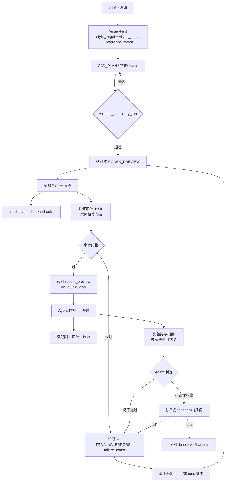

# Agent 训练阶段（方案 A）

最后更新：2026-05-28

Core Lab 施工已收口。本目录是**默认工作入口**：用真实/脱敏案例训 Agent「指哪打哪」，而不是再开 V-PROOF / 三轨施工包。

## 主训场景

| 项 | 约定 |
| --- | --- |
| **当前主训** | **家装（`agents/residential/`）** |
| **其它场景** | 保留配置，默认 **paused**（见 `agents/AGENT_TRAINING_STATUS.md`） |
| **底座** | `core/` 不动算法；训练改 `agents/residential/rules.md`、`preferences.json` 与 `projects/<case>/` |
| **白话落图** | 必须先变成 `CAD_PLAN` 或结构化意图 → validate → dry-run → `CODEX_PREVIEW` → handles 回读 |

家装专项约定：`docs/training/residential-primary.md`。

## 白话 → CAD → 审计 → 给你 feedback（主链路 · 会迭代）

训练期**端到端**目标：你用白话描述要什么图 → Agent 落成 `CODEX_PREVIEW` → **机器审计 + 自检**过关后才请你填 `feedback.md` → 你指出不准点 → Agent **记下错因、执行修复、判断要不要改链路** → 未 pass 则进入下一轮。

**审计架构（全局 ← 案例）：** 探针在 `core/verification/training_geometry_audit.py`；阈值在 `expected/audit_checklist.json`。详见 [`audit-architecture.md`](audit-architecture.md)。

**多 Agent 流水线（全局角色）：** 全局 Agent 由 `pipeline_context_curator` / 编排 / `pipeline_visual_intent` / 意图 / 落图 / 审计 / 修复 / 交付 / `pipeline_learning_promoter` + 场景 plugin 组成。详见 [`global-agent-pipeline.md`](global-agent-pipeline.md) 与 `agents/pipeline/pipeline_manifest.json`。

**精度优先（north star）：** 不准 = 不能用。可接受体量变大、链路变长，但每层须有可验证证据。详见 [`precision-first.md`](precision-first.md)。

**变聪明逻辑（触发条件 / round20 交付什么）：** 见 [`learning-loop.md`](learning-loop.md)。

本主链路写在 `docs/training/`，会随训练**不断修订**；修订记录见 [`pipeline-changelog.md`](pipeline-changelog.md)（只收 **链路类** 教训）。

```text
  白话 brief
      → Step1 需求拆分：style_target + roundN_visual_parts.json + roundN_intent.json（+ 可选 CAD_PLAN）
      → Step1b reference_match gate：缺 `visual_parts` 或款式不明则阻断 Execute
      → Step2 落预览（CODEX_PREVIEW）
      → Step3 审计环：geometry_audit.json → audit_review → 截图
      → 【仅审计通过】请你 §几何 feedback
      → 记错因 → 修 intent / checklist / 脚本 → 下一轮
```

| 阶段 | 你的动作 | Agent 必须留痕 |
| --- | --- | --- |
| 提需求 | 白话 / 截图 / 附件 | `brief.md` → **`runs/roundN_intent.json`** |
| 验收 | `feedback.md` §几何 pass/fail | §用户指出的错因 |
| 指错后 | 可只说一句「靠背少线」 | Agent 补全根因分析 + §修复步骤 + 是否改链路 |

**你说「记反馈」时**，Agent 默认：更新当前案例 `feedback.md` → 追加 `TRAINING_ERRORS.md` 一行 → 若属链路则追加 `pipeline-changelog.md` → **不**把纯几何 bug 写进链路 changelog。

---

## 三角色：现阶段简单步骤 → 后期专业 Agent

产品方向：**需求拆分 · 落图执行 · 审计** 应分角色；训练早期**不单独部署三个 bot**，先在同一个交互式 Agent 会话里**强制分步 + 固定产物**（Codex、Cursor 或同类工具均可），案例多了再拆成专业 Agent。

| 角色 | 现在（简单步骤） | 后期（专业 Agent） |
| --- | --- | --- |
| **需求拆分** | 白话 → 澄清 → 写 `runs/roundN_intent.json`（+ 能走 Core 时再写 `cad_plan.json`） | 独立需求 Agent，读 brief/附件，只输出 intent + CAD_PLAN |
| **落图执行** | 读 intent → validate/dry-run → CAD 或案例脚本 | 执行 Agent / Core execute，不改审计规则 |
| **审计** | 机器 `geometry_audit.json` + 人读 `audit_review.md`（或 `agent_review.md`） | 独立审计 Agent，只读 intent + 参考基线 + 预览证据 |

```text
【Step 1 需求拆分】 你白话
        → brief.md
        → 缺参澄清（feedback §理解）
        → runs/roundN_intent.json     ← 本轮「拆完的需求」
        → （可选）runs/roundN_cad_plan.json + validate + dry-run

【Step 2 落图】     只认 intent / CAD_PLAN，不回头改 brief  silently
        → CODEX_PREVIEW + execution_summary

【Step 3 审计环】   与落图分离：先机器 audit，再审计自检，过了才截图
        → roundN_geometry_audit.json
        → roundN_audit_review.md（对照 intent + 截图）
        → 请你 feedback §几何
```

**Step 1 通过标准（`ready_to_draw: true`）：** intent 里目标、参考、约束、执行路径无 `open_questions` 阻塞项。

**Step 3 通过标准：** `audit_pass: true` 且审计自检勾选「可请你验收」。

模板（复制案例时改 id）：

| 文件 | 用途 |
| --- | --- |
| `expected/intent.template.json` | 需求拆分输出形状 |
| `expected/audit_checklist.template.json` | 机器审计门槛（随训练加厚） |
| `expected/audit_review.template.md` | 审计环自检（审计 Agent 角色文稿） |

复杂案例（如沙发改座数）在 intent 里标 `"execution_route": "case_script"` 并指向 `runs/*.py`；**仍须**先写 intent，再跑脚本，再审计——禁止从白话直接跳脚本。

---

## 理想链路（全局 · 训练期）

**适用范围：** 本链路是 **Agent 训练阶段的默认输出流程**，适用于所有 `projects/<case_id>/` 案例轮次（家装、展陈、医疗等），**不是**某个单案例（如沙发改座数）的私有脚本路径。与 Core Lab 的 V-PROOF / RCAD / 表 C 烟囱**并行但不替代**：训练案例以你的 `feedback.md` pass 为准；抬表 C 仍走 `docs/governance/cad-agent-rules.md` 与 capability registry。

**底座关系：** `core/` 提供 validate / execute / readback / `render_preview` 等**通用能力**；场景差异在 `agents/<scenario>/rules.md`；案例几何在 `projects/<case>/runs/`。理想链路规定的是 **Agent 在训练期必须按顺序调用的工序**，不要求把训练逻辑写进 `core/`。

### 流程图



### 工序说明

| 顺序 | 工序 | 角色（现均为同 Agent 分步） | 通过标准 |
| --- | --- | --- | --- |
| 1 | **需求拆分** | 需求 | `roundN_intent.json`，`ready_to_draw: true` |
| 2 | 计划与校验 | 需求→执行 | `validate_plan` + `dry_run_plan`（或 intent 标明 case_script） |
| 3 | 落预览 | 执行 | 仅 `CODEX_PREVIEW`；`execution_summary` |
| 4 | **机器审计** | 审计 | `geometry_audit.json` 全绿 |
| 5 | **审计自检 + 截图** | 审计 | `audit_review.md`；仅 audit 过后截图 |
| 6 | **你验收** | 你 | `feedback.md` §几何 pass/fail |

### 每轮建议产物（`projects/<case>/runs/`）

| 文件 | 用途 |
| --- | --- |
| `roundN_intent.json` | **Step1** 需求拆分（白话→可执行） |
| `roundN_visual_parts.json` | **Step1** 款式目标、部件清单和 forbidden shortcuts |
| `roundN_cad_plan.json` | 走 Core 时的落图计划（可选） |
| `roundN_execution_summary.json` | Zoom / 截图 handles |
| `roundN_geometry_audit.json` | **Step3** 机器审计 |
| `roundN_audit_review.md` | **Step3** 审计环自检（`agent_review.md` 可同名沿用） |
| `roundN_preview.png` | 目视辅助 |

**几何审计门槛**由案例写入 `brief.md` 或 `expected/audit_checklist.json`（例如沙发：全宽底框、两座中缝竖线、靠背区线密度等）。全局最低要求：审计项必须与 **brief 语义** 一致，禁止仅「总线数 + 一条底边」。

### 审计 Agent 界定（训练期）

机器审计由 **global engine + 案例 checklist** 驱动（`audit-architecture.md`），分 **三层**：

| 层 | 查什么 | 实现位置 |
| --- | --- | --- |
| **语义** | brief + 参考 profile 容差 | checklist `checks.semantic` + core 探针 |
| **洁净度** | 微线、端点、实体上限 | checklist `checks.cleanliness` + core 探针 |
| **反模式** | schematic 偷懒等 | core `forbidden_patterns`（训练晋升） |
| **Agent 自检** | 目视款式/brief | checklist `agent_review_required`（任何案例） |

**审计 Agent 必须：**

- 读 `expected/audit_checklist.json`（schema v2），输出 `roundN_geometry_audit.json` 含 **`audit_failures`**
- 调用 `core.verification.training_geometry_audit.run_training_geometry_audit`
- **`audit_pass: false` 时 exit 非 0**，禁止截图、禁止请你验收
- **`agent_review_required` 未勾选不得请你验收**（机器绿 ≠ 可交付）

**审计 Agent 禁止：**

- 仅 `line_count` + `bottom_rail` 两项绿灯
- 为过关补假几何（单独画底边、靠背仍空）
- 把截图当成审计通过依据

案例 fail 若属「杂线 / 叠线 / 中缝毛刺」，判因类型常为 **链路**（审计项缺失）+ **几何**（裁切算法）；链路侧补 checklist，几何侧改 runs 脚本或 rules。

### 禁止（反模式）

- 落图后**直接截图**、跳过机器审计或未达标仍截图。
- 审计 JSON 已红灯仍请你「看一下」——等于把诊断推给你。
- **多轮只换截图、不改几何或审计项**（沙发案例曾犯）。
- 用表 C / Lab 烟囱 pass 代替案例 `feedback.md` pass。
- 为通过审计写「假几何」（如单独补一条底边而靠背仍空）。

### 与 Lab / 表 C 的边界

| 维度 | 训练期理想链路 | Core Lab（表 C / V-PROOF / RCAD） |
| --- | --- | --- |
| 目标 | 白话「指哪打哪」、场景 rules | 能力登记、跨机回归、registry verified |
| 通过 | 你的案例 feedback | coverage JSON + 文档 hard gate |
| 截图 | 训练自检 + 请你验收 | 证据链一环，仍服从 cad-agent-rules |
| Agent 自检 | **强制** | 报告里仍需证据，但不替代 registry |

---

## 一轮训练闭环（checklist）

与上文理想链路一致；缩写版：

1. **建案例**：复制 `projects/residential_training_template/` → `projects/<your_case_id>/`，填 `brief.md`（白话需求）、`input/shell.manual.json`（脱敏空壳）；**勿提交 DWG**。
2. **听懂**：在对话里澄清缺参；把「误解 / 漏问」记进 `feedback.md` §理解。
3. **出计划**：生成或修订 `CAD_PLAN`；跑 `validate_plan` + `dry_run_plan`；失败只改最小范围。
4. **落预览 + 机器审计**：真实 CAD 只写 `CODEX_PREVIEW`；写 `roundN_geometry_audit.json`；**审计未过不得进入步骤 5**。
5. **截图 + Agent 自检**：`render_preview` → 读图 + 审计 + brief → `roundN_agent_review.md`（或对话等效）；仍不通过则修复后回到步骤 4，**不要**请你验收。
6. **你验收**：在 `feedback.md` §几何 标 pass / 不准点；**满意才算案例 done**。
7. **反哺 Agent**：只改 `agents/<scenario>/` 的词汇与偏好；必要时登记 registry（抬表 C 时仍走 hard gate）。
8. **防回归**：改 rules 后跑 `unittest` 相关 scene 测试 + 可选 `run_capability_coverage.py`。

## 案例目录约定

```
projects/<case_id>/
  sample.manifest.json   # domain=residential
  brief.md               # 白话需求（你可直接粘贴对话框原文）
  feedback.md            # 每轮反馈（理解 / 计划 / 几何）
  input/shell.manual.json
  runs/                  # 本轮 CAD_PLAN、dry_run、verification（可 gitignore）
  expected/expected_notes.md
```

Intake 协议与扫描：`docs/runbooks/project-sample-intake.md`。

## 口令（训练期）

| 你说 | Agent 默认做 |
| --- | --- |
| **开一轮训练** / **家装案例** | Step1 写 `intent.json` → Step2 落图 → Step3 审计环 → 未过自修 |
| **记反馈** | 写 `feedback.md` §用户指出的错因 + §修复步骤；追加 `TRAINING_ERRORS.md`；链路类再写 `pipeline-changelog.md` |
| **刷新表 C** | 只跑 coverage（Lab 回归，不代替案例 pass） |
| **画不准** | `docs/runbooks/blocker-playbook.md` |

执行台账与案例 backlog：`docs/planning/任务清单.md` §0。

## 交付汇报（训练期）

- Agent 回复**默认不带** `AGENTS.md` 的表 C / 精简四行进度表；用户点名「表 C / 报进度 / 完整状态」时才展示。
- 默认只写：本轮做了什么、证据路径（`runs/`、handles）、请你目视什么。

## 截图（训练期默认）

默认 **保留你的 CAD/IDE 分屏布局**；`PrintWindow` 只抓 AutoCAD 客户区，IDE 在右侧不会进图。

**标准命令（推荐，一条做完：必要时仅恢复最小化 → 自动缩放/平移 → 只截 CAD 窗）：**

```powershell
& $py scripts\render_preview.py --capture-autocad-window --execution-summary projects\<case>\runs\roundN_execution_summary.json --output projects\<case>\runs\roundN_preview.png
```

| 步骤 | 行为 |
| --- | --- |
| 1 布局 | **不**全屏、**不**强置顶；仅当 CAD 最小化时 `SW_RESTORE` |
| 2 重取景 | 按 `execution_summary` 里 **全部** `created_handles`（含参考块 + 预览）`ZoomWindow` |
| 3 截图 | `PrintWindow` 抓 AutoCAD **客户区**（右侧 IDE 遮挡屏幕也不影响） |
| 4 兜底 | 仅当 PrintWindow 失败或 CAD 完全被挡：`--force-foreground` 置顶后重试 |
| 5 结束 | 你可立刻 Alt+Tab 回其它软件 |

- `execution_summary` 应包含参考 handle（如 `4A2`）与预览 handles，才能左右两座同框。
- **禁止**默认 `--capture-screen`；仅 AutoCAD 找不到且用户同意时才 `--fallback-screen`。
- 截图仅 `visual_aid_only`；尺寸仍以 handles 回读为准。
- **截图之后** Agent 必须完成「理想链路」中的 **自检**（读图 + 审计 + brief），列出原因；不通过则自修，不得默认进入请你验收。
- 用户暂停后：读 `feedback.md` + `round*_execution_summary.json` + 附件，从上次 handles 续画，勿重缩放。

## feedback 之后：错因、修复、链路优化（必做）

你在 `feedback.md` §几何标 **fail** 或口头指出不准点后，Agent **在同一轮或下一轮开始前**完成下表，**不得**只改图不记账。

### 1. 案例内（`projects/<case_id>/feedback.md`）

| 小节 | 内容 |
| --- | --- |
| **§用户指出的错因** | 你的原话 / 不准点（不替换成技术黑话） |
| **§Agent 根因分析** | 机器证据（审计 JSON、handle、截图路径）+ 推断 |
| **§修复步骤** | 本轮实际做了什么（改 rules / 改 runs 脚本 / 改审计项 / 重跑 round） |
| **§判因类型** | `链路` / `几何` / `环境` / `需求`（可多选；**链路**才触发 pipeline 修订） |

### 2. 仓库级

| 文件 | 何时写 |
| --- | --- |
| `TRAINING_ERRORS.md` | 每次 fail 或 CAD 异常 **一行**（现象 / 根因 / 修复 / 状态） |
| `docs/training/pipeline-changelog.md` | 仅当 §判因类型 含 **链路** |
| `agents/<scenario>/rules.md` | 几何类、可复现场景规则 |
| `runs/roundN_failure_notes.json` | 可选；复杂几何细节 |

### 3. Agent 自检（未请你验收前）

与「理想链路」步骤 5 相同：读 `roundN_preview.png` + `roundN_geometry_audit.json` + `brief.md`，输出 `roundN_agent_review.md`。若与你之后会指出的问题一致，应在请你验收**之前**就回到修复环，而不是等你再说一遍。

### 4. 什么 **不算** 链路问题（不必改 README / changelog）

- 单案例裁切公式、坐标、块内解析错误（只记 `TRAINING_ERRORS` + case `runs/`）。
- 某一家具款式特有的造型规则（进 `agents/.../rules.md` 或 `expected_notes`）。
- 你尚未给出不准点、仅说「再看看」——Agent 应先自检列假设，**不要**空改链路文档。

---

## 训练错误记录

- 根目录：`TRAINING_ERRORS.md`（每次验收 fail / CAD 异常追加一行；含几何与环境）。
- 链路修订：`docs/training/pipeline-changelog.md`（仅工序 / 审计 / 自检类）。
- 案例内：`projects/<case_id>/runs/*_failure_notes.json` 可写当轮细节。

## 不可声称

- 案例模板扫描 pass ≠ 你家图纸已 `geometry_verified`。
- 表 C 99% ≠ 白话已训通；以**你的案例 feedback** 为准。
- 不能把训练期的临时规则写进 `core/` 当通用算法（应留在 `agents/residential/` 或 `projects/`）。

## 相关入口

| 需要 | 路径 |
| --- | --- |
| 家装主训说明 | `docs/training/residential-primary.md` |
| **链路修订记录** | `docs/training/pipeline-changelog.md` |
| 场景 Agent 边界 | `agents/SCENE_AGENT_RULES.md` |
| PlanMD 路由 | `CORE_RESTRUCTURE_PLAN.md` |
| Lab 证据 / 表 C | `docs/planning/archive/`、`output/validation_runs/capability-lab/` |
